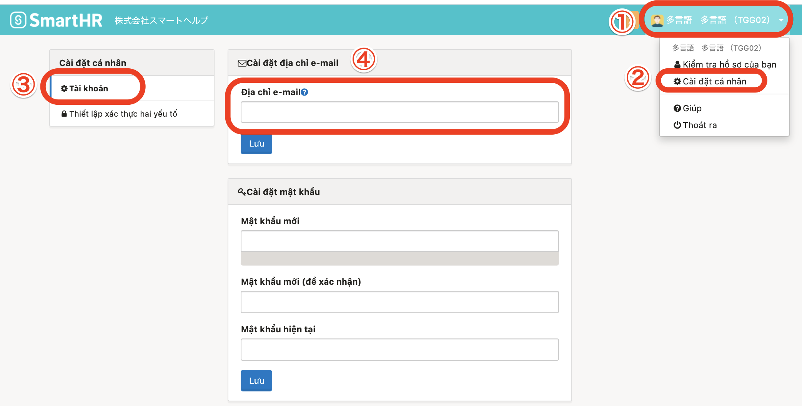

Bạn có thể nhận được các loại thông báo sau nếu bạn cài đặt địa chỉ e-mail.

- Cấp lại mật khẩu khi quên mật khẩu đăng nhập
- Thông báo phát hành Bảng lương chi tiết và Bảng tổng kết thu nhập và thuế cả năm
- Yêu cầu đăng ký mã số cá nhân (My number)
- Yêu cầu Điều chỉnh thuế cuối năm, v.v.

# 1\. Nhấn vào Tên tài khoản ở góc trên bên phải màn hình > \[Cài đặt cá nhân\] > \[Tài khoản\]

Khi nhấn vào **Tên tài khoản ở góc trên bên phải màn hình > \[Cài đặt cá nhân\]** thì sẽ thấy thanh Menu **\[Cài đặt cá nhân\]** hiển thị ở bên trái màn hình.

Trên menu **\[Cài đặt cá nhân\]**, nhấn vào **\[Tài khoản\]** rồi nhập địa chỉ e-mail dùng để đăng nhập và nhận thông báo vào ô **\[Địa chỉ e-mail\]**.

Sau khi điền xong địa chỉ e-mail, nhấn nút **\[Lưu\]** ở phía dưới ô **\[Địa chỉ e-mail\]**.

# 2\. Nhấn vào đường dẫn trong e-mail xác nhận

Sau khi nhấn nút **\[Lưu\]** thì sẽ có e-mail xác nhận gửi đến địa chỉ email của bạn.

Trong e-mail được gửi đến, hãy nhấn vào đường dẫn có ghi “Xác nhận địa chỉ e-mail（メールアドレスを認証する）” để hoàn thành cài đặt (thay đổi).

| 件名 | メールアドレスの認証｜**\[会社名\]** |
| --- | --- |
| 本文 |   SmartHRにご登録いただいたメールアドレスを確認します。  以下のリンクをクリックして、 メールアドレスの認証を完了させてください。 メールアドレスを認証する メールアドレスの認証には事前にログインが必要です。 メールアドレス変更の場合は変更前のメールアドレスでログインして認証をお願いします。  ※確認用リンクは 72 時間有効です。 有効期間が過ぎた場合にはお手数ですが以下より再度確認用メールの再送信を行ってください。 確認用メールを再送信する  \------------------------------ \-------------------  本メールは SmartHR をご利用いただいているお客様宛に配信しています。 【 運営会社 】 株式会社SmartHR https://smarth.co.jp \------------------------------ \-------------------  ※本メールは配信専用のため、 返信いただいてもご回答ができません。 あらかじめご了承ください。   |

Hãy chắc chắn là bạn đã kiểm tra e-mail được gửi đến và nhấn vào đường dẫn, vì việc cài đặt (thay đổi) địa chỉ email chỉ hoàn tất sau khi bạn nhấn vào đường dẫn này.

Ngay cả khi bạn thay đổi địa chỉ e-mail đăng nhập SmartHR, thì địa chỉ e-mail trong thông tin nhân viên sẽ không tự thay đổi theo.

Tương tự, ngay cả khi bạn thay đổi địa chỉ e-mail trong thông tin nhân viên, thì địa chỉ e-mail đăng nhập SmartHR cũng không tự thay đổi theo.

Vì vậy, trường hợp bạn muốn thay đổi địa chỉ e-mail trong thông tin nhân viên, hãy chỉnh sửa từ trang thông tin nhân viên.
