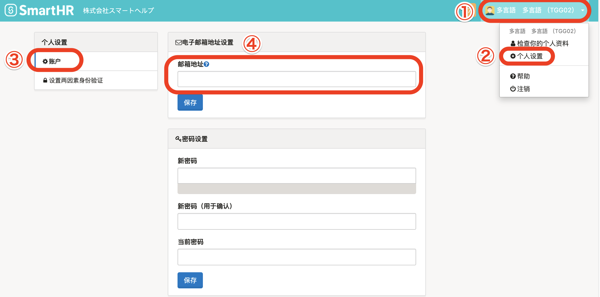

设置邮箱地址后，可收到各类通知。

- 忘记登录密码时的重新发行
- 工资明细、源泉征收票的发行联系
- 个人编号的注册申请
- 年末调整的申请等

# 1\. 在画面右上方点击账户名 > \[个人设置\] > \[账户\]

**在画面右上方点击账户名** **> \[****个人设置****\]** 后，画面左侧显示 **\[****个人设置****\]** 菜单。

请在 **\[****个人设置****\]** 菜单内点击 **\[****账户****\]** ，在 **\[****邮箱地址****\]** 栏输入登录和通知用邮箱地址。

邮箱地址输入结束后，点击 **\[****邮箱地址****\]** 栏下方的 **\[****保存****\]** 。

# 2\. 点击认证邮件内的链接

点击 **\[****保存****\]** 后，该邮箱即会收到认证邮件。

请在邮件内点击写有“认证邮箱地址（メールアドレスを認証する）”的链接，完成设置（更改）。

| 件名 | メールアドレスの認証｜**\[会社名\]** |
| --- | --- |
| 本文 |   SmartHRにご登録いただいたメールアドレスを確認します。  以下のリンクをクリックして、 メールアドレスの認証を完了させてください。 メールアドレスを認証する メールアドレスの認証には事前にログインが必要です。 メールアドレス変更の場合は変更前のメールアドレスでログインして認証をお願いします。  ※確認用リンクは 72 時間有効です。 有効期間が過ぎた場合にはお手数ですが以下より再度確認用メールの再送信を行ってください。 確認用メールを再送信する  \------------------------------ \-------------------  本メールは SmartHR をご利用いただいているお客様宛に配信しています。 【 運営会社 】 株式会社SmartHR https://smarth.co.jp \------------------------------ \-------------------  ※本メールは配信専用のため、 返信いただいてもご回答ができません。 あらかじめご了承ください。   |

如果不点击认证邮件中的链接，就无法完成邮箱地址的设置（更改）。

请务必查看收到的邮件，并点击链接。

即使更改了登录SmartHR时的邮箱地址，员工信息的邮箱地址也不会变更。

同样，即使更改了员工信息的邮箱地址，登录SmartHR时的邮箱地址也不会变更。

如果想要更改员工信息的邮箱地址，请从员工信息的页面进行编辑。
