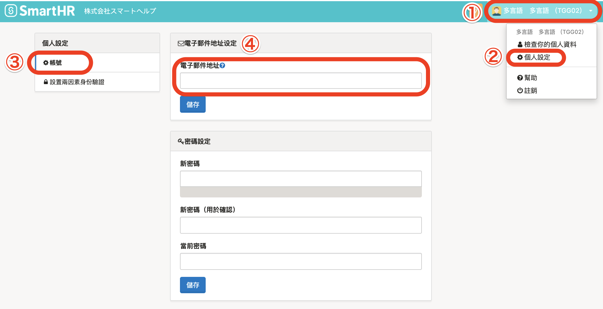

設定電子郵件地址後，即可收取各種通知：

- 忘記登入密碼時的重新發行
- 薪資明細、預扣繳憑單的發行聯絡
- 個人編號登記請求
- 年末調整請求　等

# 1\. 點選畫面右上方的帳號名稱 > \[個人設定\] > \[帳號\]

點選**畫面右上方的帳號名稱 > \[****個人設定\]****，**畫面左方將顯示 **\[****個人設定\]**選單。

在 **\[****個人設定\]** 選單點選 **\[****帳號\]****，**於 **\[****電子郵件地址\]** 欄位輸入登入、通知用電子郵件地址。

電子郵件地址輸入完畢後，點選 **\[****電子郵件地址\]** 欄位下方的 **\[****儲存\]**。

# 2\. 點選驗證電子郵件的連結

點選 **\[****儲存\]** 後，系統將會寄出驗證電子郵件。

請點選電子郵件中的「驗證電子郵件地址（メールアドレスを認証する）」連結以完成設定（變更）

| 件名 | メールアドレスの認証｜**\[会社名\]** |
| --- | --- |
| 本文 |   SmartHRにご登録いただいたメールアドレスを確認します。  以下のリンクをクリックして、 メールアドレスの認証を完了させてください。 メールアドレスを認証する メールアドレスの認証には事前にログインが必要です。 メールアドレス変更の場合は変更前のメールアドレスでログインして認証をお願いします。  ※確認用リンクは 72 時間有効です。 有効期間が過ぎた場合にはお手数ですが以下より再度確認用メールの再送信を行ってください。 確認用メールを再送信する  \------------------------------ \-------------------  本メールは SmartHR をご利用いただいているお客様宛に配信しています。 【 運営会社 】 株式会社SmartHR https://smarth.co.jp \------------------------------ \-------------------  ※本メールは配信専用のため、 返信いただいてもご回答ができません。 あらかじめご了承ください。   |

如未點選驗證電子郵件中的連結，將無法完成電子郵件地址的設定（變更）。

請務必確認驗證電子郵件，並點選連結。

更改SmartHR登入時的電子郵件地址時，員工資訊的電子郵件地址不會同步更動。

相同地，更改員工資訊的電子郵件地址時，SmartHR登入時的電子郵件地址也不會同步更動。

如欲更改員工資訊的電子郵件地址，請從員工資訊頁面進行編輯。
