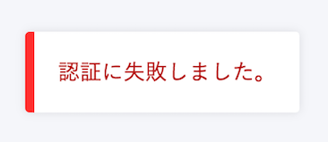

従業員さま向けに、SmartHRにログインできない場合の対応方法をご案内します。

※ はじめてSmartHRにログインする場合 / 2回目以降にログインする場合、招待方法などによって、対応が異なります。

ログインできない場合、画面左下に「認証に失敗しました。」と表示されます。

# はじめてSmartHRにログインする

## 招待メールが届いている場合

メール内の URL から、SmartHRにアクセスし、招待承認を行ってください。

招待承認後、SmartHRにログインできます。

<招待メールの例＞

| 件名 | 招待のご案内 \| **\[会社名\]** |
| --- | --- |
| 本文 |   **\[会社名\]** より SmartHR に招待されました。  下記のURLをクリックして SmartHR にアクセスいただき、アカウントの設定、情報登録をお願いいたします。  https://app.smarthr.jp/invitation/accept?invitation\_token=xxx  この招待は2週間有効です。有効期限を過ぎてしまった場合は、チームの管理者（ **\[管理者メールアドレス\]** ）までお問い合わせください。  招待を承認しない場合、このメールを無視してください。  \------------------------------\-------------------  本メールは SmartHR をご利用いただいているお客様宛に配信しています。 【 運営会社 】 株式会社SmartHR https://smarthr.co.jp \------------------------------\-------------------  ※本メールは配信専用のため、返信いただいてもご回答ができません。あらかじめご了承ください。   |

## 「社員番号」「初期パスワード」を付与されている場合

貴社専用のログインURLも同時に案内されているかと思います。

ログインURLにアクセスし、「社員番号」「初期パスワード」でログインしてください。

詳しくは下記のページをご覧ください。

[社員番号アカウントでログインする](https://knowledge.smarthr.jp/hc/ja/articles/360026263133)

# 2回目以降にログインする

## 初回は招待メールからログインした

**メールアドレスが分からない場合**

SmartHRから各種ご案内のメールが届いているアドレスでログインをお試しください。

該当するメールアドレスでもログインができない場合は、貴社SmartHR管理者へご確認ください。

（アカウントが削除されている可能性がございます）

**パスワードが分からない場合**

下記のページでご案内している手順でパスワードのリセットを行ってください。

[パスワードを忘れてしまったら？](https://knowledge.smarthr.jp/hc/ja/articles/360026265593)

## 付与された「社員番号」と「初期パスワード」でログインした

**ログイン後、メールアドレスの設定を行った場合**

メールアドレスの設定を行っている場合、下記のページでご案内している手順でパスワードのリセットを行ってください。

[パスワードを忘れてしまったら？](https://knowledge.smarthr.jp/hc/ja/articles/360026265593)

**メールアドレスの設定を行っていない場合**

貴社SmartHR管理者さまにて、パスワードリセットを行っていただく必要があります。

詳しい手順は下記のページをご覧ください。

[社員番号アカウントのパスワードを忘れてしまったら？](https://knowledge.smarthr.jp/hc/ja/articles/360026104374)
