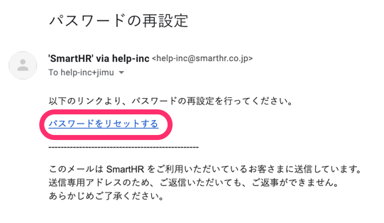

If you have forgotten your login password, you can reset it from the login page.

Please check the following page if you have not registered your email address and are using your employee number to log in.

[Forgot your password for your employee number account?](https://knowledge.smarthr.jp/hc/ja/articles/360026104374)

If you are no longer able to use your registered email address, an administrator must first delete your account and then reissue it.

Please contact a SmartHR administrator and inform them that you have forgotten your password and email address.

# 1\. Click \[Forgot your password（パスワードをお忘れの方）\]

Click **\[Forgot your password?（パスワードをお忘れの方）\]** at the bottom of the login screen to open the password reset screen.

# 2\. Click \[Reset Password（パスワードをリセットする）\]

Enter your email address and click **\[Reset Password（パスワードをリセットする）\]** to receive an email with a link allowing you to reset your password.

# 3\. Click the \[Reset Password（パスワードをリセットする）\] link in the email you receive

An email will be sent to the email address you entered in step 2.

Click on the **\[Reset Password（パスワードをリセットする）\]** link in the body of the email received to open a screen to reset your password.

# 4\. Enter a new password

Enter a password of your choice twice (the second time is for confirmation) on the screen to set a new password and then click **\[Change password（パスワードを変更する）\]** to complete the reset.

:::tips
Please set a password that is between 8 and 128 characters in length using alphanumeric characters and symbols other than "¥" and "\\."
When this step is finished, the password will be changed and you will be able to log in using the new password.
:::
