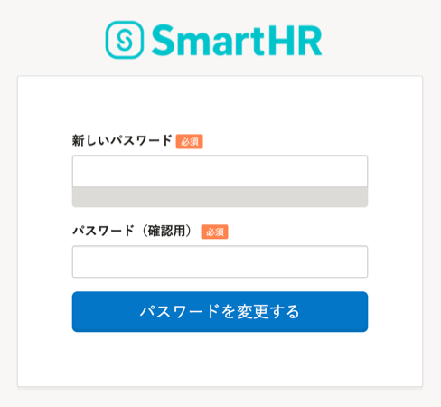

로그인용의 패스워드를 잊어버린 경우, 로그인 페이지에서 초기화 할수 있습니다.

사원번호로 로그인을 하고 있는 상태에서 로그인・통지용 이메일주소를 등록하지 않았을 경우, 하기의 헬프페이지를 참조해주세요.

[사원번호 어카운트의 패스워드를 잊어버렸을 경우](https://knowledge.smarthr.jp/hc/ja/articles/360026104374)

:::alert
등록한 이메일주소가 이용할수 없게 되었을 경우, 관리자가 해당 어카운트를 삭제한후, 어카운트의 재발행이 필요합니다.
귀사의 SmartHR 관리자에게「메일주소와 패스워드를 잊어버렸다」라는 내용으로 연락해주세요.
:::

# 1\. ［패스워드를 잊어버리신 분(パスワードをお忘れの方)］을 클릭

로그인화면 하단부의 **［패스워드를 잊어버리신 분(パスワードをお忘れの方)］** 을 클릭하면 패스워드의 초기화 화면이 표시됩니다.

# 2\. ［패스워드를 초기화 하기(パスワードをリセットする)］를 클릭

이메일주소를 입력하고 **［패스워드를 초기화 하기(パスワードをリセットする)］** 를 클릭하면 재설정용의 링크가 기재된 메일이 송신됩니다.

# 3\. 송부된 메일 안의［패스워드를 초기화 하기(パスワードをリセットする)］를 클릭

2.에서 입력한 이메일주소로 메일이 송부됩니다.

도착한 메일의 본문에 있는 **［패스워드를 초기화 하기(パスワードをリセットする)］** 를 클릭하면 패스워드의 재설정화면이 표시됩니다.

# 4\. 새로운 패스워드를 입력

새로운 패스워드의 설정화면에서 임의의 패스워드를 확인용을 포함하여 2회 입력후 **［패스워드를 변경하기(パスワードを変更する)］** 를 클릭하면 초기화가 완료됩니다.

:::tips
패스워드는 8문자이상（72문자이하）로「¥」와「\\」이외의 영문, 숫자, 기호로 설정해주세요.
:::

「패스워드를 변경하기(パスワードを変更する)」을 클릭하여 초기화를 완료한 후에는 변경한 새로운 패스워드로 로그인이 가능해집니다.
