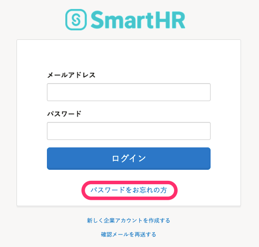
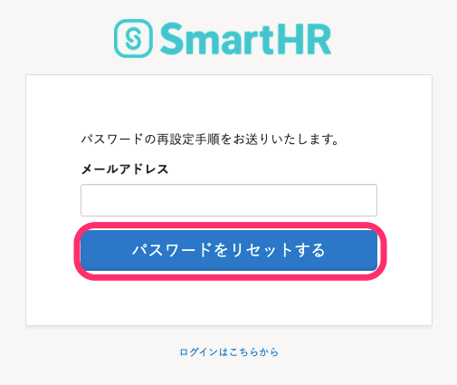
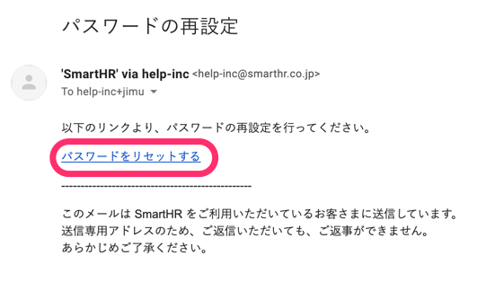
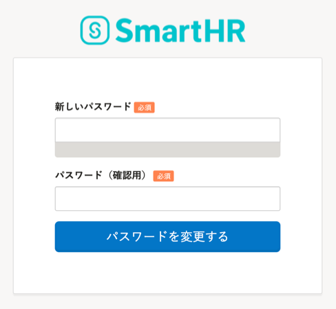

当忘记登录密码时，可以在登录页面进行重置。

使用员工编号登录，如果没有注册邮箱地址，请查看以下页面。

[忘记员工编号账户的密码怎么办？](https://knowledge.smarthr.jp/hc/ja/articles/360026104374)

当注册邮箱地址无法使用时，管理员必须删除账户，然后重新发行账户。

请联系SmartHR管理员，告知“忘记了邮箱地址和密码”。

# 1\. 点击\[忘记密码（パスワードをお忘れの方）\]

在登录画面下方点击 **\[** **忘记密码（パスワードをお忘れの方）** **\]** 后，打开密码重置画面。

# 2\. 点击\[重置密码（パスワードをリセットする）\]

输入邮箱地址并点击 **\[****重置密码****\]** 后，该邮箱会收到含有用于重新设置的链接的邮件。

# 3\. 在接收到的邮件内点击 \[重置密码（パスワードをリセットする）\]

邮件会发送至2.中输入的邮箱地址。

在接收到的邮件正文中点击 **\[****重置密码****\]** 后，显示密码重置画面。

# 4\. 输入新密码

在新密码设置画面内，输入2次任意密码（包括确认用）并点击 **\[** **更改密码（パスワードを変更する）** **\]** 后，重置完成。

:::tips
设置密码不少于8个字符（最多128个字符），使用“¥”和“\\”以外的字母、数字和符号。
该步骤完成后，密码即被更改，可用新密码进行登录。
:::
