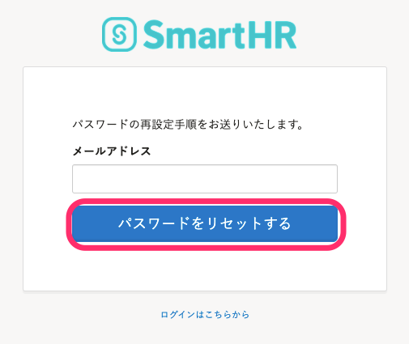

若您忘記登入用的密碼，可以從登入頁面重新設定。

若您使用員工編號登入，未登記電子郵件地址，請確認下列頁面。

[忘記員工編號帳號的密碼怎麼辦？](https://knowledge.smarthr.jp/hc/ja/articles/360026104374)

若您登記的電子郵件地址已無法使用，須由管理者刪除帳號後重新發行帳號。

請聯絡SmartHR管理者，告知「忘記電子郵件地址及密碼」。

# 1\. 點選 \[忘記密碼（パスワードをお忘れの方）\]

點選登入畫面下方的**\[****忘記密碼(パスワードをお忘れの方）\]****，**就會開啟重新設定密碼畫面。

# 2\. 點選 \[重新設定密碼（パスワードをリセットする）\]

輸入電子郵件地址，並點選**\[****重新設定密碼（パスワードをリセットする）\]**，附有重新設定用連結的電子郵件將寄至您的信箱。

# 3.點選電子郵件中的 \[重新設定密碼（パスワードをリセットする）\]

電子郵件將寄送至您於2.輸入的電子郵件地址。

點選電子郵件中的**\[****重新設定密碼（パスワードをリセットする）\]****，**將會顯示重新設定密碼的畫面。

# 4\. 輸入新密碼

在設定新密碼畫面任意輸入新密碼，連同再次確認共輸入2次，點選　**\[****變更密碼（パスワードを更新する）\]** 後即可完成設定。

:::tips
密碼須為8字元以上（128字元以下）、「¥」與「\\」以外的英數字與符號。
本步驟完成後，密碼即更新完畢，您將可以使用新密碼登入。
:::
