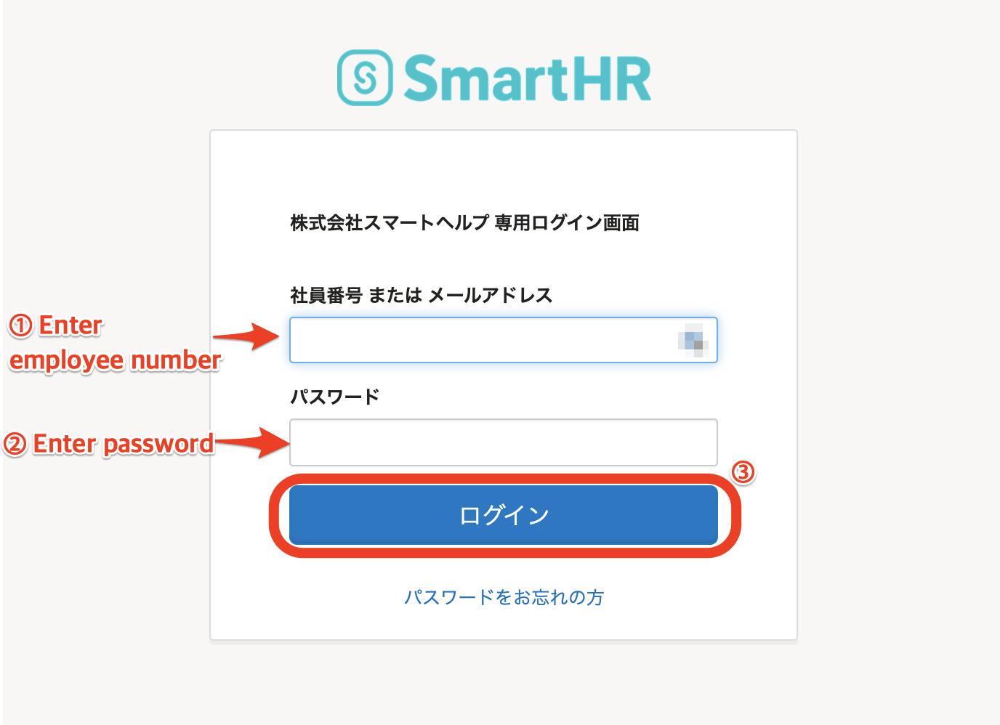
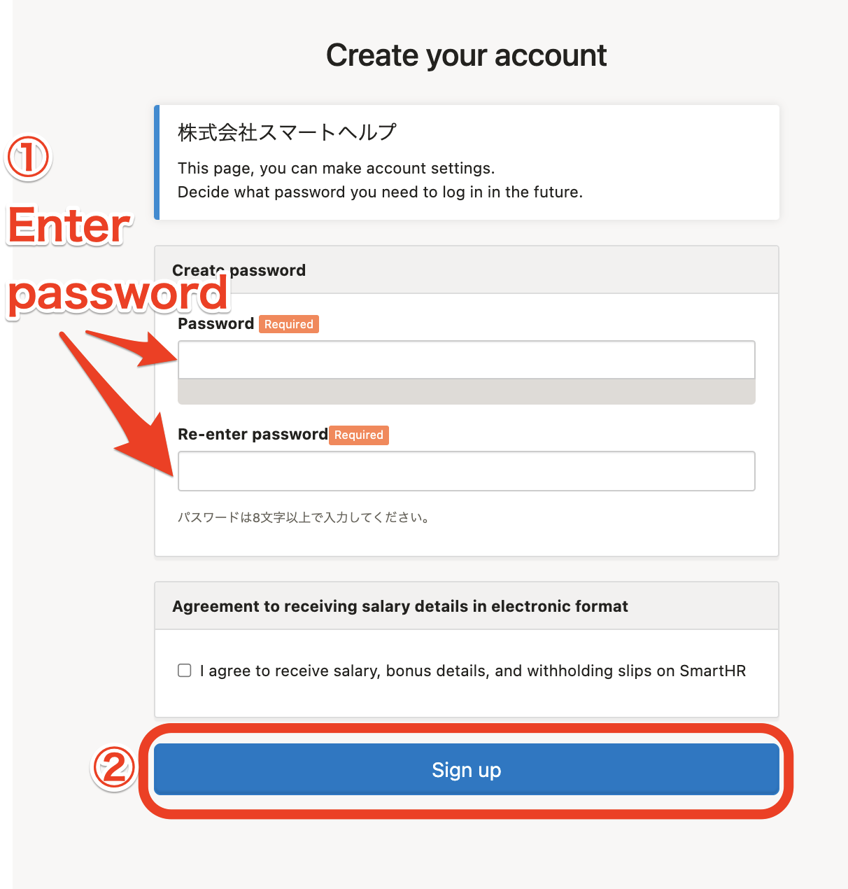
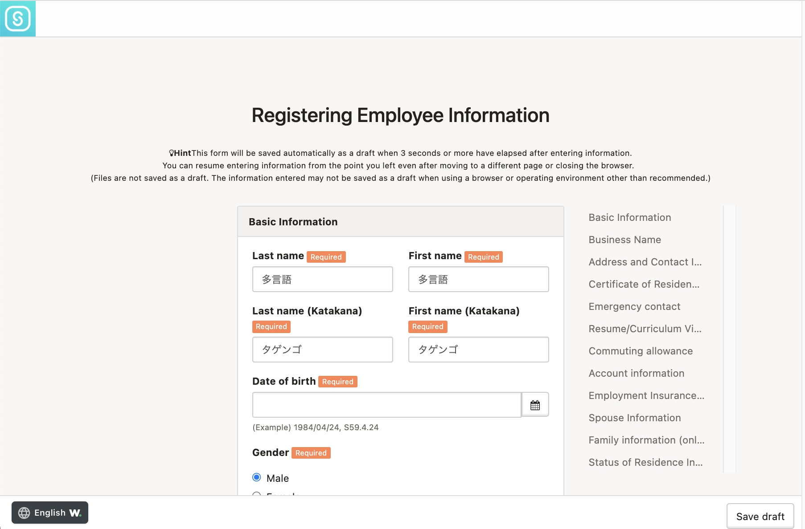
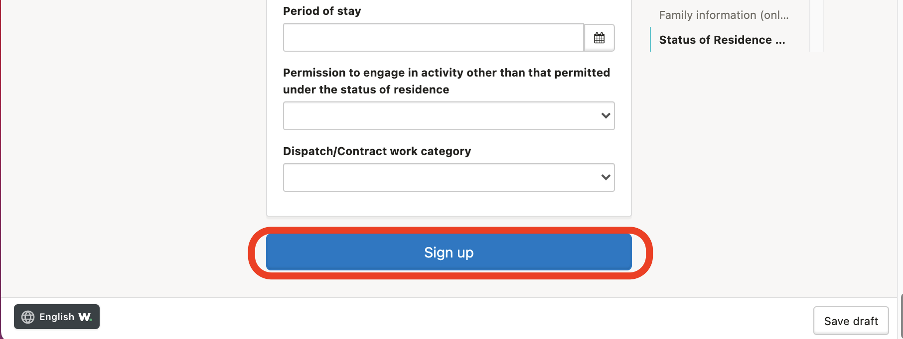
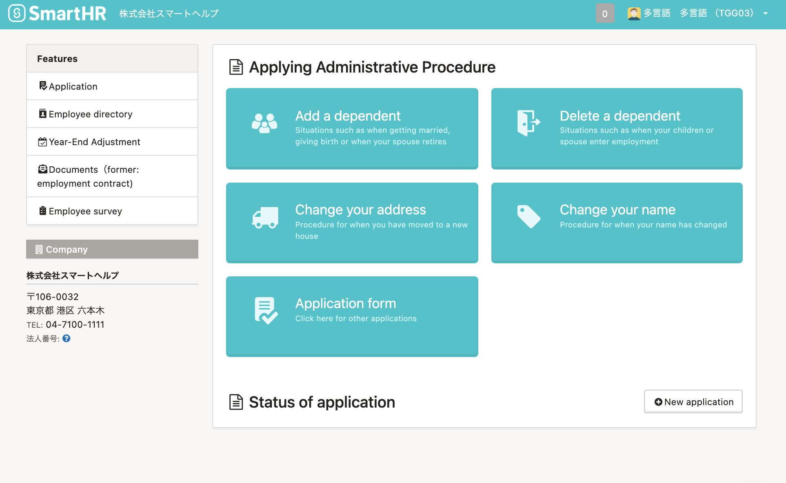
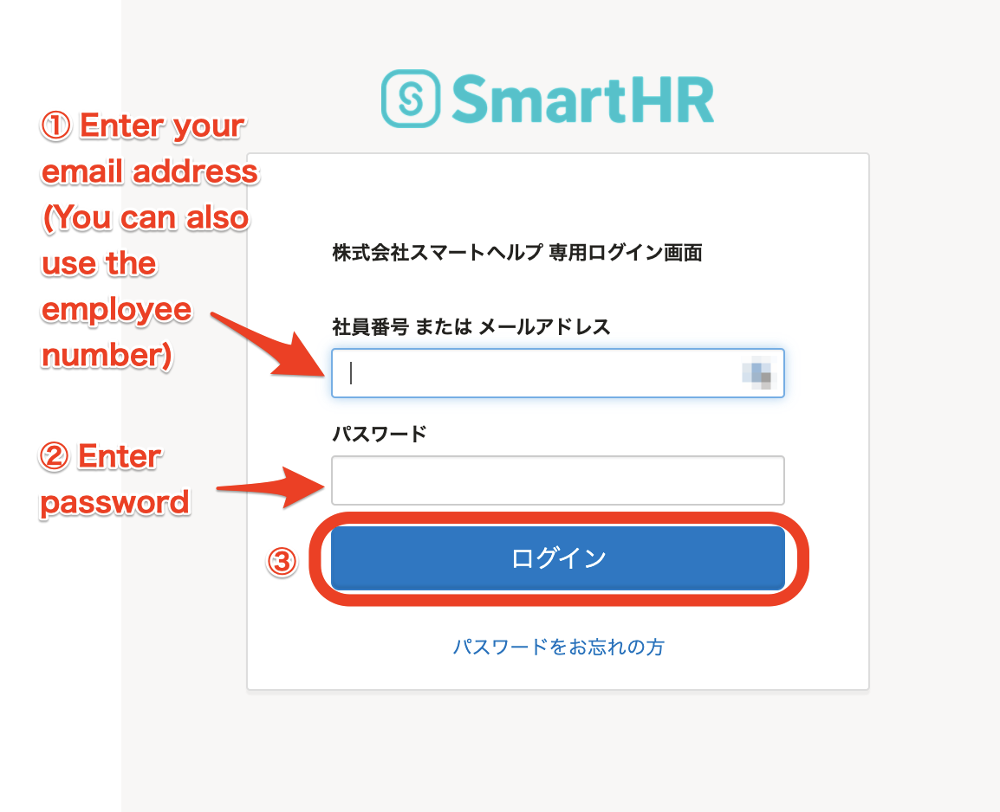

This section explains how to log in to SmartHR using your employee number and password.

When logging in for the first time, you must set a password and register (or confirm) your employee information.

For subsequent logins, you can log in using the password set when you logged in for the first time.

# How to log in for the first time

## 1\. Open the page provided by the administrator (HR staff)

Access the login page provided by the administrator (HR staff).

It will be a URL that looks something like **https://\*\*\*\*\*\*.smarthr.jp/login**

## 2\. Enter your employee number and the default password, and then click \[Log in（ログイン）\]

Enter the employee number and default password provided by the administrator (HR staff) and click **\[Log in\]** to proceed to the account settings screen.

## 3\. Enter a password and then click \[Sign up\]

Enter a password of your choice and then click **\[Sign up\]** to set the password and proceed to the employee information registration screen.

Be sure to enter a password that is different from the default password.

## 4\. Enter (or confirm) your information and then click \[Sign up\]

Follow the on-screen instructions and enter your information. If the administrator (HR staff) has already entered your employee information, please check the registered content.

:::alert
- Image files of your identity documents and pension handbook cannot be saved as drafts.
- The information entered in a draft may not be saved if you are not using a recommended browser or operating environment.
- If your employee information has already been entered, be sure to check whether the content is correct.
:::

When you have completed entering or checking the employee information, click **\[Sign up\]** at the bottom of the screen to proceed to the SmartHR top page.

# How to log in for the second and subsequent times

Please log in from the login URL specific to your company. This is the same as the page you used to log in for the first time.

When logging in for the second and subsequent times, please use the password that you set.

# If you forgot the password you set

You must ask the administrator to reset the password.

Please see the following help page for details on this procedure.

:::related
[Forgot your password for your employee number account?](https://knowledge.smarthr.jp/hc/ja/articles/360026104374)
:::

# Advanced use: Setting your email address

After registering your email address with SmartHR and completing the settings, you can use SmartHR more conveniently as described below.

- You can enter your email address to log in instead of using your employee number
- If you forget your login password, you can reset it by yourself
- You can receive various notifications from SmartHR

Please see the following help page for how to set your email address.

:::related
[Setting (or changing) the login and notification email address](https://knowledge.smarthr.jp/hc/ja/articles/360026263093)
:::

After setting your email address, you will be able to receive various notifications from SmartHR (there is no need to specify any notification settings).

You will also be able to log in using your email address and reset your password by yourself.

## Logging in using your email address

Enter your email address (or employee number) and your password, and then click **\[Log in\]** to display the SmartHR top page.

## Resetting your password

Please see the following help page for details.

:::related
[Forgot your password?](https://knowledge.smarthr.jp/hc/ja/articles/360026265593)
:::
