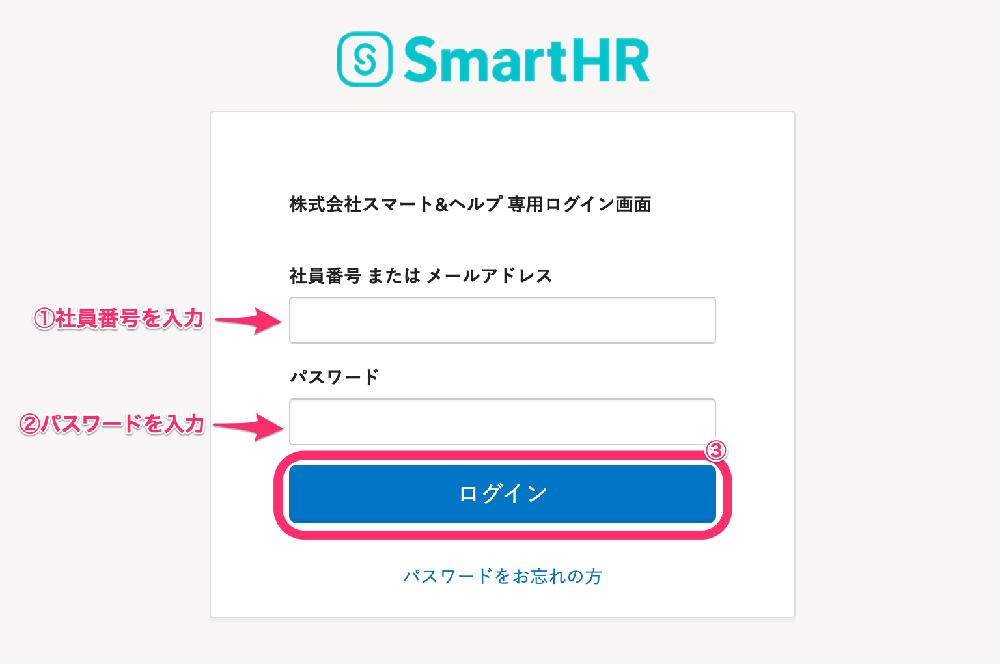
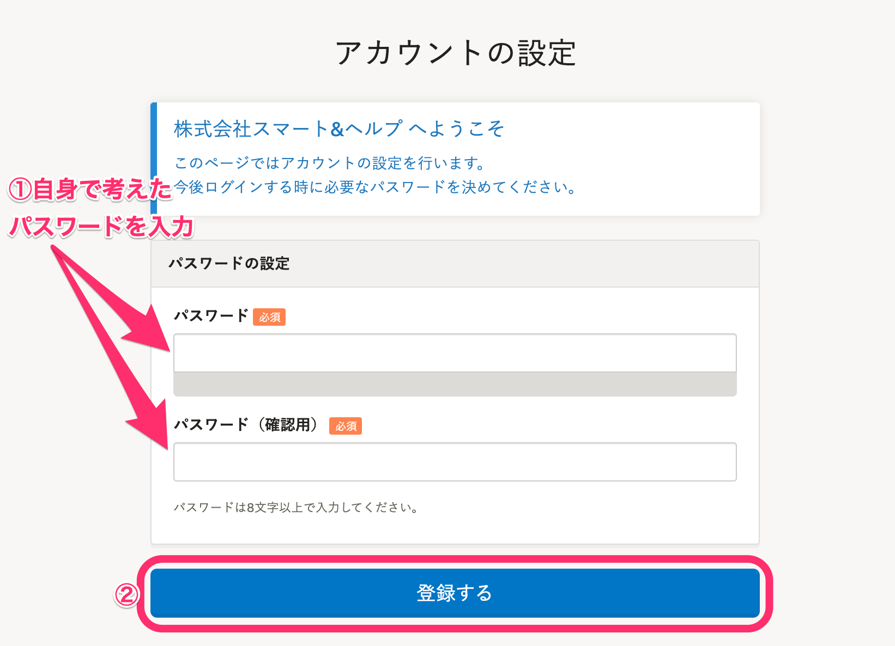
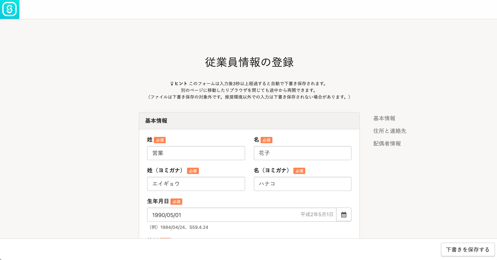
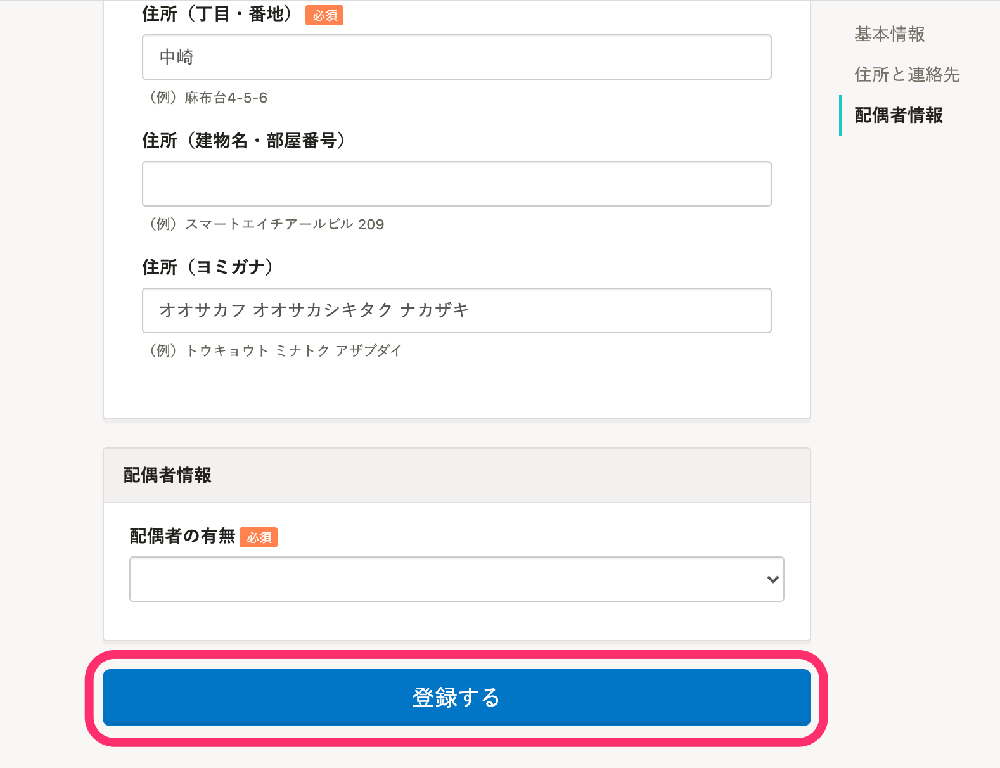
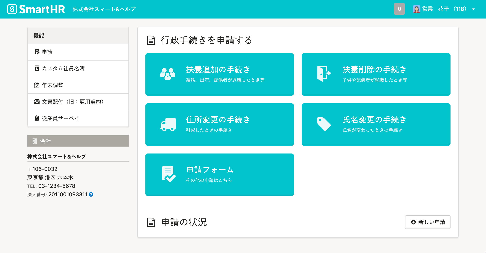
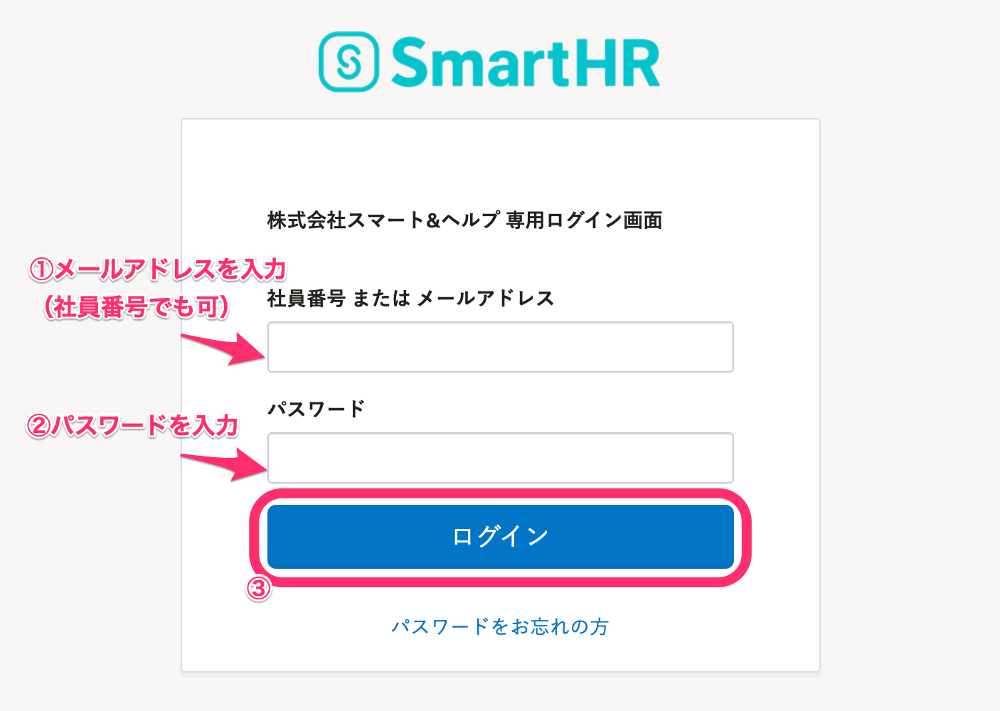

社員番号とパスワードを使ってSmartHRへログインする手順を説明します。

初回ログイン時はパスワードの設定と、従業員情報の登録（または確認）が必要です。

2回目以降は、初回ログイン時に設定したパスワードでログインできます。

# 初回ログイン方法

## 1\. 管理者（労務担当者）に案内されたページを開く

管理者（労務担当者）から案内されたログインページにアクセスします。

**https://\*\*\*\*\*\*.smarthr.jp/login** のようなURLです。

## 2\. 社員番号と初期パスワードを入力し、［ログイン］をクリック

管理者（労務担当者）から案内された「社員番号」と「初期パスワード」を入力して **［ログイン］** をクリックすると、アカウントの設定画面に移ります。

## 3\. パスワードを入力し、［登録する］をクリック

自身で考えたパスワードを入力して **［登録する］** をクリックすると、パスワードが設定され、従業員情報の登録画面に移ります。

初期パスワードとは異なるパスワードを入力してください。

## 4\. 情報を入力（確認）し、［登録する］をクリック

画面の指示に従って情報を入力します管理者（労務担当者）により、すでに従業員情報が入力されていた場合は、登録内容を確認してください。

:::alert
- 身分証明証、年金手帳・基礎年金番号通知書の画像など、ファイルは下書き保存の対象外です。
- 動作環境以外での入力は下書き保存されない場合があります。
- すでに従業員情報が入力されている場合、内容に間違いが無いか必ず確認してください。
:::

従業員情報の入力、または確認が完了したら、画面最下部にある **［登録する］** をクリックすると、SmartHRのトップページに移ります。

# 2回目以降のログイン方法

初回ログインを行なったページと同じ、会社専用のログインURLからログインしてください。

2回目以降のログインでは、パスワードはご自身で設定したものをお使いください。

# 設定したパスワードを忘れた場合

管理者によるパスワードリセットが必要です。

詳しい手順は下記のヘルプページをご覧ください。

:::related
[社員番号アカウントのパスワードを忘れてしまったら？](https://knowledge.smarthr.jp/hc/ja/articles/360026104374)
:::

# 応用編：メールアドレスを設定する

SmartHRにメールアドレスを登録し、設定を完了すると、下記のとおりSmartHRをより便利にお使いいただけます。

- 社員番号のかわりにメールアドレスを入力してログインできるようになります
- ログインパスワードを忘れた場合、ご自身でパスワードをリセットできます
- SmartHRからの各種通知を受け取れます

メールアドレスの設定手順は下記のヘルプページをご覧ください。

:::related
[ログイン・通知用メールアドレスを設定（変更）する](https://knowledge.smarthr.jp/hc/ja/articles/360026263093)
:::

メールアドレスの設定が完了すると、SmartHRの各種通知を受け取れるようになります（通知の受け取り設定は必要ありません）。

また、メールアドレスでのログインや、ご自身でのパスワードリセットができるようになります。

## メールアドレスでログインする

「メールアドレス（社員番号でも可）」と「パスワード」を入力して **［ログイン］** をクリックすると、SmartHRのトップページが表示されます。

## パスワードをリセットする

詳細は下記のヘルプページをご覧ください。

:::related
[パスワードを忘れてしまったら？](https://knowledge.smarthr.jp/hc/ja/articles/360026265593)
:::
