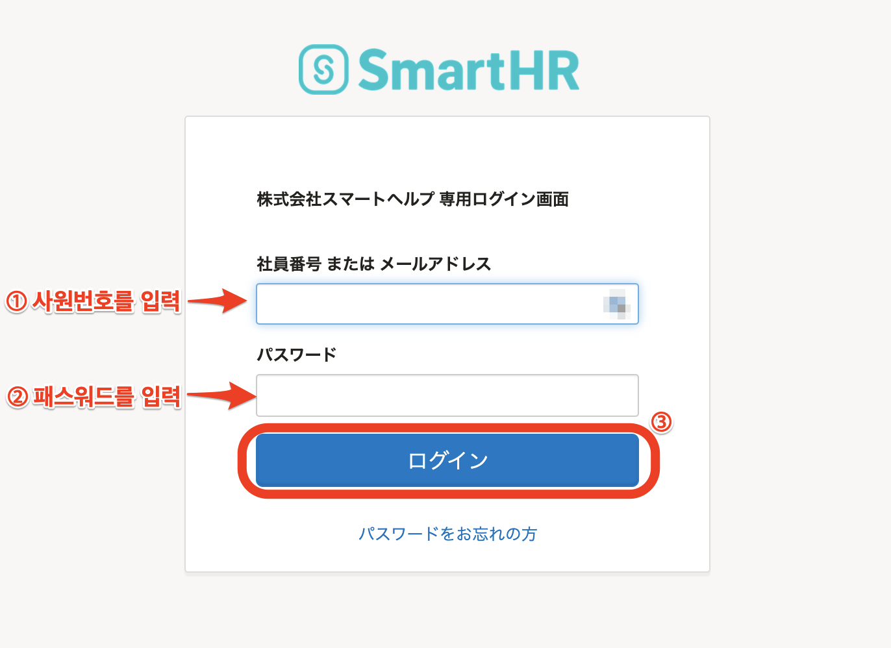
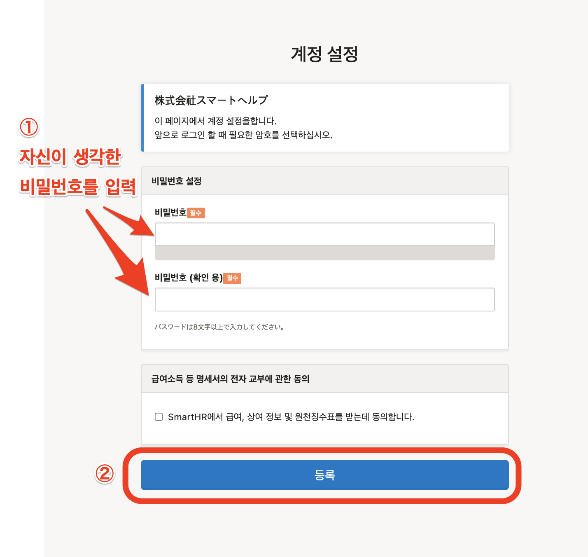
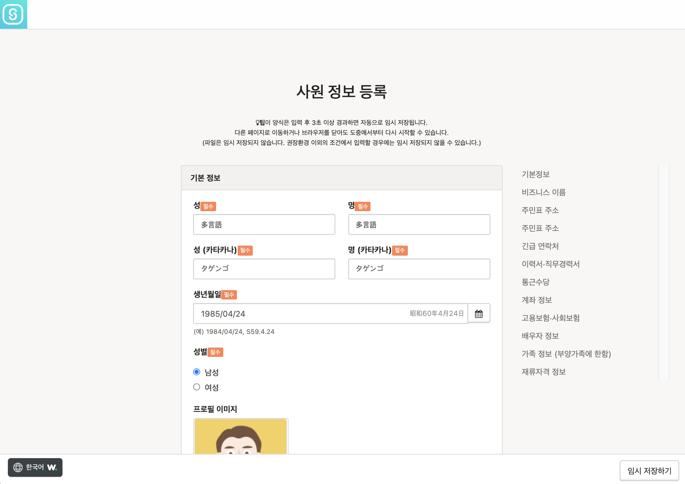
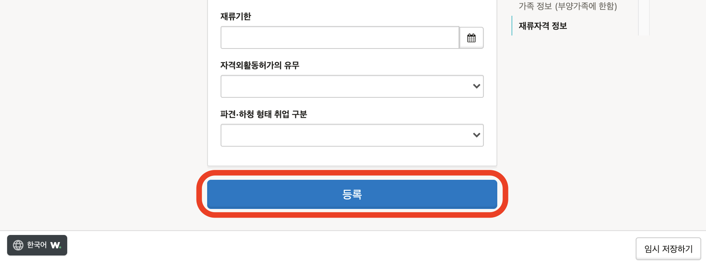
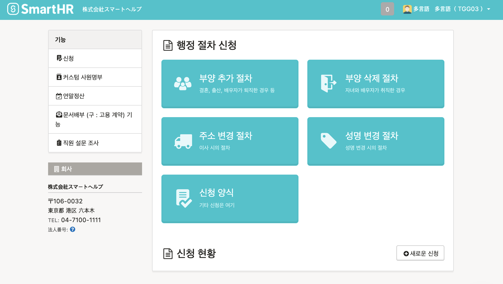
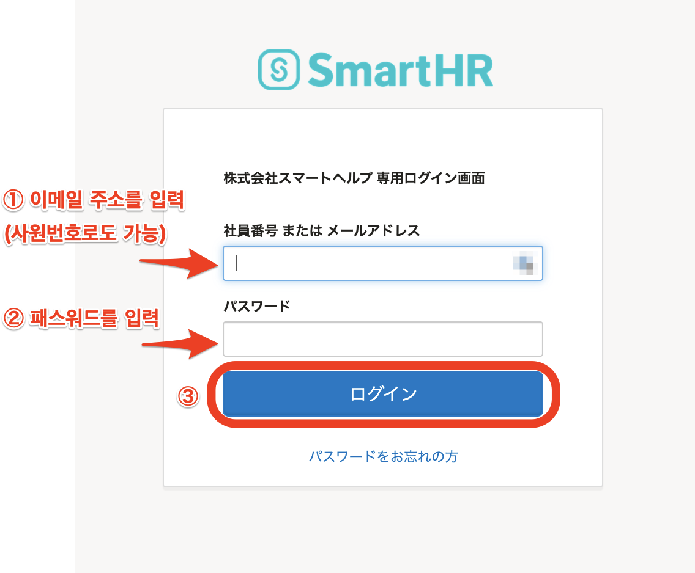

사원번호와 패스워드를 사용하여 SmartHR에 로그인하는 방법을 설명합니다.

최초로 로그인하는 경우, 패스워드의 설정과 사원정보의 등록(혹은 확인)이 필요합니다.

두번째 이후 로그인시에는 최초로 로그인 당시 설정하였던 패스워드로 로그인 할수 있습니다.

# 최초로 로그인하는 경우의 방법

## 1\. 관리자（노무담당자）로부터 안내받은 페이지를 열기

관리자（노무담당자）로부터 안내받은 로그인페이지에 엑세스합니다.

**https://\*\*\*\*\*\*.smarthr.jp/login** 와 같은URL입니다.

## 2\. 사원번호와 초기패스워드를 입력후 \[로그인\]

관리자（노무담당자）로부터 안내받은「사원번호」와「초기 패스워드」를 입력하고 **\[로그인\]** 을 클릭하면, 계정의 설정화면으로 이동합니다.

## 3\. 패스워드를 입력하고 \[등록\]을 클릭

임의의 패스워드를 입력하고 **\[등록\]** 을 글릭하면 패스워드가 설정되어 직원정보의 등록화면으로 이동합니다.

초기 패스워드와는 다른 패스워드를 입력해주세요.

## 4\. 정보를 입력 (확인) 하고 \[등록\]을 클릭

화면의 지시에 따라 정보를 입력합니다.

관리자(노무 담당자)에 의하여 이미 직원정보가 입력되어 있는 경우에는 등록된 내용을 확인하여주세요.

:::alert
- 신분증명증, 연금수첩의 이미지 등의 파일은 임시저장의 대상외 입니다.
- 추천환경이외의 입력은 임시저장이 되지 않을 경우가 있습니다.
- 이미 직원정보가 입력되어 있는 경우, 내용에 틀림이 없는지 반드시 확인해주세요.
:::

직원정보의 입력, 또는 확인을 완료하였을 경우, 화면 최하단부에 있는 **\[등록\]** 을 클릭하면 SmartHR의 톱 페이지로 이동합니다.

# 2회이후의 로그인 방법

초회 로그인을 한 페이지와 같이, 회사전용의 로그인URL에서 로그인해주세요.

2회째 이후의 로그인 시, 패스워드는 본인이 설정하신 패스워드를 입력해주세요.

# 설정한 패스워드를 잊어버린 경우

관리자에 의한 패스워드 리셋이 필요합니다.

자세한 내용은 하기의 헬프페이지를 참조해주세요.

:::related
[사원번호 어카운트의 패스워드를 잊어버린 경우](https://knowledge.smarthr.jp/hc/ja/articles/360026104374)
:::

# 응용편：이메일 주소를 설정하기

SmartHR에 이메일 주소를 등록설정을 완료할 경우, 하기와 같이 SmartHR을 보다 편리하게 이용할수 있습니다.

- 사원번호 대신 이메일주소를 입력하여 로그인이 가능해집니다.
- 로그인 패스워드를 잊어버렸을 경우, 자신의 패스워드를 리셋할수 있습니다.
- SmartHR에서의 각종통지를 받을수 있습니다.

이메일 주소의 설정방법은 하기의 헬프페이지를 확인해주세요.

:::related
[로그인・통지용 이메일 주소를 설정（변경）하기](https://knowledge.smarthr.jp/hc/ja/articles/360026263093)
:::

이메일 주소의 설정을 완료하면 SmartHR의 각종통지를 받을수 있습니다.（통지의 수신설정은 필요없습니다.）

또한, 이메일 주소로 로그인과 자신의 패스워드 리셋을 할수 있게 됩니다.

## 이메일 주소로 로그인하기

「이메일 주소（사원번호로도 가능）」와「패스워드」를 입력하고  **\[로그인(ログイン)\]** 을 클릭하면 SmartHR의 톱 페이지가 표시됩니다.

## 패스워드를 리셋하기

상세한 내용은 하기의 헬프페이지를 확인해주세요.

:::related
[패스워드를 잊어버렸을 경우](https://knowledge.smarthr.jp/hc/ja/articles/360026265593)
:::
