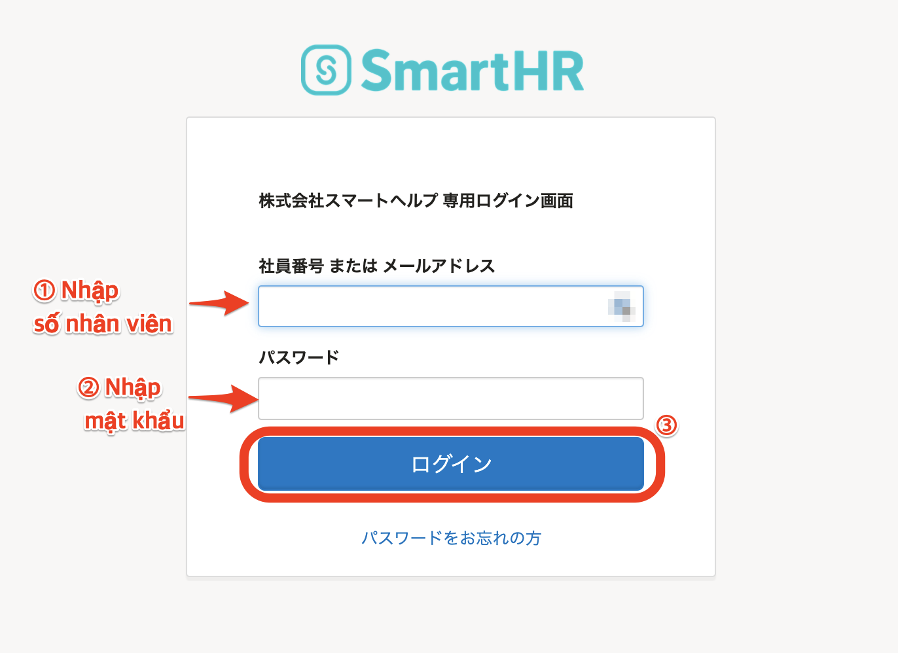
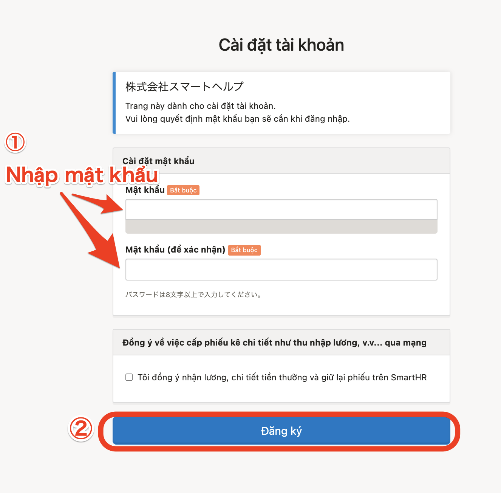
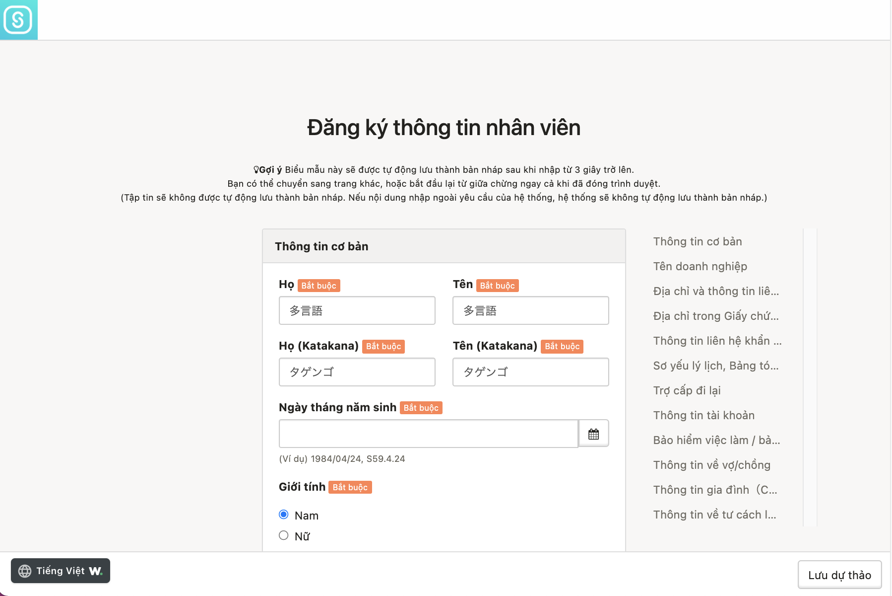
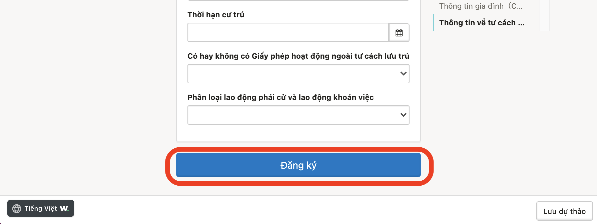
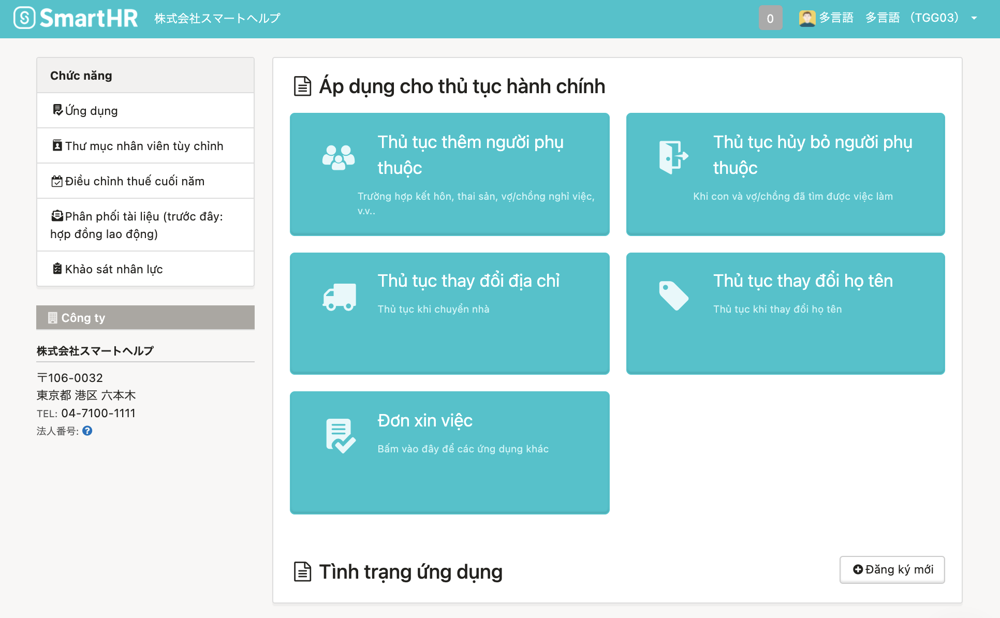
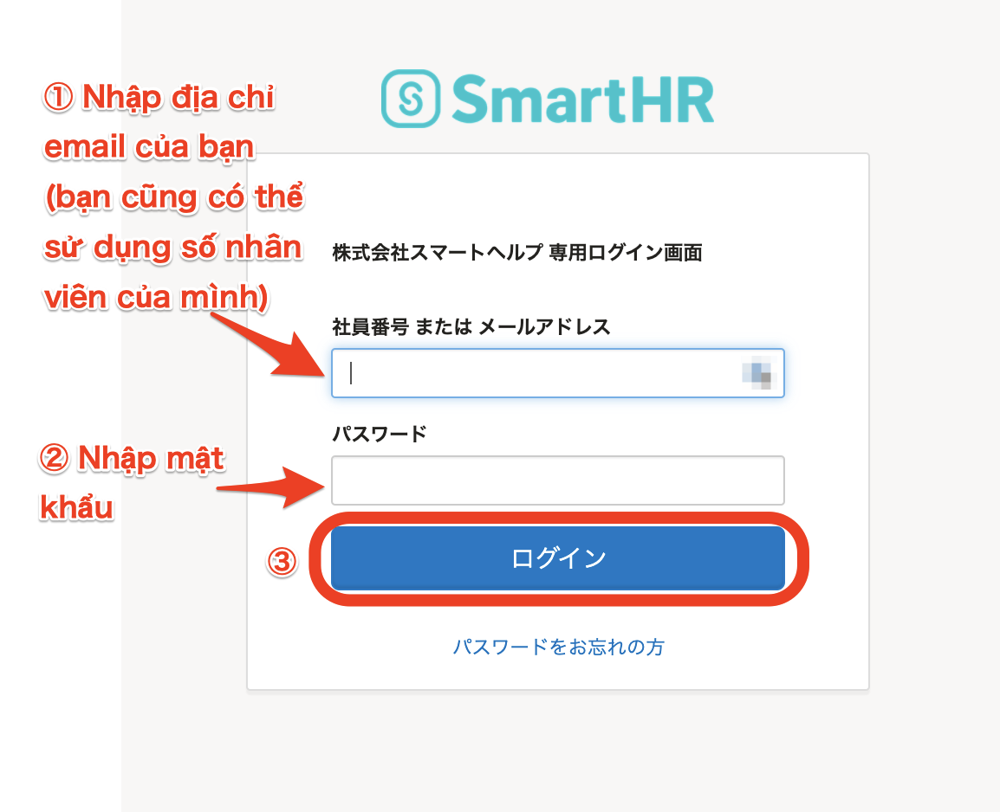

Sau đây là hướng dẫn về trình tự đăng nhập vào SmartHR bằng mã số nhân viên và mật khẩu.

Trong lần đăng nhập đầu tiên, bạn cần phải cài đặt mật khẩu và đăng ký (hoặc xác nhận) thông tin nhân viên.

Từ lần đăng nhập thứ 2, bạn có thể đăng nhập bằng mật khẩu đã cài đặt trong lần đăng nhập đầu tiên.

# Phương pháp đăng nhập lần đầu

## 1\. Mở trang do quản trị viên (nhân viên phụ trách hành chính nhân sự) cung cấp

Truy cập vào trang đăng nhập do quản trị viên (nhân viên phụ trách hành chính nhân sự) cung cấp.

Đường dẫn (URL) có dạng như sau: **https://\*\*\*\*\*\*.smarthr.jp/login**

## 2\. Nhập mã số nhân viên và mật khẩu khởi tạo, và nhấn \[Đăng nhập（ログイン）\]

Điền “mã số nhân viên” và “mật khẩu khởi tạo” do quản trị viên (nhân viên phụ trách hành chính nhân sự) cung cấp, rồi nhấn \[Đăng nhập（ログイン）\] để chuyển tới màn hình thiết lập tài khoản.

## 3\. Nhập mật khẩu, và nhấn \[Đăng ký\]

Nhập mật khẩu do bạn tự đặt rồi nhấn \[**Đăng ký**\] để cài đặt mật khẩu và chuyển đến màn hình đăng ký thông tin nhân viên.

Hãy nhập mật khẩu khác với mật khẩu khởi tạo.

## 4\. Nhập (xác nhận) thông tin, và nhấn \[Đăng ký\]

Nhập thông tin theo hướng dẫn trên màn hình, hoặc xác nhận nội dung đăng ký nếu thông tin nhân viên đã được nhập sẵn bởi quản trị viên (nhân viên phụ trách hành chính nhân sự).

:::alert
- Các tệp như ảnh giấy tờ tùy thân, ảnh sổ tay bảo hiểm lương hưu, v.v. không thuộc đối tượng sao lưu.
- Có trường hợp không thể sao lưu nếu nhập dữ liệu trên hệ thống không tương thích.
- Trường hợp thông tin nhân viên đã được điền sẵn, vui lòng kiểm tra kỹ nội dung xem có chính xác không.
:::

Sau khi hoàn thành nhập dữ liệu hoặc xác nhận thông tin nhân viên, nhấn \[**Đăng ký**\] tại phía dưới cùng của màn hình để chuyển đến đầu trang chủ của SmartHR.

# Phương pháp đăng nhập từ lần thứ 2 trở đi

Hãy đăng nhập từ URL đăng nhập chuyên dụng của công ty, giống như trang đăng nhập lần đầu.

Từ lần đăng nhập thứ 2, hãy sử dụng mật khẩu do chính bạn đã cài đặt.

# Trường hợp quên mật khẩu đã cài đặt

Cài đặt lại mật khẩu cần phải được tiến hành bởi quản trị viên.

Tham khảo trang trợ giúp dưới đây để biết hướng dẫn chi tiết.

:::related
[Làm thế nào khi quên mật khẩu của tài khoản mã số nhân viên?](https://knowledge.smarthr.jp/hc/ja/articles/360026104374)
:::

# Ứng dụng thực tế: Cài đặt địa chỉ e-mail

Sau khi đăng ký và hoàn thành cài đặt địa chỉ e-mail trên SmartHR, bạn sẽ sử dụng SmartHR thuận tiện hơn với các chức năng như sau:

- Bạn có thể đăng nhập bằng địa chỉ e-mail thay vì mã số nhân viên
- Bạn có thể tự cài đặt lại mật khẩu trường hợp bạn quên mật khẩu đăng nhập
- Bạn sẽ nhận được các thông báo từ SmartHR

Truy cập trang trợ giúp dưới đây để xem hướng dẫn cài đặt địa chỉ e-mail .

:::related
[Cài đặt (thay đổi) địa chỉ e-mail dùng để đăng nhập và nhận thông báo](https://knowledge.smarthr.jp/hc/ja/articles/360026263093)
:::

Sau khi hoàn thành cài đặt địa chỉ e-mail, bạn sẽ nhận được các thông báo từ SmartHR (mà không cần cài đặt nhận thông báo).

Ngoài ra, bạn có thể đăng nhập và tự cài đặt lại mật khẩu bằng địa chỉ e-mail.

## Đăng nhập bằng địa chỉ e-mail

Sau khi bạn nhập “địa chỉ e-mail (hoặc mã số nhân viên)” và “mật khẩu” rồi nhấn \[**Đăng nhập**\], đầu trang chủ của SmartHR sẽ được hiển thị.

## Cài đặt lại mật khẩu

Truy cập trang trợ giúp dưới đây để biết thêm chi tiết.

:::related
[Làm thế nào khi quên mật khẩu?](https://knowledge.smarthr.jp/hc/ja/articles/360026265593)
:::
