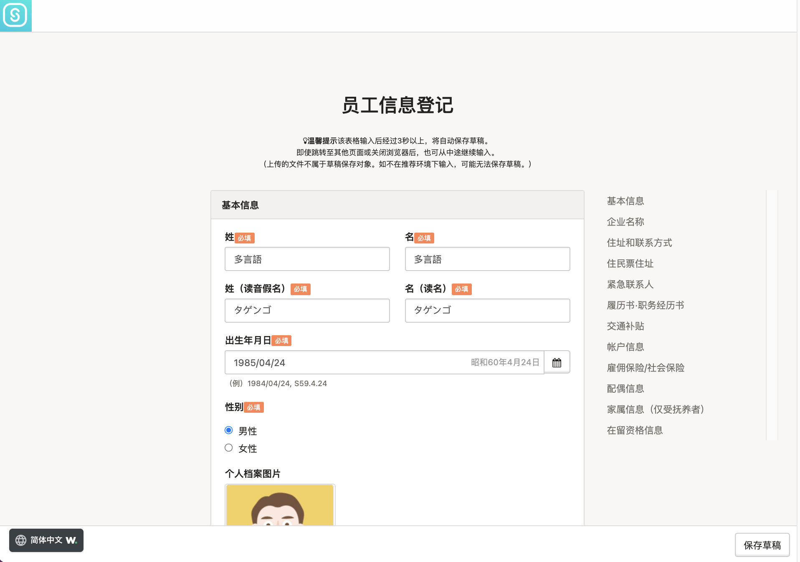

本文将说明使用员工编号和密码登录到SmartHR的步骤。

第1次登录时，必须设置密码，注册（或确认）员工信息。

从第2次开始，可使用第1次登录时设置的密码登录。

# 第1次登录的方法

## 1\. 在管理员（劳务专员）的指导下打开页面

在管理员（劳务专员）的指导下进入登录页面。

登录页面为**https://\*\*\*\*\*\*.smarthr.jp/login**。

## 2\. 输入员工编号和初始密码，点击\[登录（ログイン）\]

在管理员（劳务专员）的指导下输入“员工编号”和“初始密码”，然后点击 **\[** **登录（ログイン）** **\]** ，跳转到账户设置画面。

## 3\. 输入密码并点击\[登记\]

输入自己的密码，点击 **\[登记****\]** 后，密码设置完成，跳转到员工信息的注册画面。

请勿输入与初始密码相同的密码。

## 4\. 输入（确认）信息并点击\[登记\]

根据画面的指示输入信息。当完成员工信息输入时，请由管理员（劳务专员）确认注册内容。

:::alert
- 身份证明证、年金手账的图像等文件不会被保存为草稿。
- 如果未在推荐环境下输入，可能无法保存草稿。
- 当完成员工信息输入时，请务必确认内容正确无误。
:::

员工信息输入或确认完成后，在画面最下方点击 **\[登记****\]** ，跳转到SmartHR首页。

# 第2次开始的登录方法

与第1次登录的页面相同，请从公司专用的登录URL进行登录。

在从第2次开始的登录中，请使用自己设置的密码。

# 忘记设置的密码时

必须由管理员重置密码。

详细步骤请查看以下帮助页面。

:::related
[忘记员工编号账户的密码怎么办？](https://knowledge.smarthr.jp/hc/ja/articles/360026104374)
:::

# 应用篇：设置邮箱地址

在SmartHR中注册邮箱地址并完成设置后，就可以如下方便地使用SmartHR。

- 可以输入邮箱地址代替员工编号进行登录
- 忘记登录密码时，可自行重置密码
- 可接收来自SmartHR的各类通知

邮箱地址的设置步骤请查看以下帮助页面。

:::related
[设置（更改）登录和通知用邮箱地址](https://knowledge.smarthr.jp/hc/ja/articles/360026263093)
:::

邮箱地址设置完成后，即可接收来自SmartHR的各类通知（无需进行接收通知的设定）。

此外，还可以用邮箱地址登录，或者自行重置密码。

## 用邮箱地址登录

输入“邮箱地址（员工编号也可）”和“密码”并点击 **\[****登录****\]** 后，显示SmartHR首页。

## 重置密码

详情请查看以下帮助页面。

:::related
[忘记密码怎么办？](https://knowledge.smarthr.jp/hc/ja/articles/360026265593)
:::
