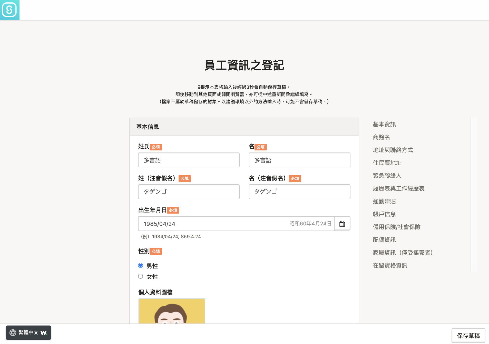

以下說明為使用員工編號與密碼登入SmartHR的步驟。

首次登入時需要設定密碼與登記（或確認）員工資訊。

第2次以後，可以使用首次登入時設定的密碼登入。

# 首次登入方法

## 1\. 開啟管理者（人資負責人）提供的頁面

進入管理者（人資負責人）提供的登入頁面。

如**https://\*\*\*\*\*\*.smarthr.jp/login** 的網址。

## 2\. 輸入員工編號與預設密碼，點選\[登入（ログイン）\]

輸入管理者（人資負責人）提供的「員工編號」與「預設密碼」並點 **\[****登入（ログイン）\]**，移動至帳號設定畫面。

## 3\. 輸入密碼，點選\[登記\]

輸入自行設定的密碼並點選 **\[****登記\]**，密碼即設定完成，將移動至員工資訊登記畫面。

請輸入與預設密碼不同的密碼。

## 4\. 輸入（確認）資訊，點選\[登記\]

依照畫面指示輸入資訊。若管理者（人資負責人）已輸入員工資訊，請確認登記內容。

:::alert
- 證明證件、年金手冊的圖檔等檔案不屬於草稿儲存的對象。
- 以建議環境以外的方法輸入時，可能不會儲存草稿。
- 若員工資訊已輸入，請務必確認內容是否有誤。
:::

員工資訊輸入或確認完成後，點選畫面最下方的 **\[****登記\]****，**即會移動至 SmartHR的首頁。

# 第2次以後登入的方法

與首次登入的頁面相同，請從公司專用的登入網址登入。

第2次以後登入時，請使用自行設定的密碼。

# 若忘記設定的密碼

需要由管理者重新設定密碼。

詳細步驟請參考以下幫助頁面。

:::related
[忘記員工編號帳號的密碼怎麼辦？](https://knowledge.smarthr.jp/hc/ja/articles/360026104374)
:::

# 應用篇：設定電子郵件地址

在SmartHR登記電子郵件地址並完成設定後，使用SmartHR將更為便利如下：

- 登入時可輸入電子郵件地址代替員工編號
- 若忘記登入密碼，可自行重置密碼
- 收取SmartHR的各種通知

電子郵件地址的設定步驟請參考以下幫助頁面。

:::related
[設定（變更）登入、通知用電子郵件地址](https://knowledge.smarthr.jp/hc/ja/articles/360026263093)
:::

電子郵件地址設定完成後，即可收取SmartHR的各種通知（不須設定接收通知）。

此外，可以透過電子郵件地址登入，或自行重新設定密碼。

## 以電子郵件地址登入

輸入「電子郵件地址（員工編號亦可）」與「密碼」並點選**\[****登入\]****，將**會顯示 SmartHR首頁。

# 重新設定密碼

詳情請參考以下幫助頁面。

:::related
[忘記密碼怎麼辦？](https://knowledge.smarthr.jp/hc/ja/articles/360026265593)
:::
