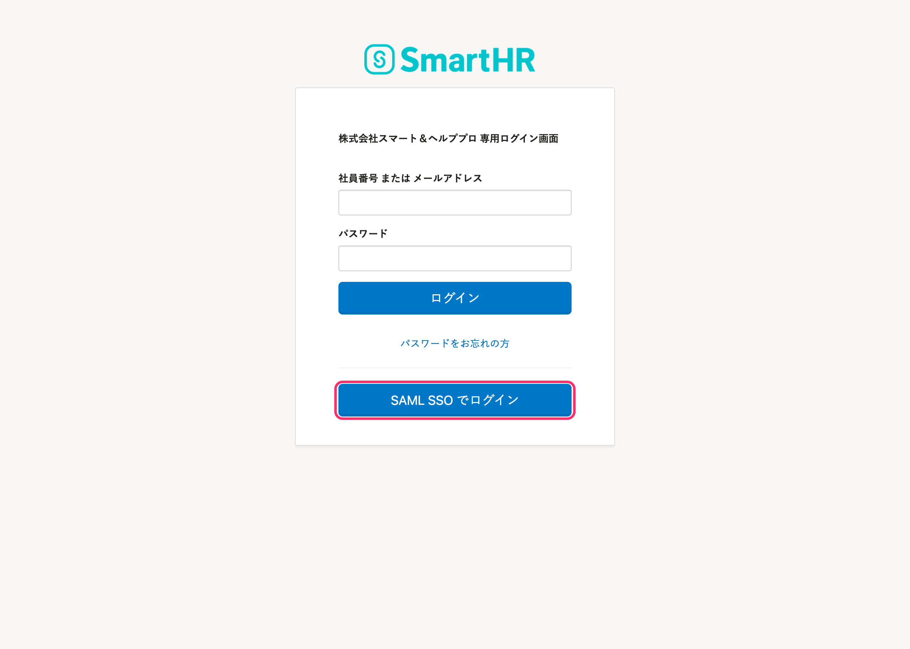
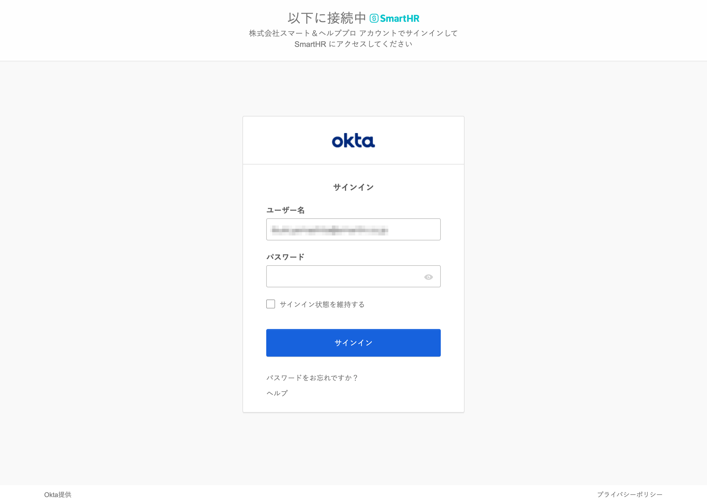
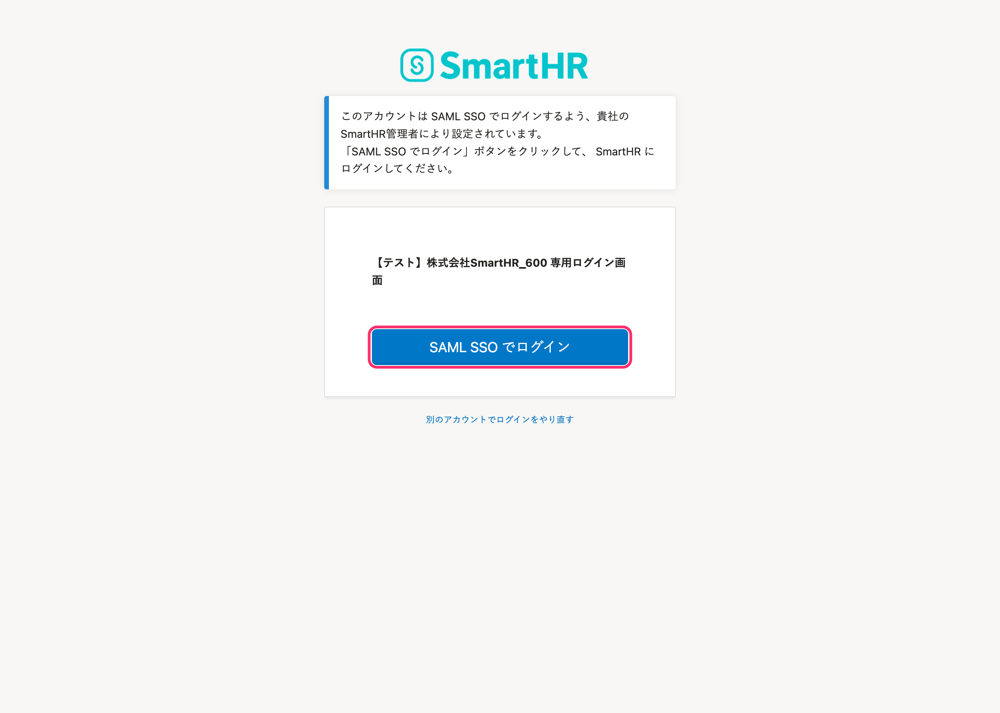
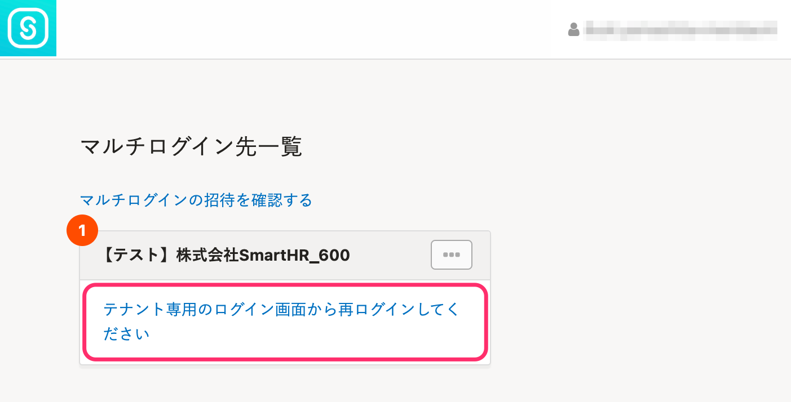

SAML認証（SSO）を使ってSmartHRにログインする手順を説明します。

SAML認証（SSO）でログインするためには、管理者側で下記の設定が完了している必要があります。詳しくは、貴社のSmartHR管理者にお問い合わせください。

- [SAML認証（SSO）を設定する](https://knowledge.smarthr.jp/hc/ja/articles/360037010093)
- [SAML認証（SSO）を使ってログインする](https://knowledge.smarthr.jp/hc/ja/articles/360037085933)（SAML SSOアカウントの有効化）

# 1\. ログイン画面で［SAML SSO でログイン］をクリック

貴社専用のログイン画面で **［SAML SSO でログイン］** をクリックし、利用しているIDプロバイダー（IdP）のログイン画面へ移動します。 **［社員番号 または メールアドレス］** と **［パスワード］** の入力は必要ありません。

:::alert
**https://app.smarthr.jp/login**がURLのログイン画面では、 **［SAML SSO でログイン］** は表示されません。貴社専用のログイン画面を利用してください。
:::

# 2\. IDプロバイダー（IdP）経由でログインする

IdP上のアカウント情報を入力し、SmartHRにログインします。IdPのログイン画面は、利用しているIdPによって異なります。

:::tips
# SAML SSOが有効なアカウントで通常のログインをした場合
SAML SSOが有効なアカウントで、通常のログインをした場合に表示される画面について説明します。
## 貴社専用のログイン画面の場合
社員番号またはメールアドレスとパスワードを用いたログインを行なった場合、SAML認証（SSO）を使ったログインができる画面が表示されます。

## https://app.smarthr.jp/loginがURLのログイン画面の場合
メールアドレスとパスワードを用いたログインを行なった場合、マルチログイン先一覧の画面が表示されます。貴社専用のログイン画面に移動し、SAML認証（SSO）でログインしてください。

:::
