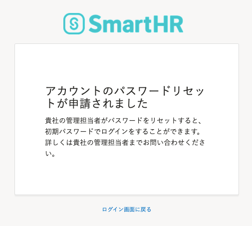

ログイン・通知用メールアドレスが設定されているかどうかにより、手順が異なります。

メールアドレスの設定について詳しくは、以下のページをご覧ください。

[ログイン・通知用メールアドレスを設定（変更）する](https://knowledge.smarthr.jp/hc/ja/articles/360026263093)

# メールアドレス未設定の場合

管理担当者にパスワードのリセットを申請します。

## 1\. ［パスワードをお忘れの方］をクリック

ログイン画面下部の **［パスワードをお忘れの方］** をクリックすると、パスワードのリセット画面が表示されます。

## 2\. ［パスワードをリセットする］をクリック

ご自身の社員番号を入力し、 **［パスワードをリセットする］** をクリックします。

## 3\. 管理者の承認を待つ

管理者宛に、アカウントのパスワードリセット申請が行なわれます。

管理者がパスワードをリセットすると、初期パスワードでログインできます。

:::tips
初期パスワードでログインできない場合は、パスワードが変更されている可能性があります。
管理者に新しい初期パスワードを確認してください。
:::

# メールアドレス設定済みの場合

ログイン・通知用メールアドレスを設定済みの場合は、ご自身でパスワードをリセットできます。

詳しい手順は下記のページをご覧ください。

[パスワードを忘れてしまったら？](https://knowledge.smarthr.jp/hc/ja/articles/360026265593)
