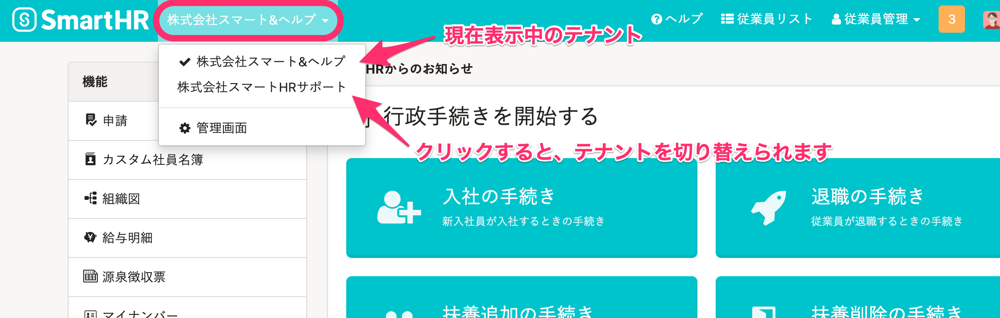

# A. SmartHRにログインした状態でリンクをひらく必要があります。

招待メールを受けとったメールアドレスがすでに他の会社でSmartHRに登録されている場合、招待メール内のリンクをクリックすると、ログイン画面が表示されます。

この場合、以前利用していたSmartHRのテナントにログインしたあとに、 **［マルチログイン招待の確認］** 画面にて **［承認する］** をクリックすると、 **［マルチログインアカウント］** としてログインし、画面左上からテナントを切り替えられるようになります。

マルチログインアカウントについて詳しくは、下記のページをご覧ください。

[マルチログインアカウントとは](https://knowledge.smarthr.jp/hc/ja/articles/360026262853)

## 1\. SmartHRにログイン

招待メールを受けとったメールアドレスと、他の会社でSmartHRに招待を受けた際に自身で設定したパスワードを入力すると、SmartHRにログインできます。

### 下図のログイン画面が表示されたら？

この画面からログインしてもマルチログイン招待画面には移動しません。

在籍している企業アカウントのSmartHRにログインした状態でメール画面を別タブでひらき、 **［招待を確認する］** のリンクをクリックしてください。

### パスワードがわからない場合は？

下記のリンクにアクセスすると、パスワードをリセットして再設定できます。

[パスワードの再設定](https://app.smarthr.jp/account/password)

パスワード再設定後、あらためてSmartHRにログインをしてください。

[SmartHRログインページ](https://app.smarthr.jp/login)

## 2\. マルチログイン招待の確認画面にて［承認する］をクリック

招待を受けた会社名を確認のうえ、 **［承認する］** をクリックして、登録を進めてください。

## 3\. テナントの切り替えができることを確認

トップページの左上に表示されている会社名をクリックすると、マルチログインアカウントとしてログインできていることを確認できます。

表示された会社名をクリックすると、テナントを切り替えられます。

 **［管理画面］** をクリックすると、 **［マルチログイン先一覧］** を確認できます。
