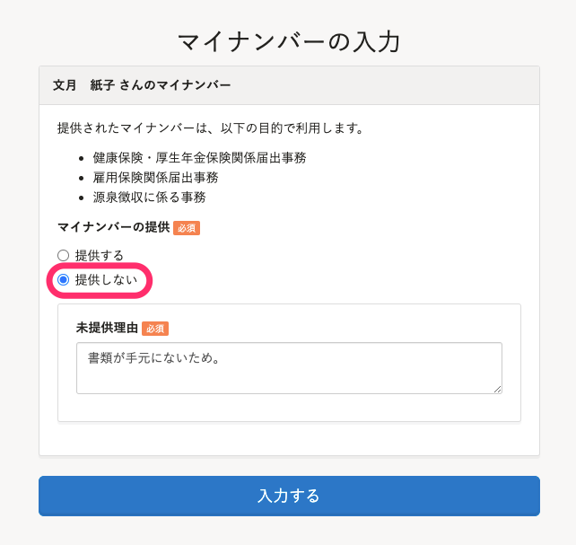

マイナンバーの提供依頼が届いたら **利用目的** を確認のうえ、 **マイナンバー** と **番号確認書類** を登録してください。

# マイナンバーを入力する

## 1\. メールの通知、またはSmartHRのトップページの通知を確認する

管理者からマイナンバーの提供依頼があると、メールが届きます。

また、SmartHRにログインしたトップページにも登録ボタンが表示されます。
提供依頼メール例：

メール内に記載されているURLをクリックすると、マイナンバー入力画面に移動します。

トップページの通知：

マイナンバーの提供依頼があると、SmartHRのトップページに  **［マイナンバーの入力］** というボタンが表示されます。

ボタンをクリックすると、入力画面が表示されます。

## 2\. マイナンバーを入力し、確認書類を添付して提出する

メール内のリンクまたは、トップページからマイナンバーの入力画面を開きます。

マイナンバー（半角数字12桁）を入力し、番号確認書類・身元確認書類を添付して画面下部にある **［入力する］** をクリックすると、管理者にマイナンバーが提出されます。

:::tips
番号確認書類や身元確認書類の添付が必要かどうかは、管理者の設定により異なります。
:::

# マイナンバーの入力をスキップする時

マイナンバーの番号確認書類が手元にない場合などは、 **［提供しない］** を選択し、 **［未提供理由］** を記載して、提出してください。

なお、 **［提供しない］** を選択した後も、SmartHRトップページの **［マイナンバーの入力］** からいつでもマイナンバーを提出できます。

# マイナンバーが変わった場合や間違って入力してしまった場合

変更理由を管理者に連絡し、再提供依頼を行なってもらってください。

:::tips
存在しないマイナンバーを入力した場合は、エラーになるため、誤入力を防げます。
マイナンバーは、末尾の1桁で入力ミスを確認できるようになっており、その仕組みを利用してエラーを判定しています。
:::
