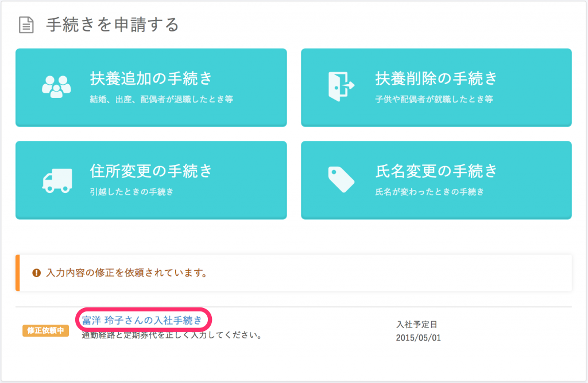
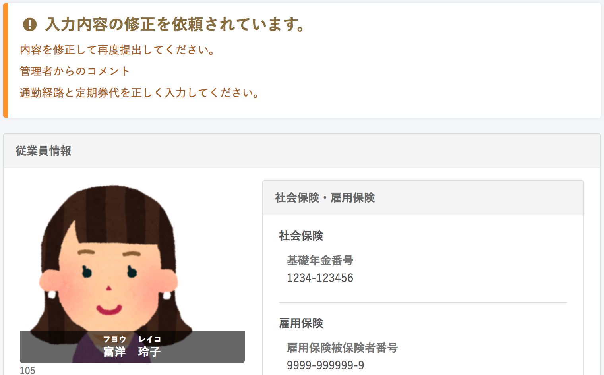
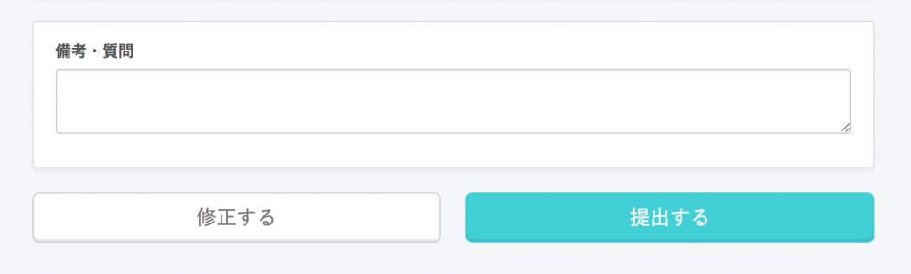

入社手続きの修正依頼が届いたら、内容を確認の上、情報を入力して再度提出してください。

# 1\. 入社手続きのメール・依頼を確認する

管理者から入社手続きの修正依頼があると、メールが届きます。

また、SmartHRにログインしたトップページにも修正依頼が表示されます。

**▼修正依頼メール例**

| 件名 | **\[従業員名\]** さんの入社手続き の修正が依頼されました｜**\[会社名\]** |
| --- | --- |
| 本文 |   **\[従業員名\]** さんの入社手続き で入力していただいた内容に、  修正や追加いただきたい箇所があります。  下記のURLよりご確認ください。  https://xxx.smarthr.jp/produres/xxx/confirmation?  \------------------------------\-------------------  https://app.smarthr.jp  本メールは SmartHR をご利用いただいているお客様宛に配信しています。 【 運営会社 】 株式会社SmartHR [https://smarthr.co.jp](https://smarthr.co.jp/) \------------------------------\-------------------  ※本メールは配信専用のため、返信いただいてもご回答ができません。あらかじめご了承ください。   |

**▼トップページ**

# 2\. 修正画面を開く

メール内のリンクまたは、トップページの **\[○○さんの入社手続き\]** ボタン から修正画面を開きます。

# 3\. 再度情報を入力して \[提出\] ボタンをクリック

**\[修正する\]** ボタン から再度情報を入力し、質問等がある場合は **\[備考・質問\]** 欄 にコメントを入れて **\[提出\]** ボタンをクリックしてください。

