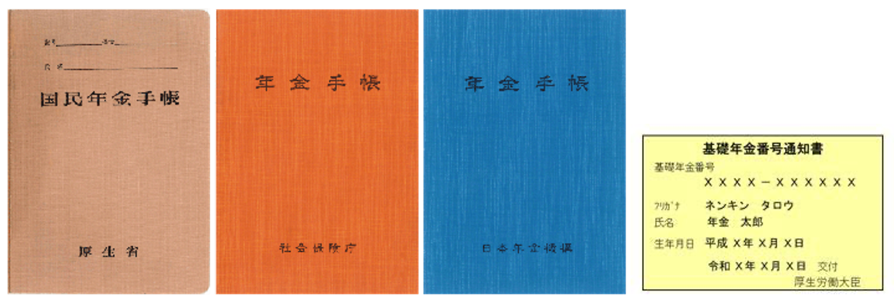
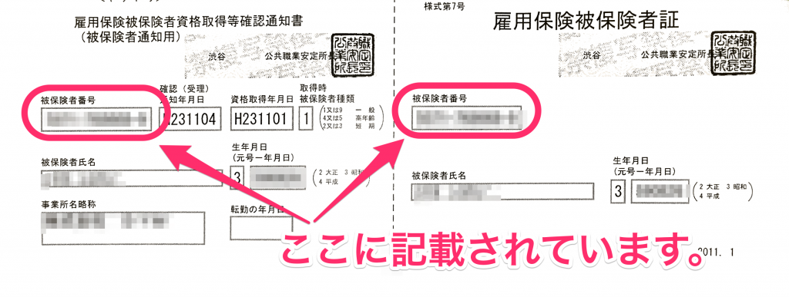
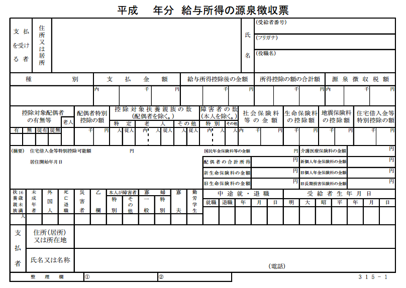

以下の書類を入社日までに用意しておきましょう。

# 1\. 年金手帳・基礎年金番号通知書のコピー

自分で保管しているか、前職の会社が保管しています。前職が保管している場合は退職時に返却されます。

入社先の指示に従って、実物を持参するか、「基礎年金番号」の記載されたページをコピーしていきましょう。

## 年金手帳・基礎年金番号通知書の外観 （発行された年によって表紙が違います）

サンプル画像は [日本年金機構](https://www.nenkin.go.jp/service/seidozenpan/yakuwari/20131107.html) より

## 基礎年金番号は年金手帳（青色）の見開き1ページ目に記載されています

青色以外の年金手帳をお持ちの場合は、「基礎年金番号通知書」など、基礎年金番号の記載された書類を持参しましょう。

また、年金手帳を紛失した場合は再発行できます。再発行の方法については以下のページを参照してください。

[年金手帳の再交付を受けようとするとき｜日本年金機構](https://www.nenkin.go.jp/service/kounen/todokesho/sonota/20120314-02.html)

# 2\. 雇用保険被保険者証

自分で保管しているか、前職の会社が保管しています。前職が保管している場合は退職時に返却されます。

紛失した場合は再発行できます。「身分証明書」と「印鑑」を持参して、最寄りのハローワークで手続きを行ないます。ハローワークの場所は[管轄のハローワークの場所を調べる](https://knowledge.smarthr.jp/hc/ja/articles/360026107834)を参照してください。

または、入社先に前職の社名を伝えることで手続きできる場合があります。入社先の指示に従ってください。

## 雇用保険被保険者証の外観

# 3\. 源泉徴収票

前職の会社から発行されます。退職してから1ヶ月前後かかる場合がありますので、その際は入社先にその旨を伝えてください。

入社先での年末調整で使用するため、その時期までに提出しておくのが望ましいです。また、紛失した場合は前職の担当者に依頼してください（税務署や市役所等では発行できません）。

必要となるのは、その年の「給与所得の源泉徴収票」です。去年のものや、「退職所得の源泉徴収票・特別徴収票」は提出不要です。

例：　令和4年に入社する場合

- 「令和4年分　給与所得の源泉徴収票」　→　要提出
- 「令和3年分　給与所得の源泉徴収票」　→　提出不要
- 「令和4年分　退職所得の源泉徴収票・特別徴収票」　→　提出不要
- 「令和3年分　退職所得の源泉徴収票・特別徴収票」　→　提出不要

## 源泉徴収票の外観

# 4\. 健康診断書

直近3ヶ月以内に健康診断を受診している場合、その結果を証明する書面を提出します。

# 5\. 印鑑

印鑑を用意しましょう。認印で手続きできます。

雇用契約書など、確実に本人がサインしたということを証明するためにも、シャチハタではなく認印を押すようにしてください。
