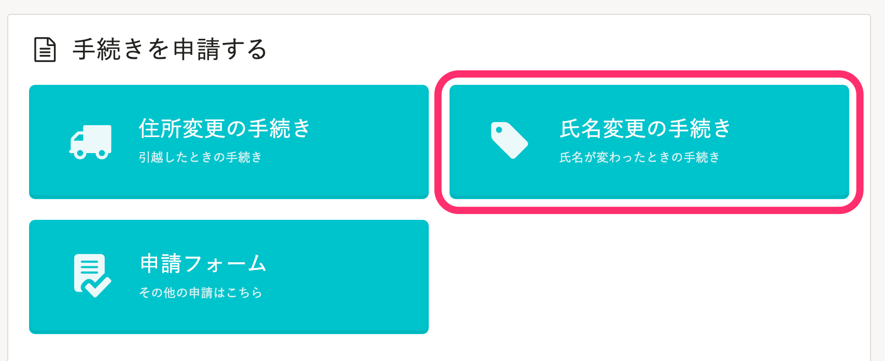

結婚などの際、従業員から氏名変更の手続きをする方法を説明します。

# 1\. トップページの［氏名変更の手続き］をクリック

トップページにある **［氏名変更の手続き］** をクリックすると、氏名変更の入力画面が表示されます。

# 2\. 氏名変更に関する情報を入力

氏名変更した日や、新しい氏名など必要な情報を入力し、最下部にある **［手続きを提出する］** をクリックすると、管理者に情報が提出されます。

提出すると、トップページの **［手続きToDo一覧］** に **［管理者対応中］** として表示されます。

