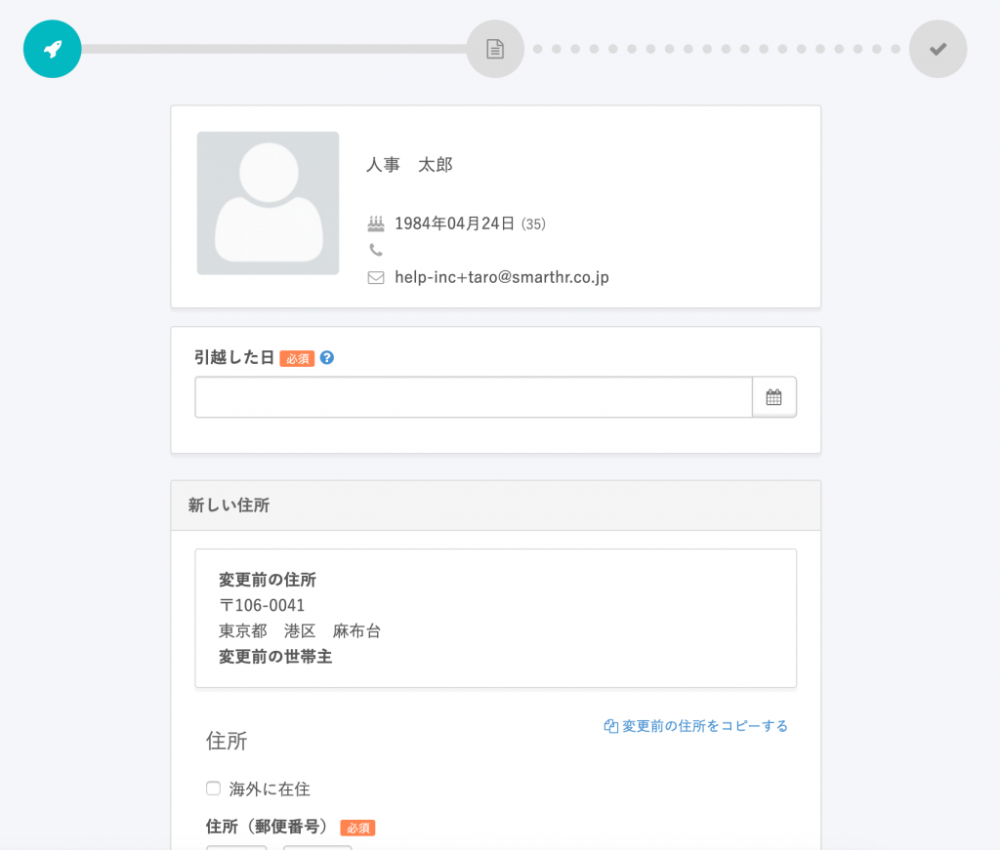
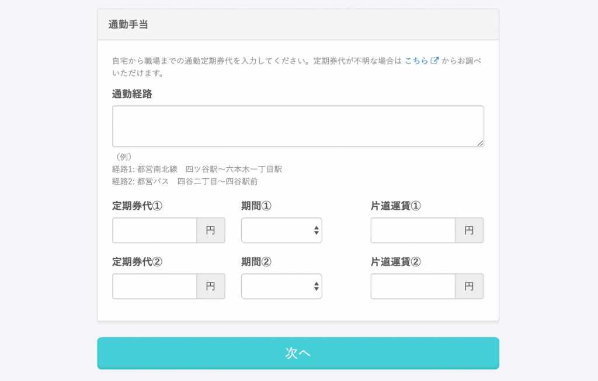
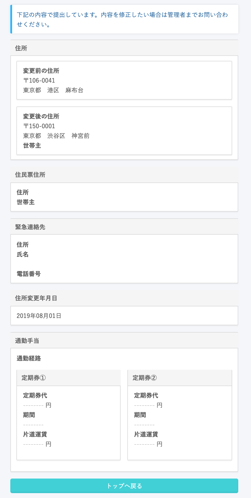

引越しなどの際、従業員から住所変更の手続きを申請する方法を説明します。

# 1\. トップページの［住所変更の手続き］をクリック

# 2\. 住所変更に関する情報を入力

引越し日や、新しい住所、引越し後の通勤手当などの情報を入力します。

必要な情報を入力し、最下部にある **［次へ］** をクリックすると、管理者に情報が提出されます。

申請が終わると、トップページの **［手続きToDo一覧］** に **［管理者確認中］** として表示されます。

