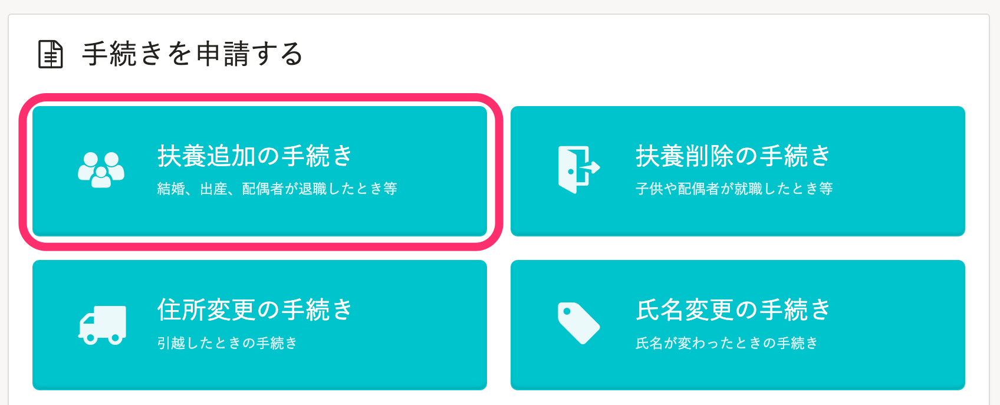
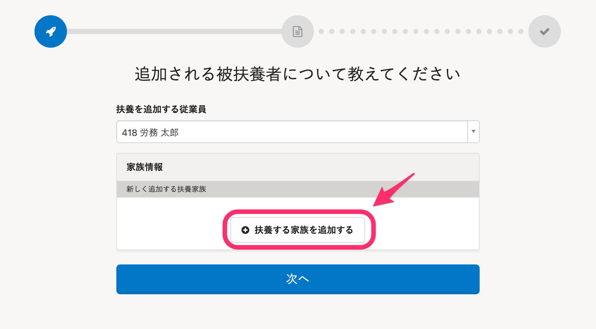
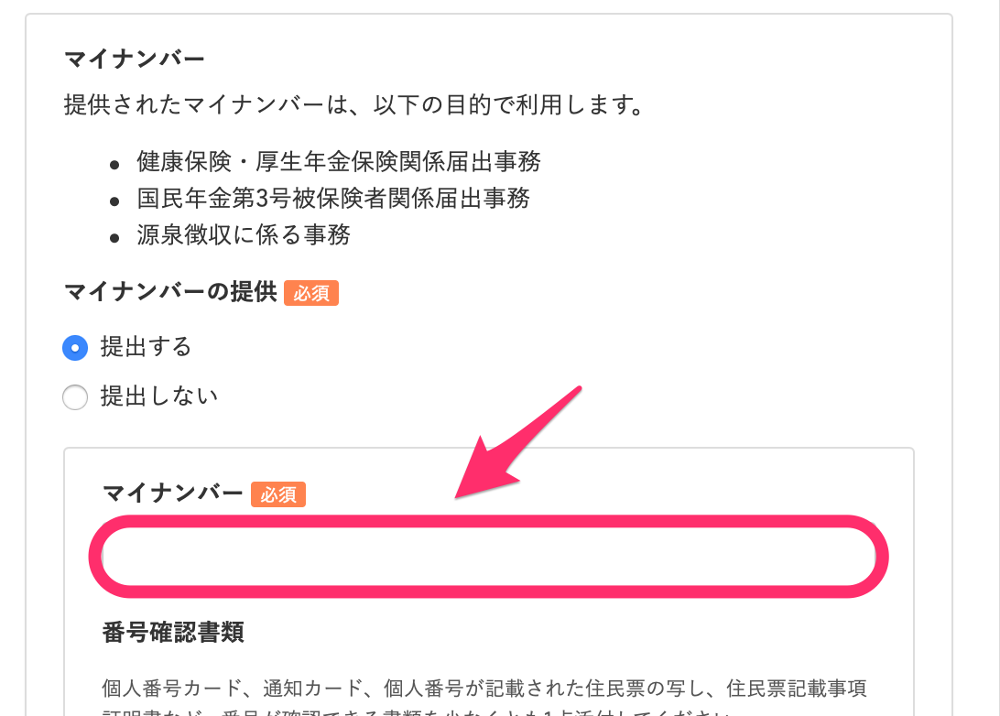
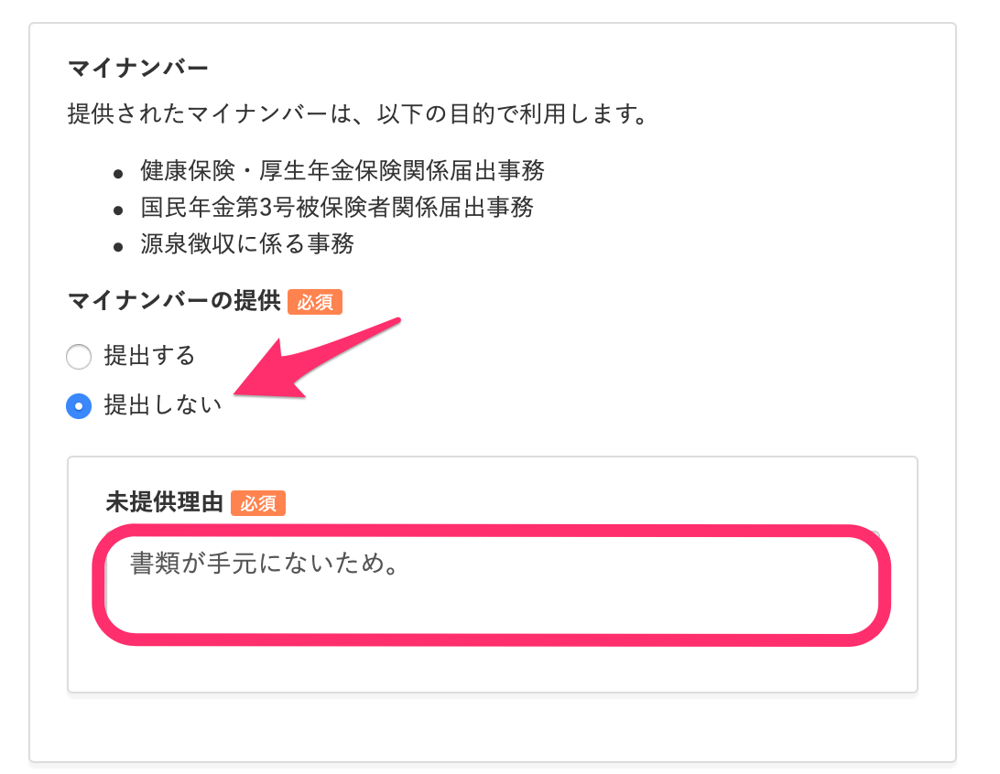
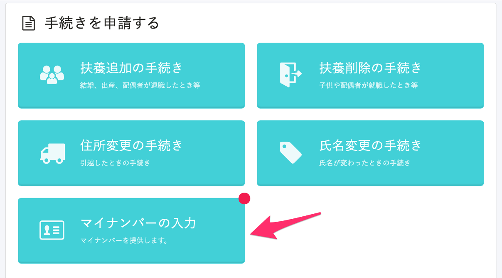
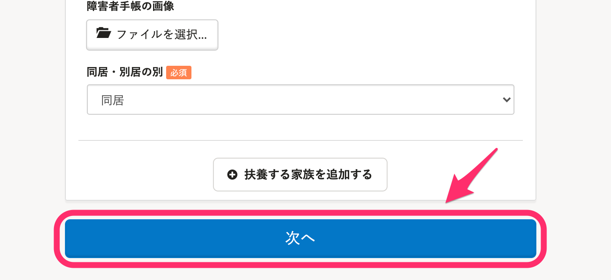
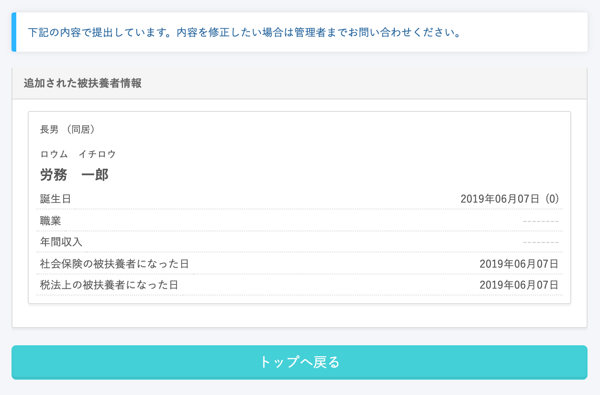
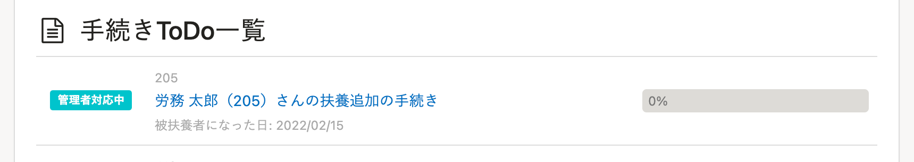

結婚や出産などの際、従業員が扶養追加の手続きを申請する方法を説明します。

:::tips
**控除対象でない扶養家族**も、扶養追加の手続きを申請してください。
[Q.「控除対象でない16歳未満の扶養家族」も、扶養家族として登録すべきですか？](https://knowledge.smarthr.jp/hc/ja/articles/4412123017369)
:::

# 1\. トップページの［扶養追加の手続き］をクリック

トップページにある **［扶養追加の手続き］** をクリックすると、手続きが開始されます。

# 2\. 追加する被扶養者情報を入力する

 **［扶養する家族を追加する］** をクリックすると、追加する被扶養者情報の入力欄が表示されるので、必要な情報を入力してください。

管理者が「被扶養者追加手続きの際にマイナンバーの提供を依頼する」という設定をしている場合、
マイナンバーの入力欄が表示されます。

:::tips
 **［提供しない］** を選択した後も、トップページの **［マイナンバーの入力］** からいつでも提供できます。
マイナンバーが手元にない場合など手続きの申請と一緒に提供できないときは、一旦 **［提供しない］** を選択し、
 **［未提供理由］** を記入して提出してください。

SmartHRトップページに **［マイナンバーの入力］** が表示され、クリックすると **［マイナンバー入力］** 画面に移動します。

:::

# 3\. 被扶養者情報を提出する

必要な情報を入力し、最下部にある **［次へ］** をクリックすると、管理者に情報が提出されます。

提出した被扶養者情報の内容が表示されます。

申請は以上で終了です。

申請が終わると、トップページの **［手続きToDo一覧］** に **［管理者対応中］** またはご加入のプランによって **［管理者確認中］** と表示されます。

