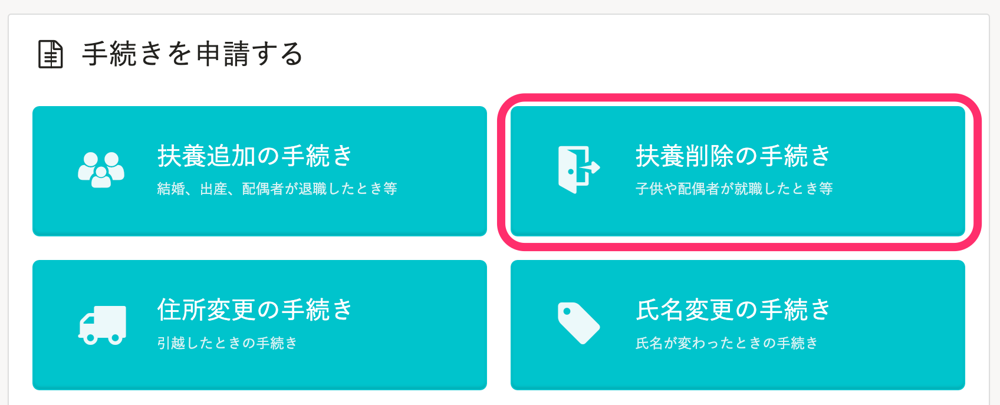
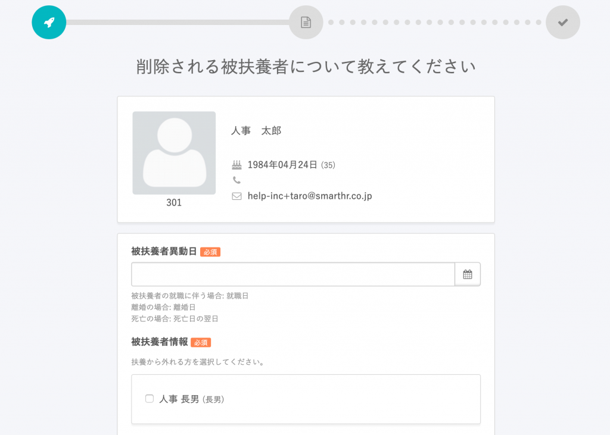
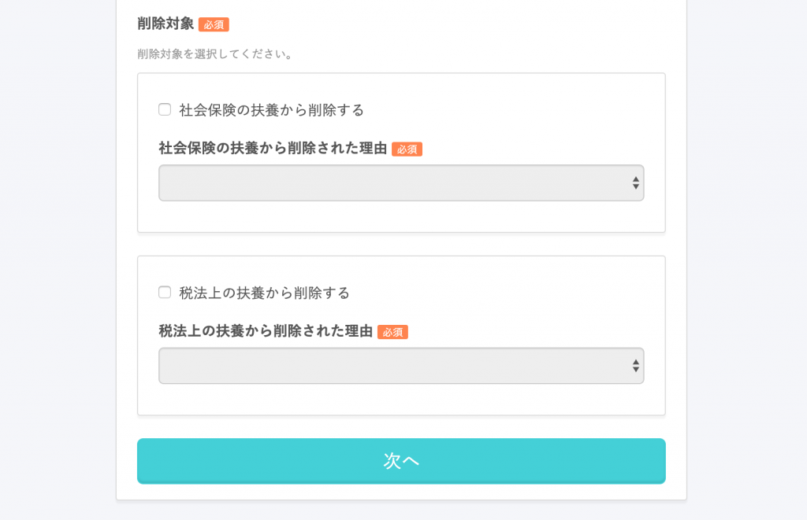
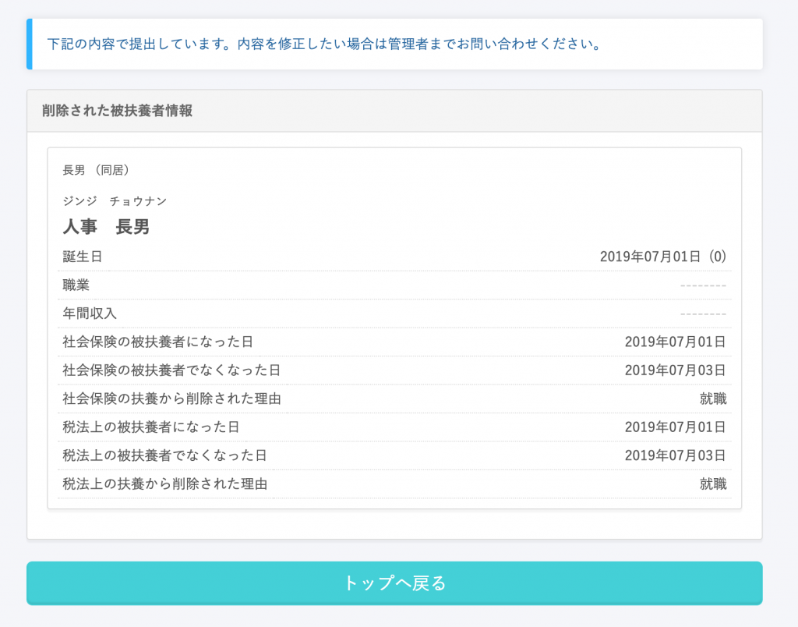
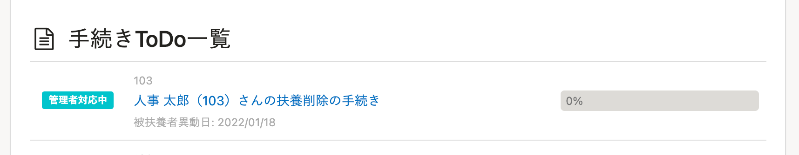

子供や配偶者の就職などの際、従業員から扶養削除の手続きを申請する方法を説明します。

# 1\. トップページから［扶養削除の手続き］をクリック

# 2\. 削除する被扶養者の情報を入力

被扶養者の異動日（就職の場合は就職日）や、異動する被扶養者の情報、「社会保険の被扶養者」「税法上の被扶養者」のどちらの扶養から削除するか、などの情報を入力します。

必要な情報を入力し、最下部にある「次へ」をクリックすると、管理者に情報が提出されます。

申請が終わると、トップページの **［手続きToDo一覧］** に **［管理者確認中］** として表示されます。

