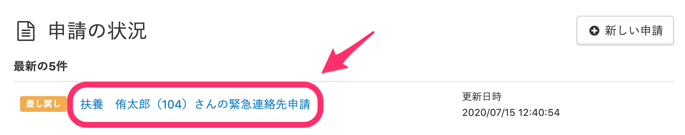
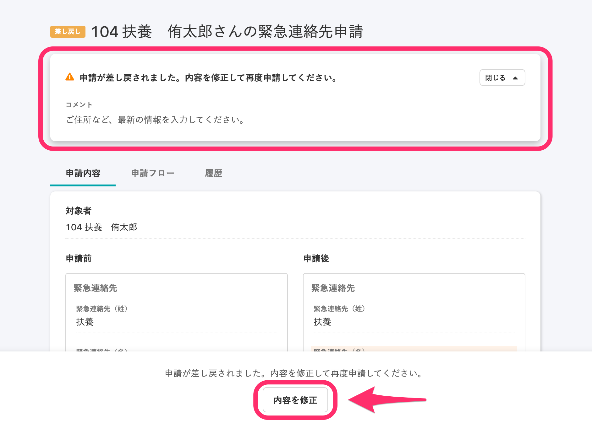
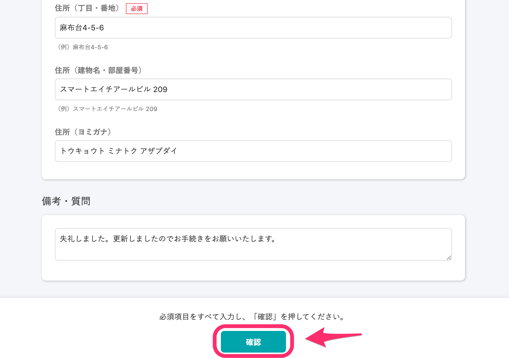
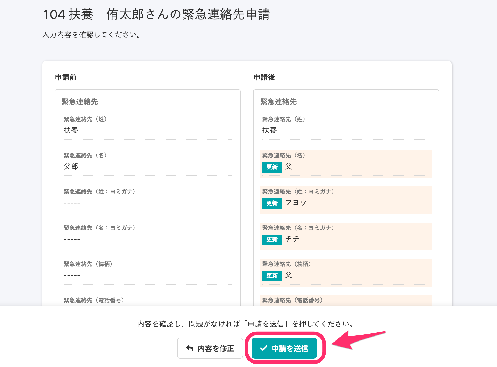

提出した申請に対して、管理者から差し戻しがあった場合の対応方法です。

※管理者から申請依頼（初回）があった場合は、下記のページを参照してください。

[申請依頼が届いたら](https://knowledge.smarthr.jp/hc/ja/articles/360026103854)

# 1\. ［申請の状況］で［差し戻し］になっている申請名をクリック

管理者から申請の差し戻しがあった場合、トップページの  **［申請の状況］**  欄に表示されている申請のステータスが **［差し戻し］**  になります。

ステータスが  **［差し戻し］**  になっている申請名をクリックすると、申請の詳細画面に移動します。

# 2\. 依頼者のコメントを確認し、［内容を修正］をクリック

申請の詳細画面上部に、依頼者からのコメントが表示されています。

内容を確認し、画面下部の **［内容を修正］** をクリックすると、修正画面に移動します。

# 3\. 内容を修正し、［確認］をクリック

内容を修正し、画面下部の **［確認］**  をクリックすると、申請の確認画面に移動します。

# 4\. 内容を確認し、［申請を送信］をクリック

内容を確認し、問題がなければ、画面下部の **［申請を送信］** をクリックしてください。

送信すると、申請のステータスは **［承認待ち］** になります。

その後、管理者側の承認対応が完了すると、ステータスは **［完了］** になります。

ステータスについては下記のページを参照してください。

[【一覧】申請・承認機能のステータス](https://knowledge.smarthr.jp/hc/ja/articles/360026262433)

:::tips
管理者から差戻しがあった場合、トップページを確認するほかに、以下の方法で確認できます。
■  **［通知履歴］で確認する** 
SmartHRにある **［通知履歴］** で確認する場合、画面右上の数字が書かれたアイコンをクリックすると開きます。

■ **通知メールで確認する**
 **［個人設定］ > ［メールアドレス設定］**  に登録しているメールアドレス宛に届く、通知メールで確認できます。
:::
