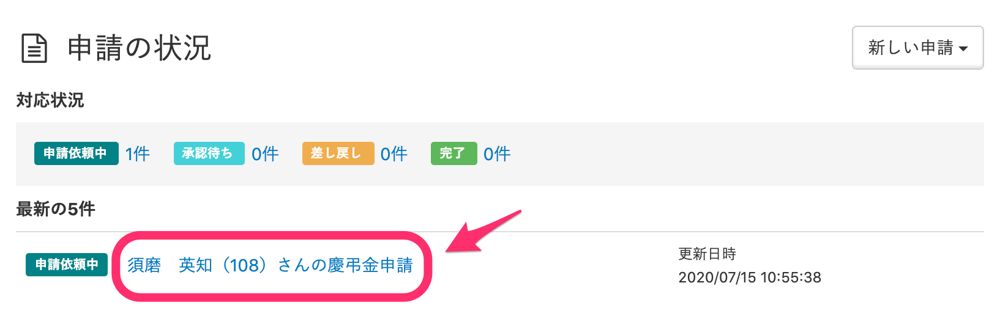
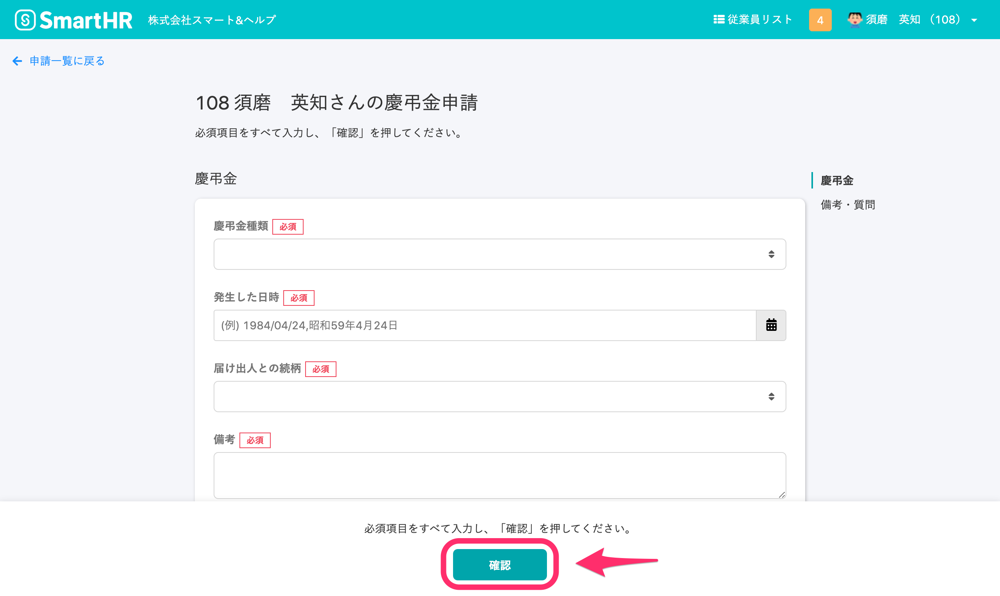
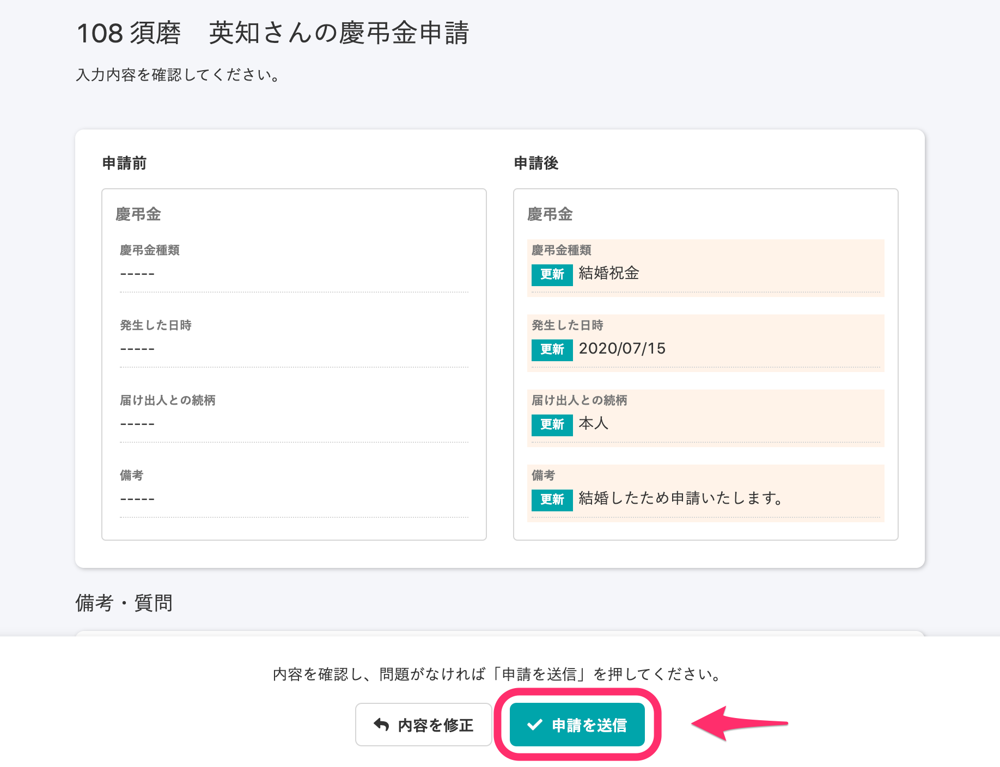
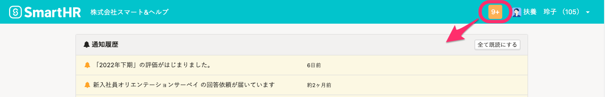

管理者から申請依頼があった場合の従業員側の対応方法です。

※管理者から差し戻しがあった場合は下記のページを参照してください。

[申請が差し戻されたら](https://knowledge.smarthr.jp/hc/ja/articles/360026262373)

# 1\. ［申請の状況］の申請名をクリック

管理者から申請の依頼があった場合、トップページの  **［申請の状況］** 欄に申請フォームへのリンクが表示されます。

申請名のリンクをクリックすると、入力フォームが表示されます。

# 2\. フォームを入力し、［確認］をクリック

フォームに必要な情報を入力し、画面下部の  **［確認］** をクリックしてください。

 **［確認］** をクリックすると、入力内容の確認画面が表示されます。

# 3\. 内容を確認し、［申請を送信］をクリック

入力内容の確認画面では、左側に申請前の情報、右側に申請後の情報が表示され、比較できます。

変更箇所は緑の更新マーク、削除した箇所は赤の削除マークが表示されます。

内容を確認し、問題がなければ  **［申請を送信］**  をクリックしてください。

申請を送信すると、申請のステータスは  **［承認待ち］**  になります。

その後、管理者の承認対応が完了すると、ステータスは  **［完了］**  になります。

ステータスについては下記のページを参照してください。

[【一覧】申請・承認機能のステータス](https://knowledge.smarthr.jp/hc/ja/articles/360026262433)

:::tips
管理者から依頼があった場合、手順1のほかに、以下の方法で確認できます。
**■［通知履歴］で確認する**
SmartHRにある **［通知履歴］**  で確認する場合、画面右上の数字が書かれたアイコンをクリックすると開きます。

**■通知メールで確認する**
 **［個人設定］ > ［メールアドレス設定］**  に登録しているメールアドレス宛に届く、通知メールで確認できます。
:::
