管理者が従業員に任意のタイミングでの「扶養しない家族の追加・編集・削除」申請を許可している場合、トップページの **［新しい申請］** ボタンから申請画面へ移動し、 **［扶養しない家族の追加・編集・削除］** を選択して **［次へ］** をクリックすると申請を始められます。

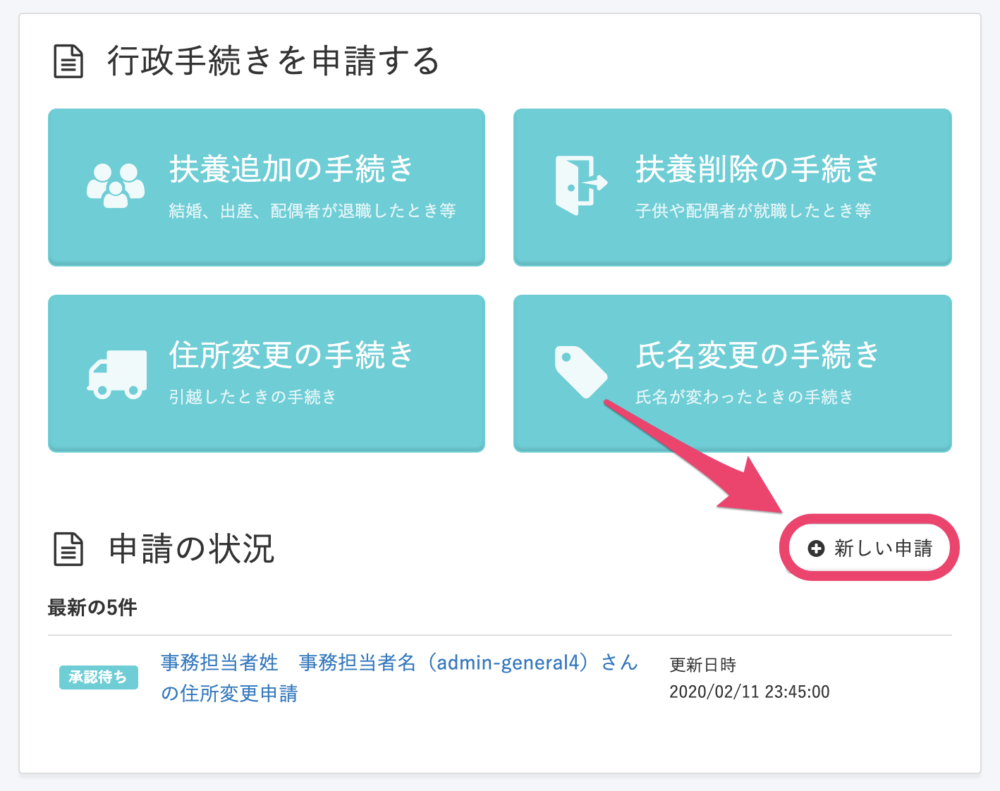

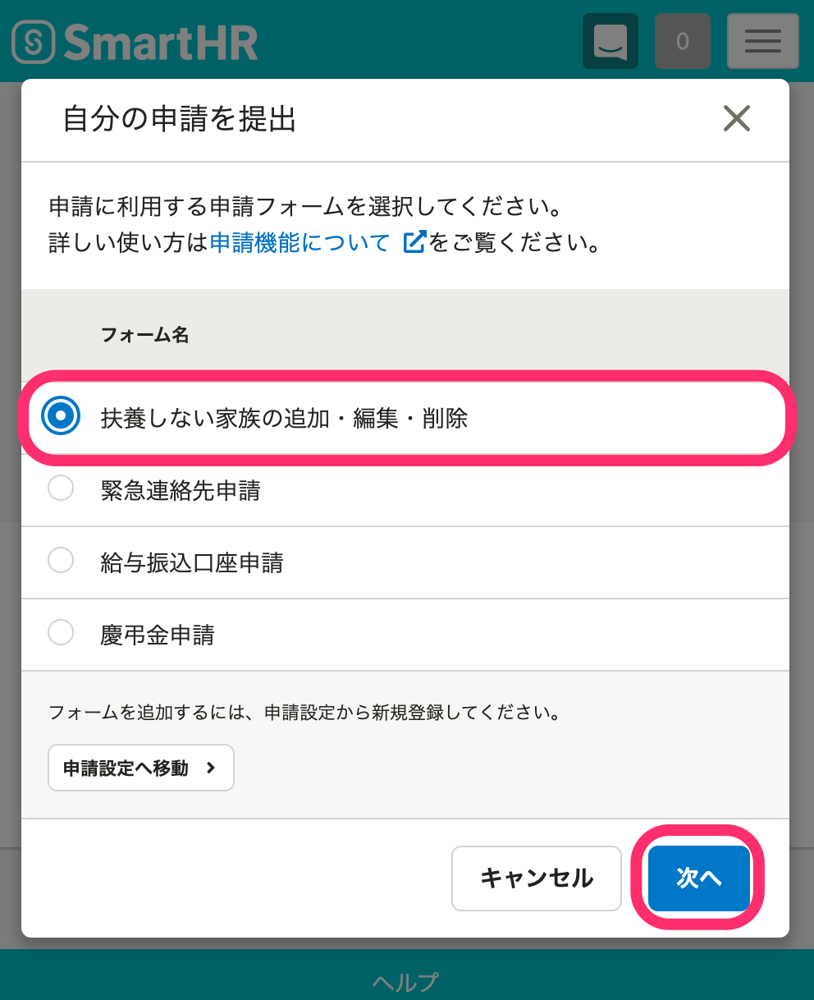

# 扶養しない家族の情報を追加する

扶養しない家族を追加する場合は、 **［家族を追加する］** をクリックします。

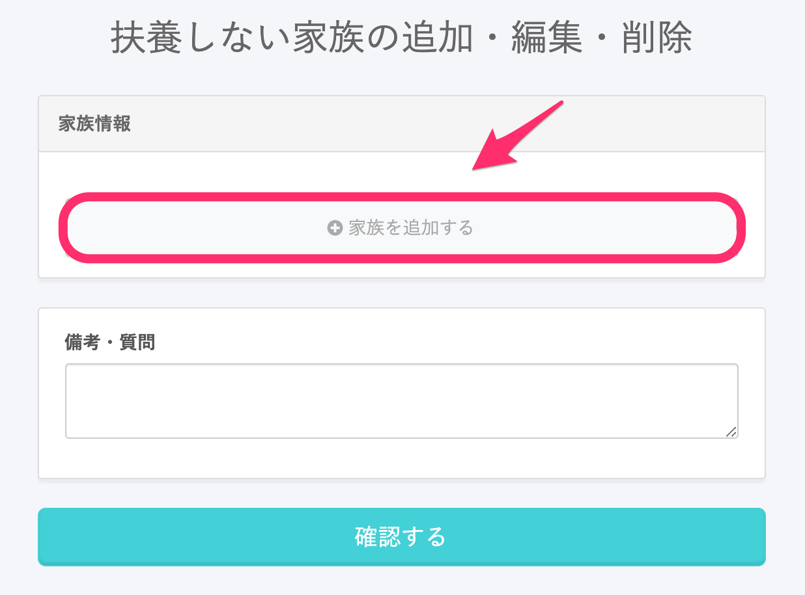

追加したい家族情報を入力し、画面下部にある **［確認する］** をクリックしてください。

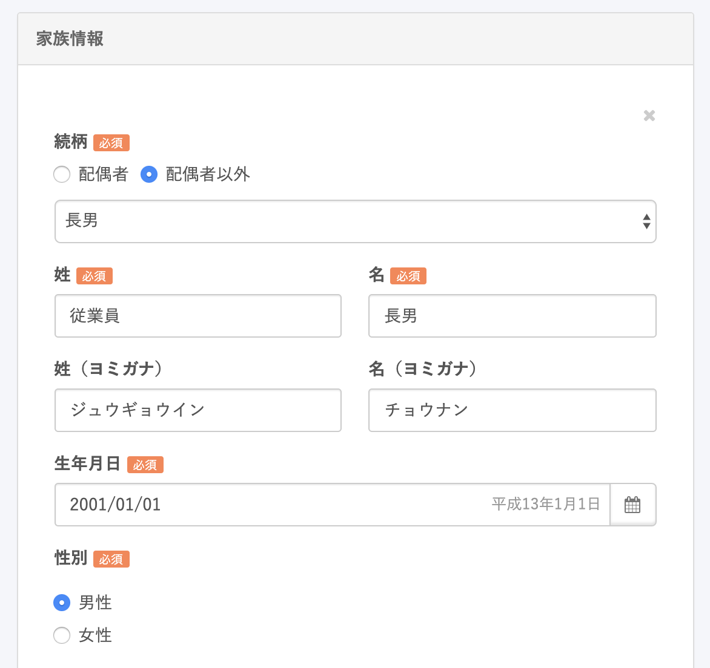

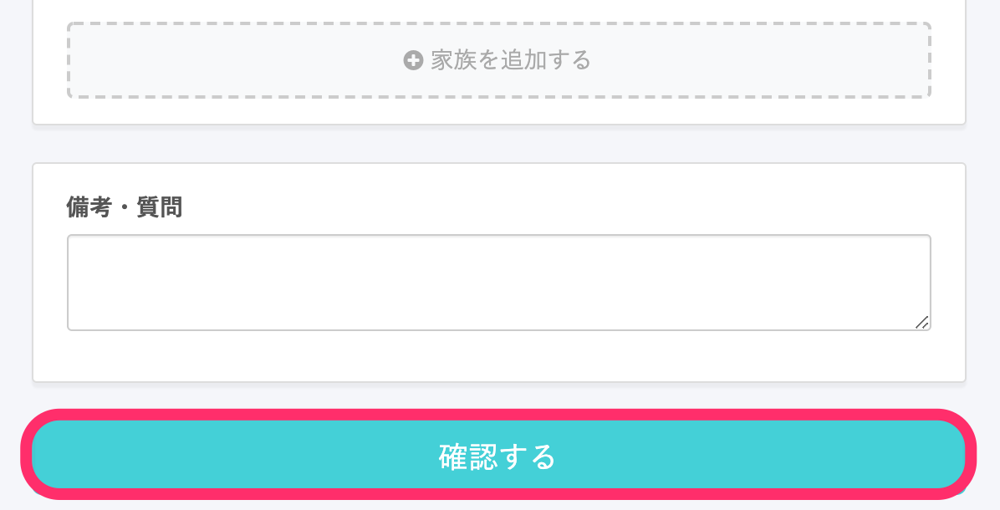

確認画面で、追加する家族情報の確認ができます。

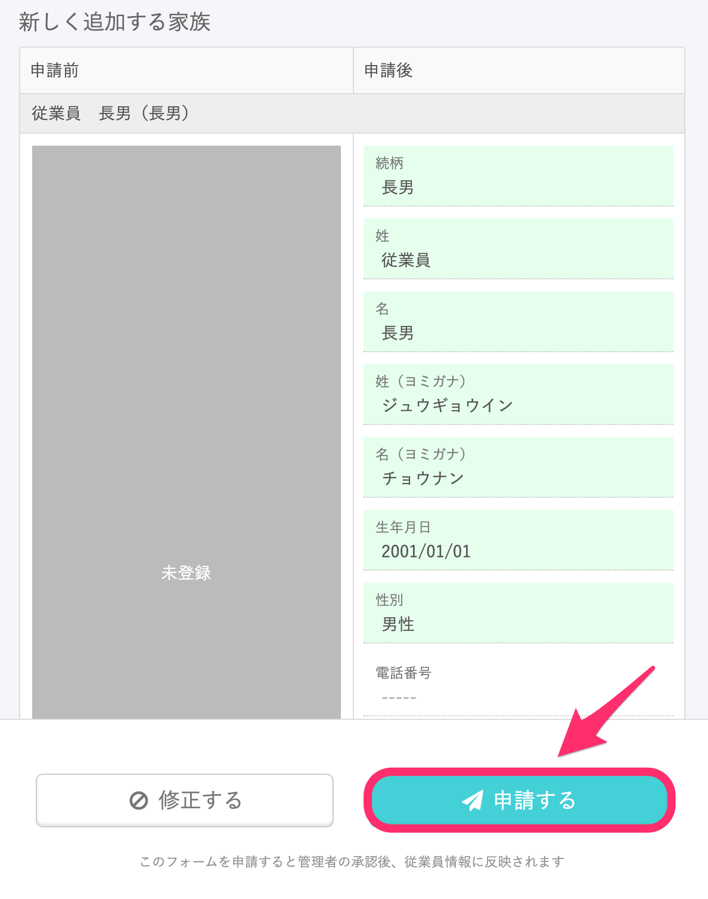

問題がなければ **［申請する］** をクリックし、管理者に提出してください。

# 扶養しない家族の情報を編集する

既に登録されている家族情報がある場合は、フォームに入力された状態で表示されます。

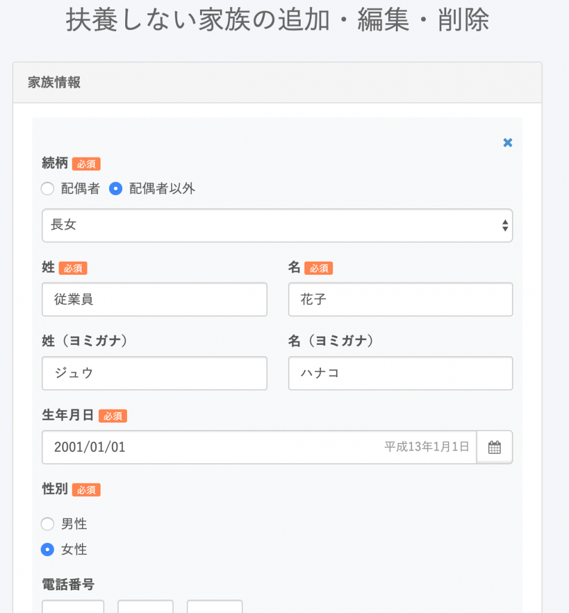

修正したい内容に変更し、画面下部にある **［確認する］** をクリックしてください。

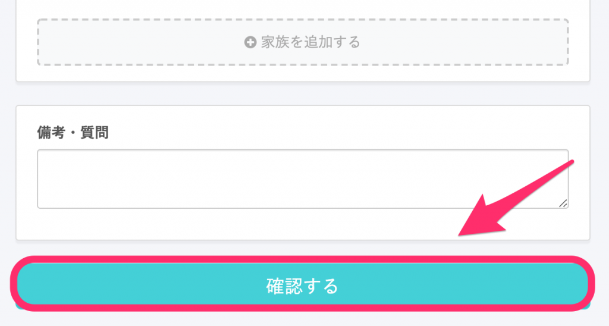

確認画面で、家族ごとに変更点の確認ができます。

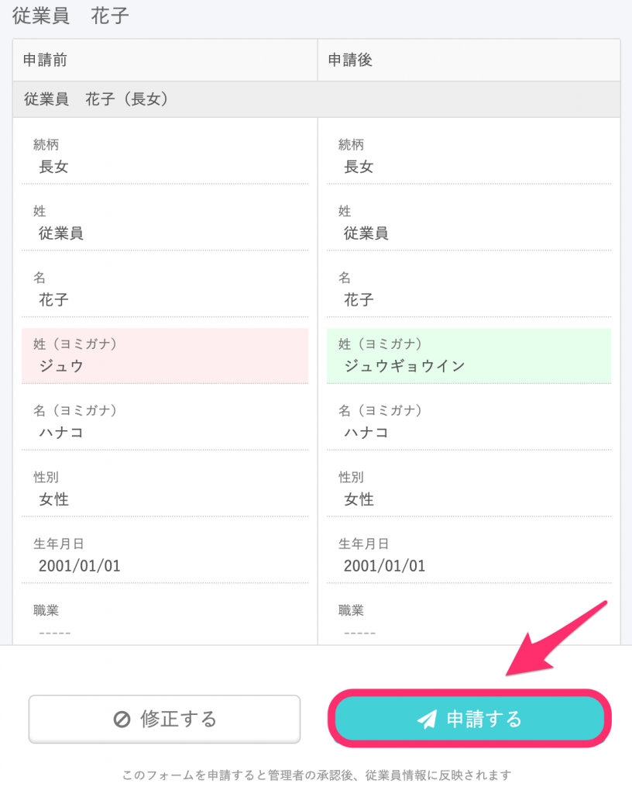

問題がなければ **［申請する］** をクリックし、管理者に提出してください。

# 扶養しない家族の情報を削除する

登録済みの家族情報を削除する場合は、 **［家族情報］** 欄の右上にある **［×］** をクリックします。

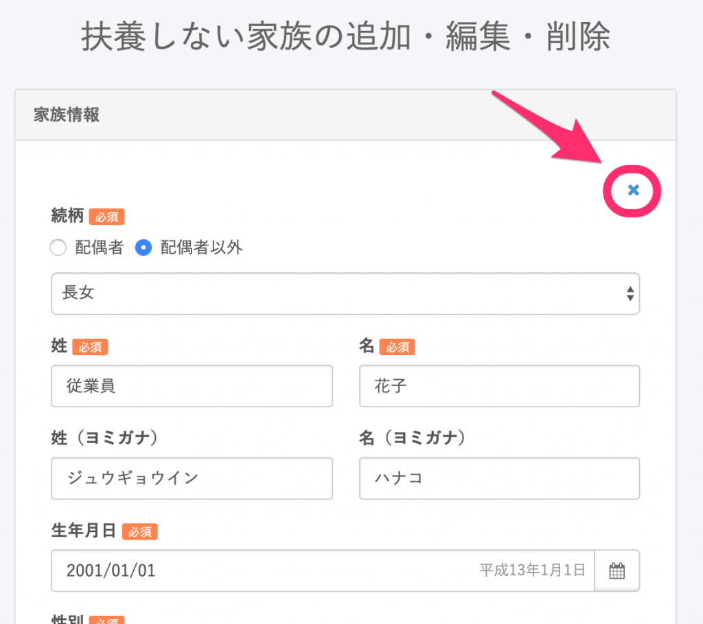

家族情報が削除する表示に切り替わったのを確認し、画面下部にある **［確認する］** をクリックしてください。

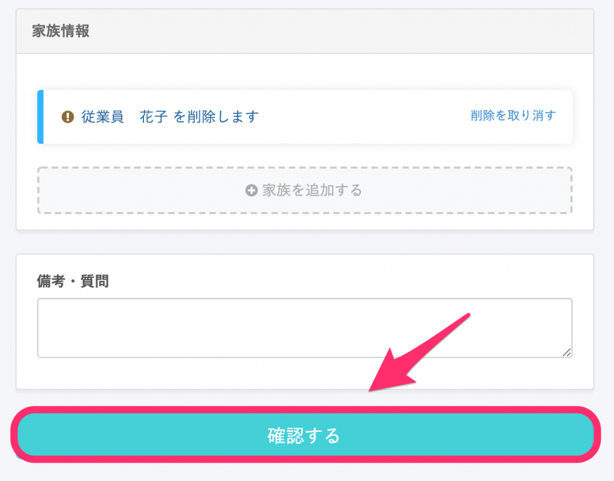

確認画面で、削除する家族情報の確認ができます。

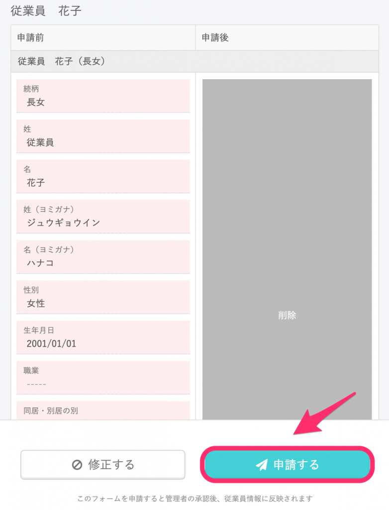

問題がなければ **［申請する］** をクリックし、管理者に提出してください。
