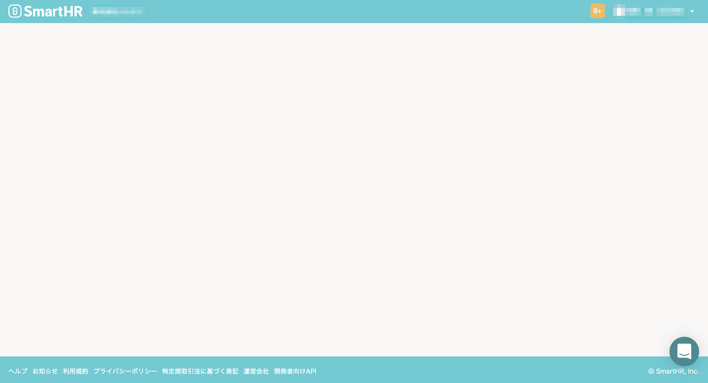
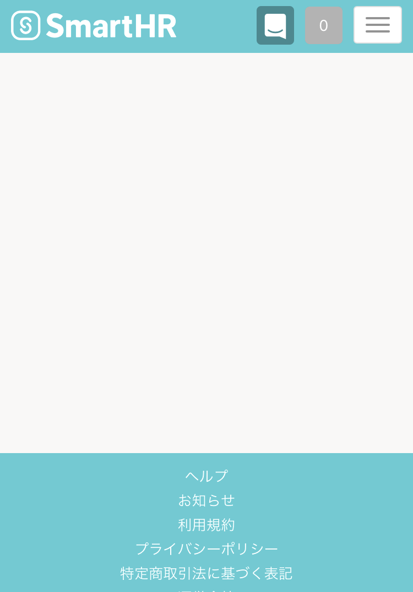

# A. ご利用中の環境がSmartHRの動作環境かどうか確認してください

下記のような真っ白な画面が表示された場合、動作環境外の端末やブラウザでSmartHRにアクセスしている可能性があります。

ご利用中の環境を確認のうえ、ブラウザを最新版にアップデートしてください。

[SmartHRの動作環境は？](https://knowledge.smarthr.jp/hc/ja/articles/360035170054)

PC

スマートフォン

