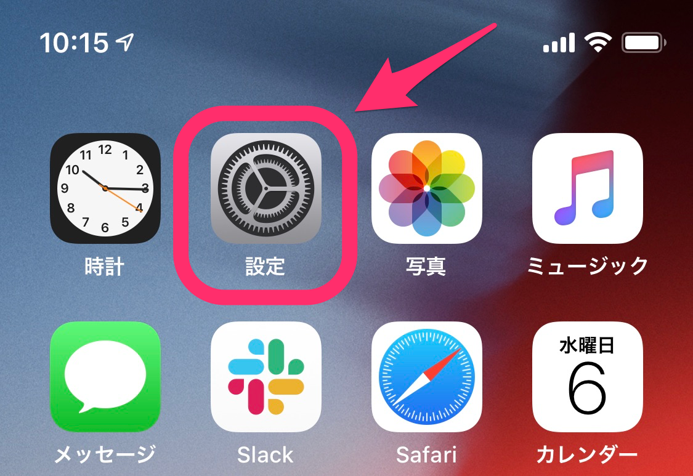
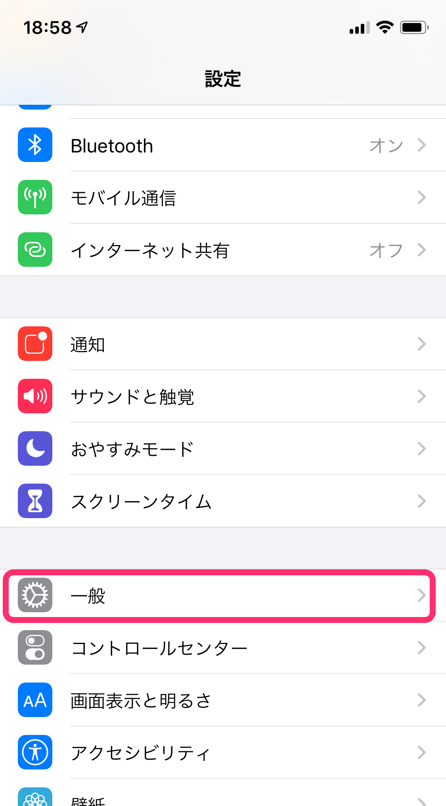
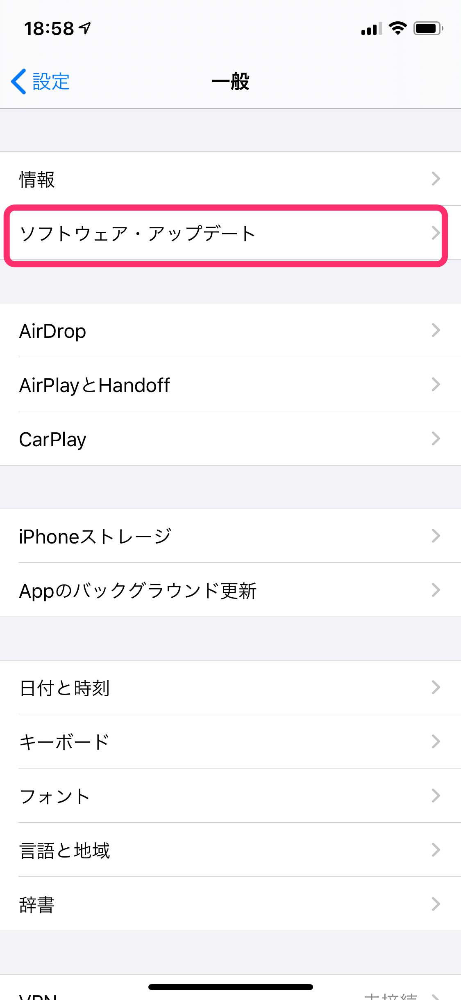
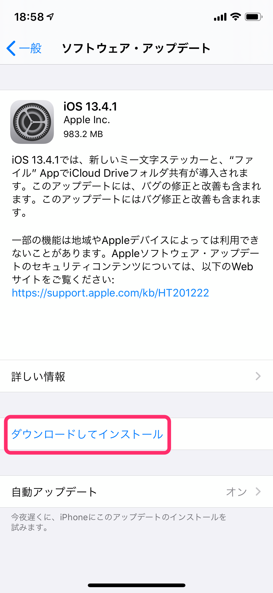

SmartHRをiPhoneで利用する際の動作環境のブラウザは、最新版のSafariです。

最新版のSafariを利用するためには、iOSを最新版にする必要があります。

ここでは、iOSを最新版にする方法を紹介します。

バージョンによっては画面の表示などが違う場合があります。ご了承ください。

# ⒈ \[設定\] をタップ

ホーム画面にある **\[設定\] アイコン** をタップします。

# 2\. \[一般\] をタップ

**\[設定\]** のメニューにある、 **\[一般\]** をタップしてください。

# 3\. \[ソフトウェア・アップデート\] をタップ

**\[一般\]** の項目で、 **\[ソフトウェア・アップデート\]** をタップしてください。

# 4\. \[ダウンロードしてインストール\] をタップ

画面の下部にある **\[ダウンロードしてインストール\]** をタップします。

その後は、画面の表示内容に従ってインストールを行ってください。
