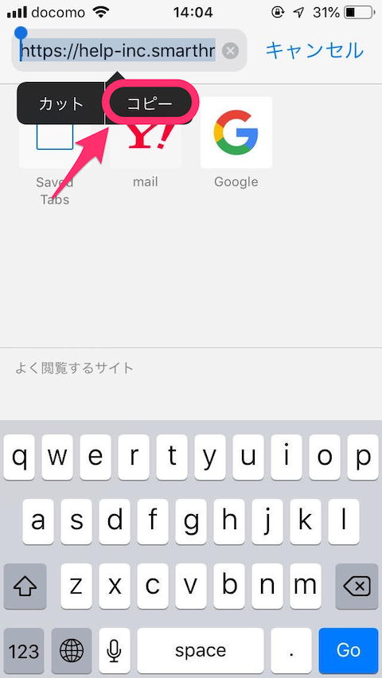

お問い合わせいただく際、現在ブラウザで表示しているURLを教えていただくと、原因の特定に大変参考になります。

スマートフォンでURLをコピーする方法は、ご利用のスマートフォン・ブラウザの種類により異なりますので、Chrome（Android）、Chrome（iPhone）、Safari（iPhone）の順にご案内します。

# **Chrome（Android）の場合**

ブラウザ上部に表示されるアドレスバーをタップします。

タップすると表示される画面にある、四角いアイコンを押すとURLがコピーされます。

# **Chrome （iPhone）の場合**

iPhoneでChromeを使用している場合も同じく、ブラウザ上部のアドレスバーをタップします。

タップするとURLが全選択され、メニューが表示されます。

真ん中の **\[コピー\]** をタップすると、URLがコピーできます。

# **Safari（iPhone）の場合**

ブラウザ上部のアドレスバーをタップすると、URLが全選択されます。

次に表示されるメニューから **\[コピー\]** を選択すると、URLをコピーできます。

