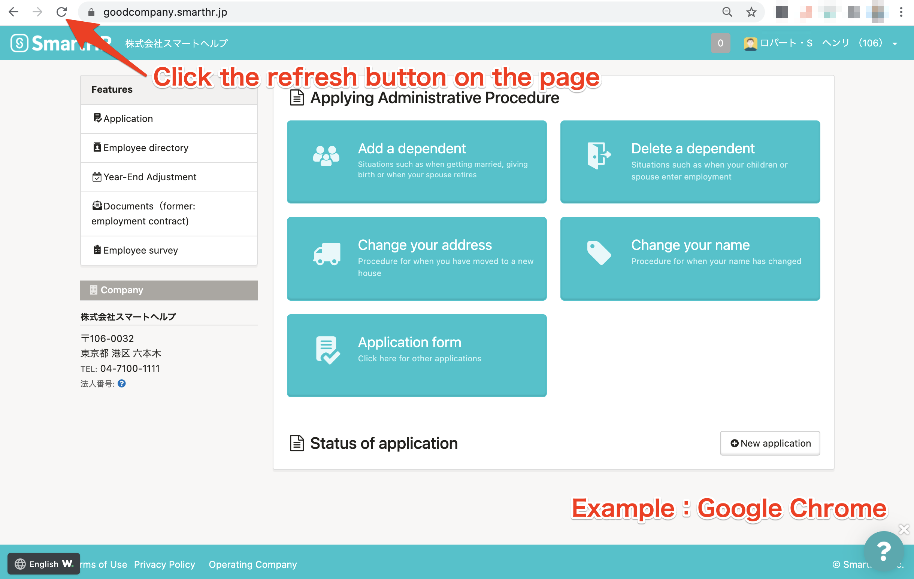
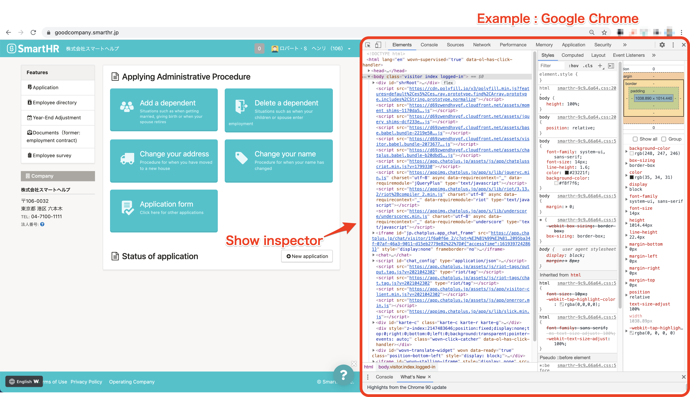
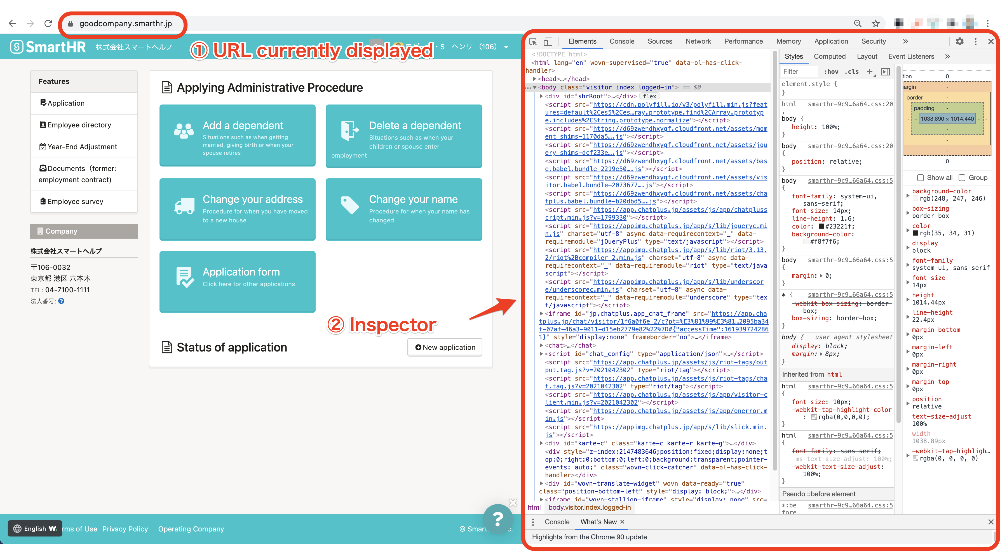

Please check that the language settings of the device and browser you are using have been set to a language other than Japanese.

If there are no problems with the language settings, try refreshing the page and deleting the browser's cache and cookies.

# Checking the language settings

The language settings of the device and browser you are using must be set to a language other than Japanese to use the multilingual display.

Please check the settings using the methods below.

## Google Chrome

Please check your browser’s language settings after looking at the following help page.

[Change your language on the web ｜ Google Account Help](https://support.google.com/accounts/answer/32047?hl=en) 

## Safari

Display the language set on the device you are using.

Please check the language settings on the device after looking at the following help pages.

### For iPhone and iPad

[Change the language on your iPhone, iPad, or iPod touch ｜ Apple Support](https://support.apple.com/en-us/HT204031)

### For Mac

[Change the language your Mac uses ｜ macOS User Guide](https://support.apple.com/us-en/guide/mac-help/mh26684/mac)

## Firefox

Please check your browser’s language settings after looking at the following help page.

[Use Firefox in another language ｜ Firefox Help](https://support.mozilla.org/en-US/kb/use-firefox-another-language?redirectslug=use-firefox-interface-other-languages-language-pack&redirectlocale=en)

## Microsoft Edge

Display the language set on the device you are using.

Please check the language settings on the device after looking at the following help page.

[Use Microsoft Edge in another language ｜ Microsoft Edge help & learning](https://support.microsoft.com/en-us/microsoft-edge/use-microsoft-edge-in-another-language-4da8b5e0-11ce-7ea4-81d7-4e332eec551f)

# Refreshing the page

Update the browser you are using and then try refreshing the page.

Multilingual display may not have loaded because it took some time for the page to open.

# Deleting the browser's cache and cookies

Please delete the browser's cache and cookies and then check the displayed content again.

## Google Chrome

[Clear cache & cookies ｜ Google Account Help](https://support.google.com/accounts/answer/32050?co=GENIE.Platform&hl=en)

## Safari

### For iPhone and iPad

[Clear the history and cookies from Safari on your iPhone, iPad, or iPod touch ｜ Apple Support](https://support.apple.com/en-us/HT201265)

### For Mac

[Set up content caching on Mac ｜ macOS User Guide](https://support.apple.com/us-en/guide/mac-help/mchl3b6c3720/mac)

[Manage cookies and website data in Safari on Mac ｜ Safari User Guide](https://support.apple.com/us-en/guide/safari/sfri11471/13.0/mac/10.15)

## Firefox

[How to clear the Firefox cache ｜ Firefox Help](https://support.mozilla.org/en-US/kb/how-clear-firefox-cache)

[Clear cookies and site data in Firefox ｜ Firefox Help](https://support.mozilla.org/en-US/kb/clear-cookies-and-site-data-firefox)

## Microsoft Edge

[View and delete browser history in Microsoft Edge ｜ Microsoft Edge help & learning](https://support.microsoft.com/en-us/microsoft-edge/view-and-delete-browser-history-in-microsoft-edge-00cf7943-a9e1-975a-a33d-ac10ce454ca4)

[Delete cookies in Microsoft Edge ｜ Microsoft Edge help & learning](https://support.microsoft.com/en-us/microsoft-edge/delete-cookies-in-microsoft-edge-63947406-40ac-c3b8-57b9-2a946a29ae09)

# If attempting all of the above does not resolve the problem

An error may have occurred. Please provide an administrator with details about the situation and have them contact SmartHR.

In addition, if you are using SmartHR from a computer, take a screenshot using the following procedure and attach it to the inquiry to make it easier for us to identify the cause of the problem.

## How to take a screenshot of the screen and the inspect tool

### 1\. Open the page on which multilingual display does not work correctly and enter the following command

- For Mac: "option" + "command" + "i"
- For Windows: "shit" + "control" + "i"

Enter the command to display the inspect tool on the screen.

### 2\. Take a screenshot

Please see the following help page for how to take a screenshot.

[Take a screenshot on your Mac ｜ Apple Support](https://support.apple.com/en-us/HT201361)

[How to take and annotate screenshots on Windows 10 ｜ Windows help & learning](https://support.microsoft.com/en-us/windows/how-to-take-and-annotate-screenshots-on-windows-10-ca08e124-cc30-2579-3e55-6db63e36fbb9)

Please take the screenshot so we can see both the currently displayed URL and the inspect tool as shown below.

