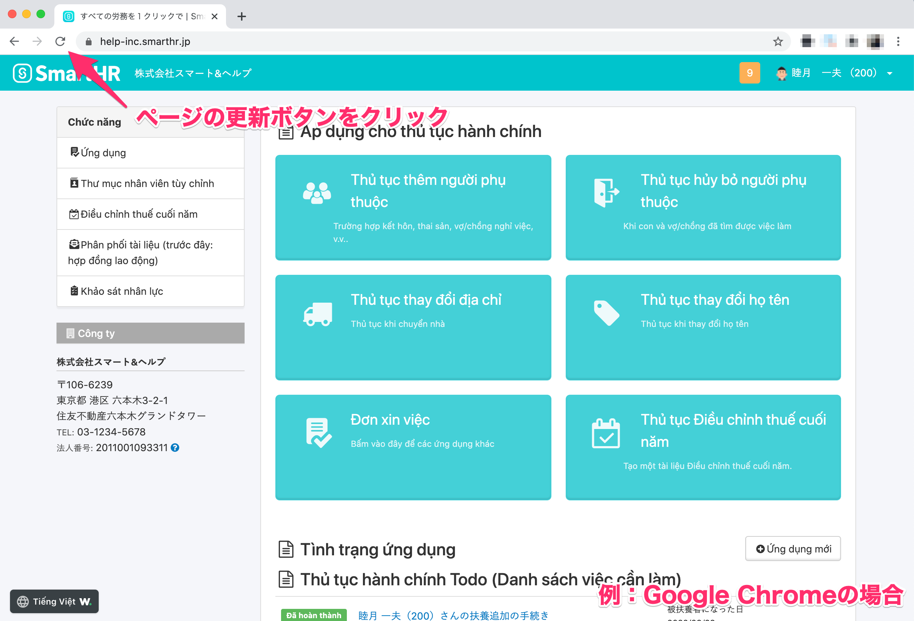
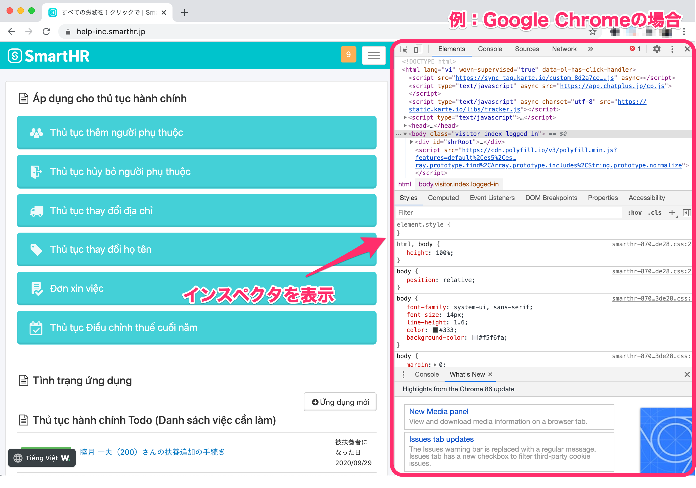
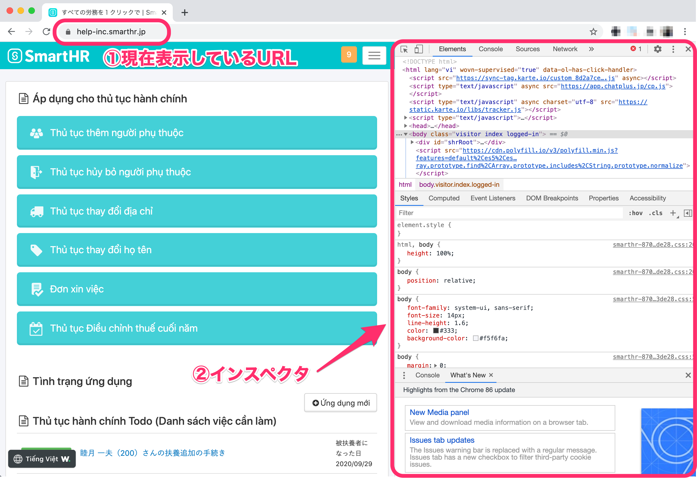

利用しているブラウザや端末の言語設定が「日本語以外」になっているか確認してください。

言語設定に問題がない場合は、ページの更新や、ブラウザのキャッシュとクッキー削除をお試しください。

# 言語設定を確認する

多言語表示を利用するには、利用しているブラウザや端末の言語設定が「日本語以外」になっている必要があります。

以下の方法で設定を確認してください。

## Google Chrome

以下のヘルプページをご覧のうえ、ブラウザの言語設定を確認してください。

[言語を変更する｜Google アカウント ヘルプ](https://support.google.com/accounts/answer/32047?hl=ja)

## Safari

ご利用の端末で設定している言語を表示します。

以下のヘルプページをご覧のうえ、端末の言語設定を確認してください。

### iPhone、iPadの場合

[iPhone、iPad、iPod touch で言語を変更する｜Apple サポート](https://support.apple.com/ja-jp/HT204031)

### Macの場合

[Macの言語を変更する｜macOSユーザガイド](https://support.apple.com/ja-jp/guide/mac-help/mh26684/mac)

## Firefox

以下のヘルプページをご覧のうえ、ブラウザの言語設定を確認してください。

[言語パックで Firefox のインターフェイスを他の言語にする｜Firefox サポート](https://support.mozilla.org/ja/kb/use-firefox-interface-other-languages-language-pack)

## Microsoft Edge

ご利用の端末で設定している言語を表示します。

以下のヘルプページをご覧のうえ、端末の言語設定を確認してください。

[別の言語で Microsoft Edge を使用する｜Microsoft Edge のヘルプと学習](https://support.microsoft.com/ja-jp/microsoft-edge/%E5%88%A5%E3%81%AE%E8%A8%80%E8%AA%9E%E3%81%A7-microsoft-edge-%E3%82%92%E4%BD%BF%E7%94%A8%E3%81%99%E3%82%8B-4da8b5e0-11ce-7ea4-81d7-4e332eec551f)

# ページを更新する

利用しているブラウザを更新して、ページを再読み込みしてください。

ページの読み込みに時間がかかり、多言語表示がロードできなかった可能性があります。

# ブラウザのキャッシュとクッキーを削除する

ブラウザのキャッシュとクッキーを削除して、再度、表示内容を確認してください。

## Google Chrome

[キャッシュと Cookie の消去｜Google アカウント ヘルプ](https://support.google.com/accounts/answer/32050?co=GENIE.Platform%3DDesktop&hl=ja)

## Safari

### iPhone、iPadの場合

[iPhone、iPad、iPod touch で Safari から閲覧履歴と Cookie を消去する｜Apple サポート](https://support.apple.com/ja-jp/HT201265)

### Macの場合

[Macでコンテンツキャッシュを設定する｜macOSユーザガイド](https://support.apple.com/ja-jp/guide/mac-help/mchl3b6c3720/mac)

[MacのSafariでCookieとWebサイトのデータを管理する｜macOSユーザガイド](https://support.apple.com/ja-jp/guide/safari/sfri11471/13.0/mac/10.15)

## Firefox

[Firefox のキャッシュを消去するには｜Firefox サポート](https://support.mozilla.org/ja/kb/how-clear-firefox-cache)

[Firefox に保存された Cookie とサイトデータを消去する｜Firefox サポート](https://support.mozilla.org/ja/kb/clear-cookies-and-site-data-firefox)

## Microsoft Edge

[Microsoft Edge の閲覧履歴を表示または削除する｜Microsoft Edge のヘルプと学習](https://support.microsoft.com/ja-jp/microsoft-edge/microsoft-edge-%E3%81%AE%E9%96%B2%E8%A6%A7%E5%B1%A5%E6%AD%B4%E3%82%92%E8%A1%A8%E7%A4%BA%E3%81%BE%E3%81%9F%E3%81%AF%E5%89%8A%E9%99%A4%E3%81%99%E3%82%8B-00cf7943-a9e1-975a-a33d-ac10ce454ca4)

[Microsoft Edge で Cookie を削除する｜Microsoft Edge のヘルプと学習](https://support.microsoft.com/ja-jp/microsoft-edge/microsoft-edge-%E3%81%A7-cookie-%E3%82%92%E5%89%8A%E9%99%A4%E3%81%99%E3%82%8B-63947406-40ac-c3b8-57b9-2a946a29ae09)

# 上記をすべて試しても解決しない場合

不具合が起きている可能性が考えられるため、管理者さまに状況を共有し、SmartHRへお問い合わせするようお伝えください。

なお、パソコンからSmartHRを利用している場合は、下記の手順でスクリーンショットを取得し、お問い合わせに添付していただけると、原因の特定がスムーズです。

## 画面とインスペクタのスクリーンショット取得方法

### 1\. 多言語表示が正しく表示されないページを開いた状態で、以下コマンドを入力

- Macの場合：「option」+「command」+「i」
- windowsの場合：「shift」+「control」+「i」

コマンドを入力すると、画面上にインスペクタが表示されます。

### 2\. スクリーンショットを取得

スクリーンショットの取得方法は下記ヘルプページをご覧ください。

[Mac でスクリーンショットを撮る｜Apple サポート](https://support.apple.com/ja-jp/HT201361)

[Windows 10 でスクリーンショットを取得してコメントを追加する方法｜Windowsのヘルプと学習](https://support.microsoft.com/ja-jp/windows/windows-10-%E3%81%A7%E3%82%B9%E3%82%AF%E3%83%AA%E3%83%BC%E3%83%B3%E3%82%B7%E3%83%A7%E3%83%83%E3%83%88%E3%82%92%E5%8F%96%E5%BE%97%E3%81%97%E3%81%A6%E3%82%B3%E3%83%A1%E3%83%B3%E3%83%88%E3%82%92%E8%BF%BD%E5%8A%A0%E3%81%99%E3%82%8B%E6%96%B9%E6%B3%95-ca08e124-cc30-2579-3e55-6db63e36fbb9)

スクリーンショットは、下図のように「現在表示しているURL」と「インスペクタ」の2点が確認できるよう取得してください。

