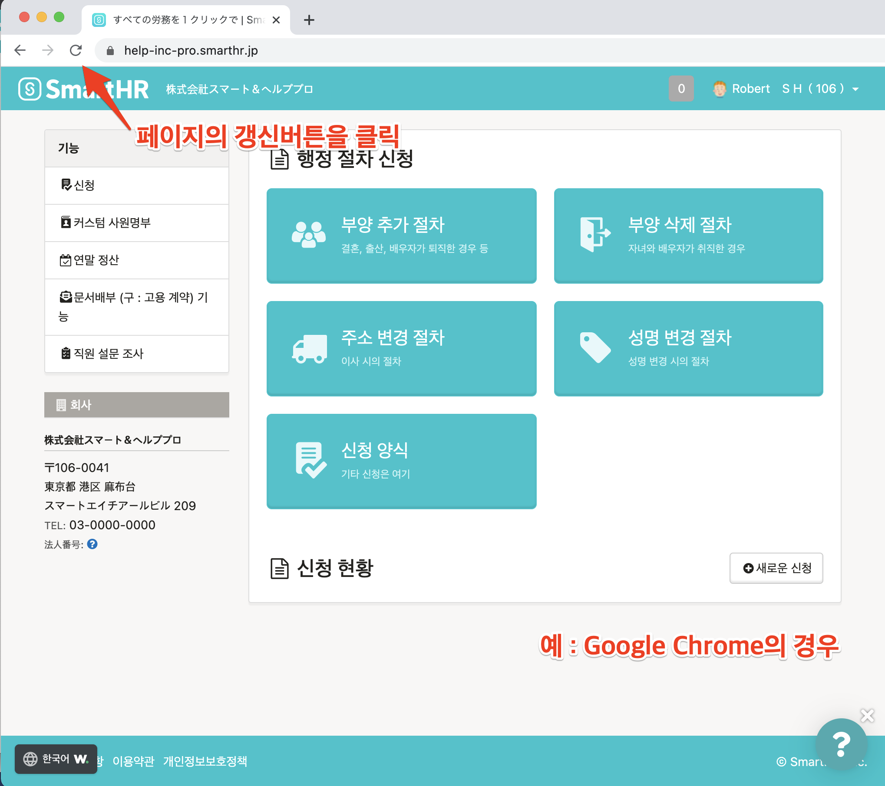
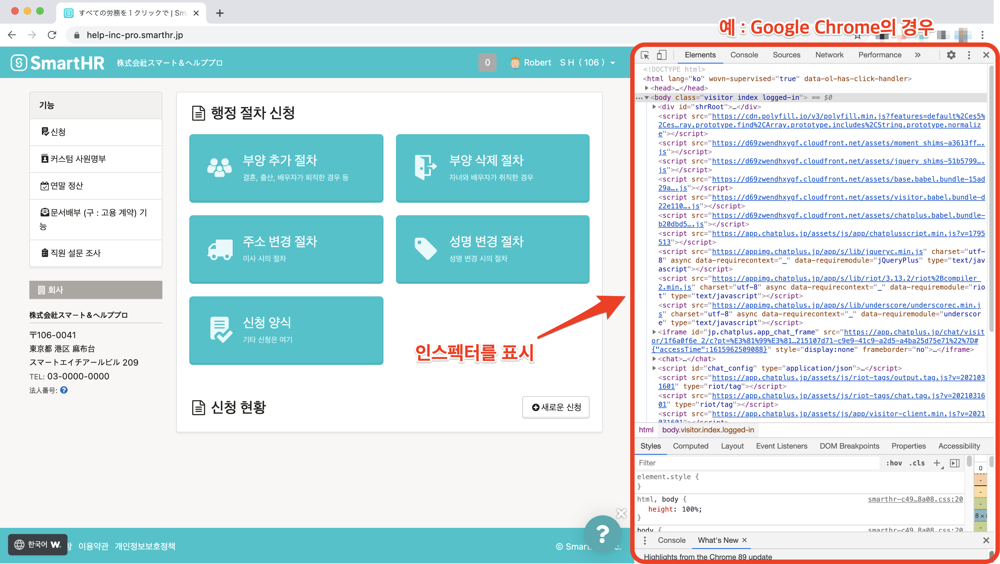
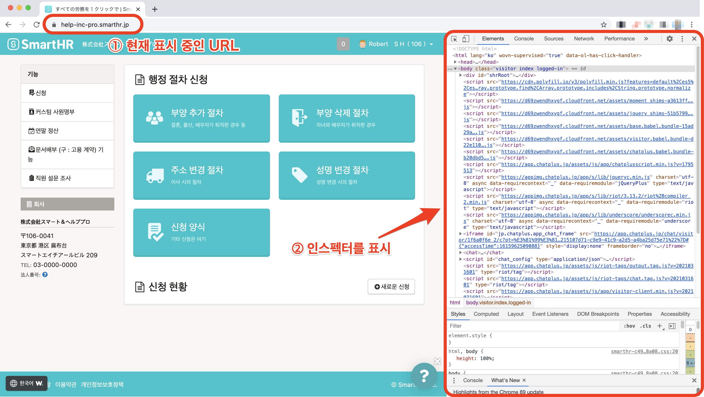

이용하고 있는 브라우저나 단말의 언어설정이 「일본어를 제외한 언어」로 되어 있는지 확인해주세요.

언어설정에 문제가 없는 경우는 페이지의 갱신과 브라우저의 캐쉬와 쿠키 삭제 후 다시 시도해주세요.

# 언어설정을 확인한다

다국어표시기능을 이용할 경우, 브라우저와 단말의 언어설정에서 「일본어를 제외한 언어」로 설정이 필요합니다.

이하의 방법으로 설정을 확인해주세요.

## Google Chrome

하기의 헬프페이지를 확인하여, 브라우저의 언어설정을 확인해주세요.

[언어를 변경한다｜Google 어카운트 도움말](https://support.google.com/accounts/answer/32047?hl=ko)

## Safari

이용 중인 단말에 설정되어있는 언어를 표시합니다.

하기의 헬프페이지를 참고하여, 단말의 언어설정을 확인해주세요.

### iPhone、iPad의 경우

[iPhone、iPad、iPod touch 에서 언어를 변경한다｜Apple 지원](https://support.apple.com/ko-kr/HT204031)

### Mac의 경우

[Mac의 언어를 변경한다｜macOS 사용설명서](https://support.apple.com/ko-kr/guide/mac-help/mh26684/mac)

## Firefox

하기의 헬프페이지를 참고하여, 브라우저의 언어설정을 확인해주세요.

[언어팩을 사용해 다른언어의 Firefox 인터페이스 사용하기｜Firefox 도움말](https://support.mozilla.org/ko/kb/use-firefox-interface-other-languages-language-pack)

## Microsoft Edge

이용 중인 단말에 설정되어있는 언어를 표시합니다.

하기의 헬프페이지를 참고하여, 단말의 언어설정을 확인해주세요.

[다른 언어로 Microsoft Edge 를 사용｜Microsoft Edge 도움말 및 학습](https://support.microsoft.com/ko-kr/microsoft-edge/%E5%88%A5%E3%81%AE%E8%A8%80%E8%AA%9E%E3%81%A7-microsoft-edge-%E3%82%92%E4%BD%BF%E7%94%A8%E3%81%99%E3%82%8B-4da8b5e0-11ce-7ea4-81d7-4e332eec551f)

# 페이지를 갱신한다

이용하고 있는 브라우저를 갱신하여 페이지 불러오기를 재시도 해주세요. 

페이지 불러오기에 시간이 걸려 다국어표시가 제대로 동작되지 않았을 가능성이 있습니다.

# 브라우저의 캐쉬와 쿠키를 삭제한다

브라우저의 캐쉬와 쿠키를 삭제하여 다시 표시내용을 확인해주세요.

## Google Chrome

[캐쉬와 쿠키의 삭제｜Google 어카운트 도움말](https://support.google.com/accounts/answer/32050?co=GENIE.Platform%3DDesktop&hl=ko)

## Safari

### iPhone、iPad의 경우

[iPhone、iPad、iPod touch 의 Safari 에서 열람이력과 Cookie 를 삭제한다｜Apple 지원](https://support.apple.com/ko-kr/HT201265)

### Mac의 경우

[Mac의 콘텐츠 캐싱 설정하기｜macOS 사용설명서](https://support.apple.com/ko-kr/guide/mac-help/mchl3b6c3720/mac)

[Mac용 Safari를 사용하여 쿠키 및 웹 사이트 관리하기｜macOS 사용설명서](https://support.apple.com/ko-kr/guide/safari/sfri11471/13.0/mac/10.15)

## Firefox

[Firefox 임시파일을 지우는 방법｜Firefox 도움말](https://support.mozilla.org/ko/kb/how-clear-firefox-cache)

[Firefox 쿠키와 사이트 데이터 삭제하기｜Firefox 도움말](https://support.mozilla.org/ko/kb/clear-cookies-and-site-data-firefox)

## Microsoft Edge

[Microsoft Edge에서 브라우저 기록 보기 및 삭제하기｜Microsoft Edge 도움말 및 학습](https://support.microsoft.com/ko-kr/microsoft-edge/microsoft-edge-%E3%81%AE%E9%96%B2%E8%A6%A7%E5%B1%A5%E6%AD%B4%E3%82%92%E8%A1%A8%E7%A4%BA%E3%81%BE%E3%81%9F%E3%81%AF%E5%89%8A%E9%99%A4%E3%81%99%E3%82%8B-00cf7943-a9e1-975a-a33d-ac10ce454ca4)

[Microsoft Edge 에서 Cookie 삭제｜Microsoft Edge 도움말 및 학습](https://support.microsoft.com/ko-kr/microsoft-edge/microsoft-edge-%E3%81%A7-cookie-%E3%82%92%E5%89%8A%E9%99%A4%E3%81%99%E3%82%8B-63947406-40ac-c3b8-57b9-2a946a29ae09)

# 위의 모든 시도로도 해결되지 않을 경우

문제가 발생하였을 가능성이 있기 때문에 관리자에게 상황을 공유하여 SmartHR에 문의하도록 전해주십시오.

또한, PC에서 SmartHR를 이용하고 계실 경우, 하기의 순서를 참고하여 스크린샷을 캡쳐하셔서 문의 시 첨부주시면 스무스하게 발생원인을 특정할수 있습니다.

## 화면과 인스펙터의 스크린샷 캡쳐방법

### 1\. 다국어표시가 올바르게 표시되지 않는 페이지에서 하기의 커맨드를 입력

- Mac의 경우：「option」+「command」+「i」
- windows의 경우：「shift」+「control」+「i」

커맨드를 입력하면, 브라우저의 화면에 인스펙터가 표시됩니다.

### 2\. 스크린샷의 캡쳐

스크린샷의 캡쳐방법은 하기의 헬프페이지를 확인해주세요.

[Mac 에서 스크린샷 찍기｜Apple 지원](https://support.apple.com/ko-kr/HT201361)

[Windows 10 에서 스크린샷을 캡쳐하고 주석을 다는 방법｜Windows 도움말과 학습](https://support.microsoft.com/ko-kr/windows/windows-10-%E3%81%A7%E3%82%B9%E3%82%AF%E3%83%AA%E3%83%BC%E3%83%B3%E3%82%B7%E3%83%A7%E3%83%83%E3%83%88%E3%82%92%E5%8F%96%E5%BE%97%E3%81%97%E3%81%A6%E3%82%B3%E3%83%A1%E3%83%B3%E3%83%88%E3%82%92%E8%BF%BD%E5%8A%A0%E3%81%99%E3%82%8B%E6%96%B9%E6%B3%95-ca08e124-cc30-2579-3e55-6db63e36fbb9)

스크린샷은 하기와 같이「현재 표시되고있는 페이지의 URL」과「인스펙터」의 2가지를 확인할수 있도록 캡쳐해주세요. 

