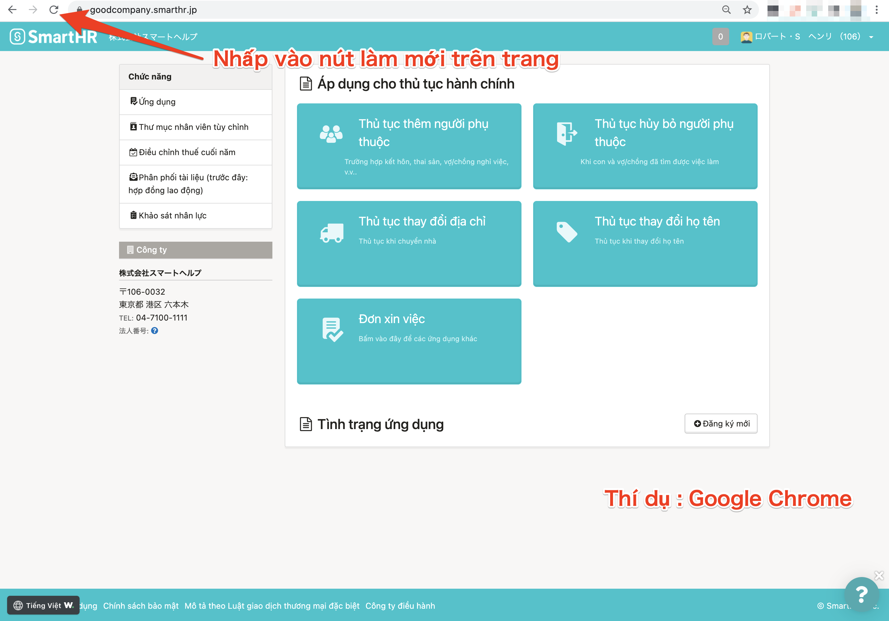
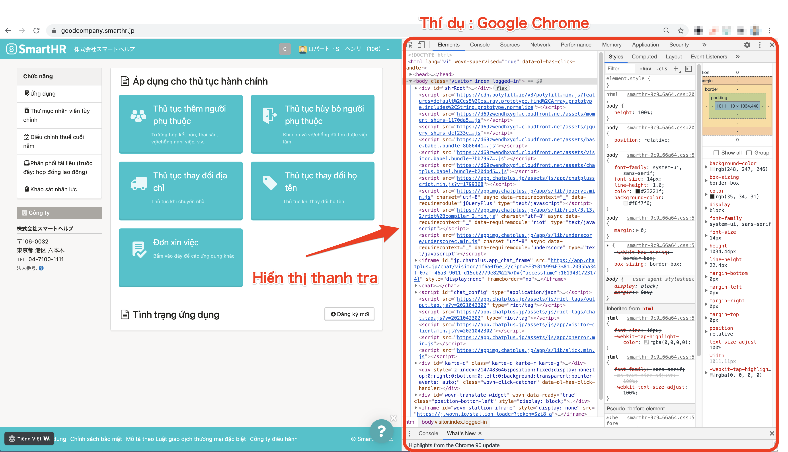
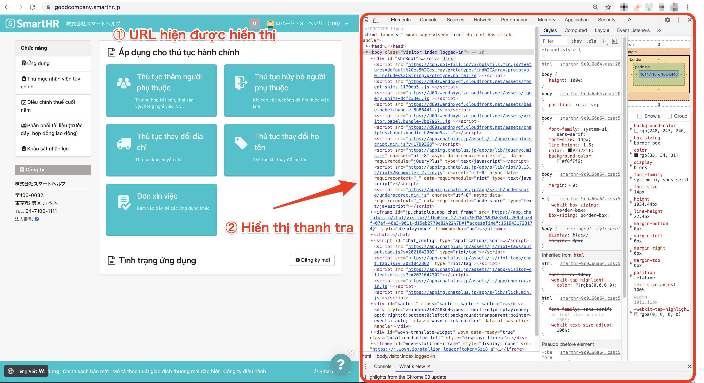

Hãy kiểm tra xem cài đặt ngôn ngữ của trình duyệt hay thiết bị mà bạn đang sử dụng đã ở chế độ “Không phải tiếng Nhật” hay chưa.

Nếu cài đặt ngôn ngữ không có vấn đề, hãy thử cập nhật lại trang và xóa cache, cookie của trình duyệt.

# Kiểm tra cài đặt ngôn ngữ

Để có thể sử dụng tính năng hiển thị đa ngôn ngữ, cài đặt ngôn ngữ cho trình duyệt và thiết bị mà bạn đang sử dụng cần đang ở chế độ “Không phải tiếng Nhật”.

Hãy kiểm tra cài đặt bằng cách thức như sau.

## Google Chrome

Xem trang trợ giúp dưới đây và kiểm tra cài đặt ngôn ngữ của trình duyệt.

[Thay đổi ngôn ngữ｜Hỗ trợ tài khoản Google](https://support.google.com/accounts/answer/32047?hl=vi)

## Safari

Cho hiển thị ngôn ngữ đang được cài đặt trong thiết bị của bạn.

Xem trang trợ giúp dưới đây và kiểm tra cài đặt ngôn ngữ của thiết bị.

### Trường hợp sử dụng iPhone, iPad

[Thay đổi ngôn ngữ trên iPhone, iPad, iPod touch｜Hỗ trợ của Apple](https://support.apple.com/vi-vn/HT204031)

### Trường hợp sử dụng Mac

[Thay đổi ngôn ngữ máy Mac sử dụng｜Hướng dẫn sử dụng macOS](https://support.apple.com/vi-vn/guide/mac-help/mh26684/mac)

## Firefox

Xem trang trợ giúp dưới đây và kiểm tra cài đặt ngôn ngữ của trình duyệt.

[Dùng Firefox với ngôn ngữ khác｜Hỗ trợ của Firefox](https://support.mozilla.org/vi/kb/use-firefox-interface-other-languages-language-pack)

## Microsoft Edge

Cho hiển thị ngôn ngữ đang được cài đặt trong thiết bị của bạn.

Xem trang trợ giúp dưới đây và kiểm tra cài đặt ngôn ngữ của thiết bị.

[Sử dụng Microsoft Edge bằng ngôn ngữ khác｜Hỗ trợ và hướng dẫn của Microsoft Edge](https://support.microsoft.com/vi-vn/microsoft-edge/%E5%88%A5%E3%81%AE%E8%A8%80%E8%AA%9E%E3%81%A7-microsoft-edge-%E3%82%92%E4%BD%BF%E7%94%A8%E3%81%99%E3%82%8B-4da8b5e0-11ce-7ea4-81d7-4e332eec551f)

# Cập nhật trang

Hãy cập nhật trình duyệt đang sử dụng và tải lại trang.

Việc tải lại trang có thể mất thời gian hoặc có khả năng không tải được hiển thị đa ngôn ngữ.

# Xóa cache và cookie của trình duyệt

Hãy xóa cache và cookie của trình duyệt, rồi kiểm tra nội dung hiển thị một lần nữa.

## Google Chrome

[Xóa bộ nhớ đệm và cookie｜Tài khoản Google trợ giúp](https://support.google.com/accounts/answer/32050?co=GENIE.Platform%3DDesktop&hl=vi)

## Safari

### Trường hợp sử dụng iPhone, iPad

[Xóa lịch sử duyệt web và cookie trên Safari của iPhone, iPad, iPod touch｜Hỗ trợ của Apple](https://support.apple.com/vi-vn/HT201265)

### Trường hợp sử dụng Mac

[Thiết lập bộ nhớ đệm nội dung trên máy Mac｜Hướng dẫn sử dụng macOS](https://support.apple.com/vi-vn/guide/mac-help/mchl3b6c3720/mac)

[Quản lý cookie và dữ liệu trang web trong Safari trên máy Mac｜Hướng dẫn sử dụng Safari](https://support.apple.com/vi-vn/guide/safari/sfri11471/13.0/mac/10.15)

## Firefox

[Cách xóa bộ nhớ đệm Firefox｜Hỗ trợ của Firefox](https://support.mozilla.org/vi/kb/how-clear-firefox-cache)

[Xóa cookie và dữ liệu trang web trong Firefox｜Hỗ trợ của Firefox](https://support.mozilla.org/vi/kb/clear-cookies-and-site-data-firefox)

## Microsoft Edge

[Xem và xóa lịch sử trình duyệt trong Microsoft Edge｜Hỗ trợ và hướng dẫn của Microsoft Edge](https://support.microsoft.com/vi-vn/microsoft-edge/microsoft-edge-%E3%81%AE%E9%96%B2%E8%A6%A7%E5%B1%A5%E6%AD%B4%E3%82%92%E8%A1%A8%E7%A4%BA%E3%81%BE%E3%81%9F%E3%81%AF%E5%89%8A%E9%99%A4%E3%81%99%E3%82%8B-00cf7943-a9e1-975a-a33d-ac10ce454ca4)

[Xóa cookie trong Microsoft Edge｜Hỗ trợ và hướng dẫn của Microsoft Edge](https://support.microsoft.com/vi-vn/microsoft-edge/microsoft-edge-%E3%81%A7-cookie-%E3%82%92%E5%89%8A%E9%99%A4%E3%81%99%E3%82%8B-63947406-40ac-c3b8-57b9-2a946a29ae09)

# Trường hợp đã thử tất cả các biện pháp trên mà vẫn không giải quyết được

Có khả năng đã xảy ra lỗi, vì vậy, hãy thông báo tình trạng tới quản trị viên và báo họ liên hệ tới SmartHR.

Ngoài ra, nếu bạn sử dụng SmartHR trên máy tính, bạn có thể chụp ảnh màn hình theo các bước dưới đây và gửi đính kèm khi liên hệ để giúp dễ dàng xác định nguyên nhân.

## Cách chụp ảnh màn hình và phần mềm kiểm tra

### 1\. **Mở trang bị lỗi hiển thị đa ngôn ngữ, và nhập câu lệnh sau đây:**

- Trường hợp sử dụng Mac：「option」+「command」+「i」
- Trường hợp sử dụng Windows：「shift」+「control」+「i」

Khi nhập câu lệnh, phần mềm kiểm tra (Inspector) sẽ hiện ra trên màn hình.

### 2\. Chụp ảnh màn hình

Xem trang hỗ trợ dưới đây để biết cách chụp ảnh màn hình.

[Chụp ảnh màn hình trên Mac｜Hỗ trợ của Apple](https://support.apple.com/vi-vn/HT201361)

[Cách chụp và chú thích cho ảnh chụp màn hình trên Windows 10｜Hỗ trợ và hướng dẫn của Windows](https://support.microsoft.com/vi-vn/windows/windows-10-%E3%81%A7%E3%82%B9%E3%82%AF%E3%83%AA%E3%83%BC%E3%83%B3%E3%82%B7%E3%83%A7%E3%83%83%E3%83%88%E3%82%92%E5%8F%96%E5%BE%97%E3%81%97%E3%81%A6%E3%82%B3%E3%83%A1%E3%83%B3%E3%83%88%E3%82%92%E8%BF%BD%E5%8A%A0%E3%81%99%E3%82%8B%E6%96%B9%E6%B3%95-ca08e124-cc30-2579-3e55-6db63e36fbb9)

Hãy chụp ảnh màn hình sao cho có thể kiểm tra được cả 2 nội dung là “URL đang hiển thị” và “phần mềm kiểm tra” như hình dưới đây.

