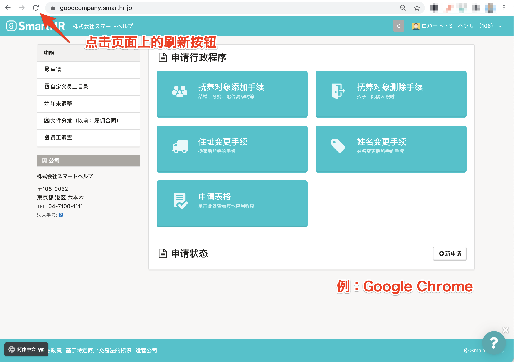
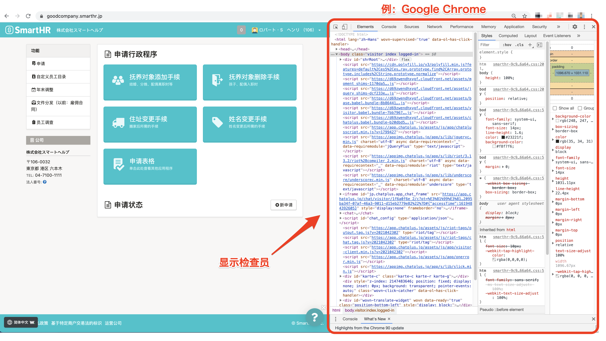
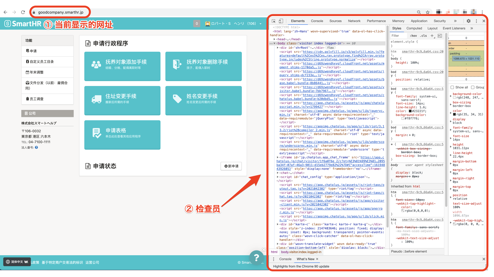

请确认使用的浏览器和终端的语言设置是否为“除日语以外的语言”。

如果语言设置没问题，请尝试刷新页面、清除浏览器的缓存和 Cookie。

# 确认语言设置

如果想要使用多语言显示，使用的浏览器和终端的语言设置必须为 “除日语以外的语言”。

请按照以下方法确认设置。

## Google Chrome

请在浏览以下帮助页面后，检查浏览器的语言设置。

[更改语言｜Google 账号 帮助](https://support.google.com/accounts/answer/32047?hl=zh)

Safari

使用的终端上显示已设置的语言。

请在浏览以下帮助页面后，检查终端的语言设置。

### iPhone和iPad

[更改您 iPhone、iPad 或 iPod touch 上的语言｜Apple 支持](https://support.apple.com/zh-cn/HT204031)

### Mac

[更改 Mac 使用的语言｜macOS 使用手册](https://support.apple.com/zh-cn/guide/mac-help/mh26684/mac)

## Firefox

请在浏览以下帮助页面后，检查浏览器的语言设置。

[使用语言包改变 Firefox 界面语言｜Firefox 支持](https://support.mozilla.org/zh/kb/use-firefox-interface-other-languages-language-pack)

## Microsoft Edge

使用的终端上显示已设置的语言。

请在浏览以下帮助页面后，检查终端的语言设置。

[以其他语言使用 Microsoft Edge｜Microsoft Edge 帮助与学习](https://support.microsoft.com/zh-cn/microsoft-edge/%E5%88%A5%E3%81%AE%E8%A8%80%E8%AA%9E%E3%81%A7-microsoft-edge-%E3%82%92%E4%BD%BF%E7%94%A8%E3%81%99%E3%82%8B-4da8b5e0-11ce-7ea4-81d7-4e332eec551f)

# 刷新页面

请刷新使用的浏览器，重新显示页面。

显示页面需要一些时间，可能无法加载多语言显示。

# 清除浏览器的缓存和 Cookie

请清除浏览器的缓存和 Cookie，然后重新检查显示内容。

## Google Chrome

[清除缓存和 Cookie｜Google 账号 帮助](https://support.google.com/accounts/answer/32050?co=GENIE.Platform%3DDesktop&hl=zh)

## Safari

### iPhone和iPad

[在 iPhone、iPad 或 iPod touch 上清除 Safari 浏览器中的历史记录和 Cookie｜Apple 支持](https://support.apple.com/zh-cn/HT201265)

### Mac

[在 Mac 上设置内容缓存｜macOS 使用手册](https://support.apple.com/zh-cn/guide/mac-help/mchl3b6c3720/mac)

[在 Mac 上的 Safari 浏览器中管理 Cookie 和网站数据｜Safari 浏览器使用手册](https://support.apple.com/zh-cn/guide/safari/sfri11471/13.0/mac/10.15)

## Firefox

[怎么清除缓存？｜Firefox 支持](https://support.mozilla.org/zh/kb/how-clear-firefox-cache)

[删除 Cookie｜Firefox 支持](https://support.mozilla.org/zh/kb/clear-cookies-and-site-data-firefox)

## Microsoft Edge

[查看和删除 Microsoft Edge 中的浏览器历史记录｜Microsoft Edge 帮助与学习](https://support.microsoft.com/zh-cn/microsoft-edge/microsoft-edge-%E3%81%AE%E9%96%B2%E8%A6%A7%E5%B1%A5%E6%AD%B4%E3%82%92%E8%A1%A8%E7%A4%BA%E3%81%BE%E3%81%9F%E3%81%AF%E5%89%8A%E9%99%A4%E3%81%99%E3%82%8B-00cf7943-a9e1-975a-a33d-ac10ce454ca4)

[在 Microsoft Edge 中删除 Cookie｜Microsoft Edge 帮助与学习](https://support.microsoft.com/zh-cn/microsoft-edge/microsoft-edge-%E3%81%A7-cookie-%E3%82%92%E5%89%8A%E9%99%A4%E3%81%99%E3%82%8B-63947406-40ac-c3b8-57b9-2a946a29ae09)

# 尝试过上述内容后仍然无法解决时

可能出现故障，请与管理员共享该情况，方便其向 SmartHR 进行咨询。

此外，在电脑上使用 SmartHR 时，请按照下述步骤获取屏幕截图，并在咨询时一同附上，这样可以更顺利地查明原因。

## 画面和检查器截图的获取方法

### 1\. **在多语言显示无法正确显示的页面处于打开的状态下，输入以下命令**

- Mac：「option」+「command」+「i」
- Windows：「shift」+「control」+「i」

输入命令后，画面上显示检查器。

### 2\. **获取屏幕截图**

屏幕截图的获取方法请查看以下帮助页面。

[在Mac上拍摄截屏｜Apple支持](https://support.apple.com/zh-cn/HT201361)

[如何获取并在Windows 10上的屏幕截图添加批注｜Windows帮助与学习](https://support.microsoft.com/zh-cn/windows/windows-10-%E3%81%A7%E3%82%B9%E3%82%AF%E3%83%AA%E3%83%BC%E3%83%B3%E3%82%B7%E3%83%A7%E3%83%83%E3%83%88%E3%82%92%E5%8F%96%E5%BE%97%E3%81%97%E3%81%A6%E3%82%B3%E3%83%A1%E3%83%B3%E3%83%88%E3%82%92%E8%BF%BD%E5%8A%A0%E3%81%99%E3%82%8B%E6%96%B9%E6%B3%95-ca08e124-cc30-2579-3e55-6db63e36fbb9)

获取屏幕截图时，请保证能够看清下图中的“当前显示的 URL”和“检查器”。

