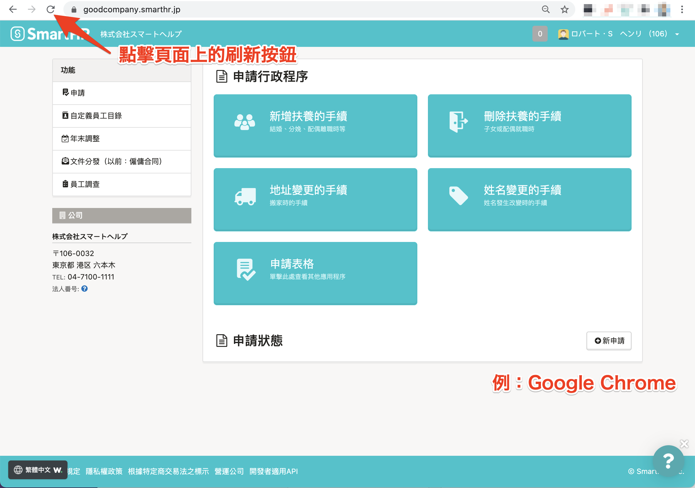
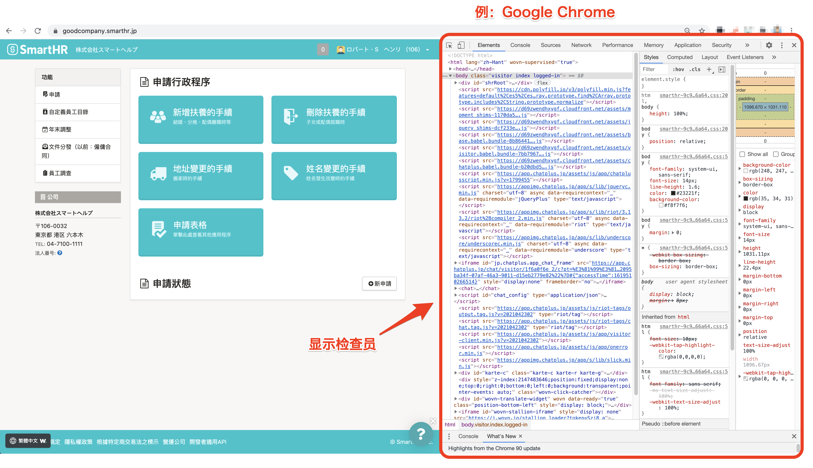
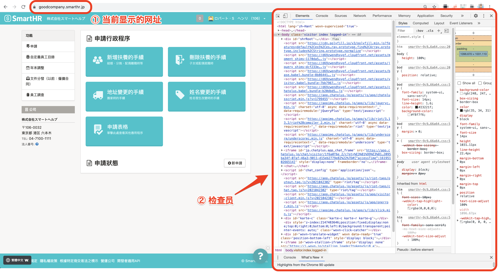

請確認您正在使用的瀏覽器或裝置，語言設定是否為「日文以外的語言」。

若語言設定沒有問題，請嘗試重新整理網頁，或清除瀏覽器的快取與Cookie。

# 確認語言設定

使用多國語言顯示前，必須將正在使用的瀏覽器或裝置的語言設定為「日文以外的語言」。

請透過以下方法確認設定。

## Google Chrome

請參考以下幫助頁面，確認瀏覽器的語言設定。

[變更語言設定｜Google 帳戶說明](https://support.google.com/accounts/answer/32047?hl=zh-Hant)

## Safari

頁面將顯示使用裝置所設定的語言。

請參考以下幫助頁面，確認裝置的語言設定。

### iPhone、iPad

[更改iPhone、iPad或iPod touch 上的語言｜Apple 支援](https://support.apple.com/zh-tw/HT204031)

### Mac

[更改 Mac 使用的語言｜macOS使用手冊](https://support.apple.com/zh-tw/guide/mac-help/mh26684/mac)

## Firefox

請參考以下幫助頁面，確認瀏覽器的語言設定。

[在 Firefox 使用不同的語言套件｜Firefox 技術支援](https://support.mozilla.org/zh-TW/kb/use-firefox-another-language)

## Microsoft Edge

頁面將顯示使用裝置所設定的語言。

請參考以下幫助頁面，確認裝置的語言設定。

[以其他語言使用 Microsoft Edge｜Microsoft Edge 說明與學習](https://support.microsoft.com/zh-tw/microsoft-edge/%E4%BB%A5%E5%85%B6%E4%BB%96%E8%AA%9E%E8%A8%80%E4%BD%BF%E7%94%A8-microsoft-edge-4da8b5e0-11ce-7ea4-81d7-4e332eec551f)

# 重新整理網頁

請重新整理您所使用的瀏覽器，再次讀取網頁。

可能因網頁讀取時間過長而無法載入多國語言顯示。

# 清除瀏覽器的快取和Cookie

請清除瀏覽器的快取和Cookie，重新確認顯示內容。

## Google Chrome

[清除快取和 Cookie｜Google 帳戶說明](https://support.google.com/accounts/answer/32050?co=GENIE.Platform%3DDesktop&hl=zh-Hant)

## Safari

### iPhone、iPad

[在 iPhone、iPad 或 iPod touch 上清除 Safari 的瀏覽記錄和 Cookie｜Apple 支援](https://support.apple.com/zh-tw/HT201265)

### Mac

[在 Mac 上設定內容快取｜macOS使用手冊](https://support.apple.com/zh-tw/guide/mac-help/mchl3b6c3720/mac)

[在 Mac 上的 Safari 中管理 Cookie 和網站資料｜Safari使用手冊](https://support.apple.com/zh-tw/guide/safari/sfri11471/13.0/mac/10.15)

## Firefox

[如何清除 Firefox 的快取｜Firefox 技術支援](https://support.mozilla.org/zh-TW/kb/how-clear-firefox-cache)

[刪除 Cookie 以移除網站存放在電腦上的資訊｜Firefox 技術支援](https://support.mozilla.org/zh-TW/kb/delete-cookies-remove-info-websites-stored)

## Microsoft Edge

[檢視及刪除 Microsoft Edge 中的瀏覽器歷程記錄｜Microsoft Edge 說明與學習](https://support.microsoft.com/zh-tw/microsoft-edge/%E6%AA%A2%E8%A6%96%E5%8F%8A%E5%88%AA%E9%99%A4-microsoft-edge-%E4%B8%AD%E7%9A%84%E7%80%8F%E8%A6%BD%E5%99%A8%E6%AD%B7%E7%A8%8B%E8%A8%98%E9%8C%84-00cf7943-a9e1-975a-a33d-ac10ce454ca4)

[在 Microsoft Edge 中刪除 Cookie｜Microsoft Edge 說明與學習](https://support.microsoft.com/zh-tw/microsoft-edge/%E5%9C%A8-microsoft-edge-%E4%B8%AD%E5%88%AA%E9%99%A4-cookie-63947406-40ac-c3b8-57b9-2a946a29ae09)

# 若嘗試過上述方法仍無法解決

可能為系統問題，請將情形告知您的管理者，由管理者聯繫SmartHR。

若您是以電腦使用SmartHR，請依照下列步驟取得螢幕截圖，並於聯繫時附加檔案，以利確認問題原因。

## 畫面與網頁檢閱器的螢幕截圖取得方法

### 1\. **在無法正確顯示多國語言的頁面為開啟的狀態下，輸入以下指令**

- Mac：「option」+「command」+「i」
- windows：「shift」+「control」+「i」

輸入指令後，畫面上會顯示網頁檢閱器。

### 2\. **取得螢幕截圖**

螢幕截圖方法請參考以下幫助頁面。

[在 Mac 上拍攝截圖｜Apple 支援](https://support.apple.com/zh-tw/HT201361)

[如何在 Windows 10 抓取螢幕擷取畫面並註解｜Windows說明與學習](https://support.microsoft.com/zh-tw/windows/%E5%A6%82%E4%BD%95%E5%9C%A8-windows-10-%E6%8A%93%E5%8F%96%E8%9E%A2%E5%B9%95%E6%93%B7%E5%8F%96%E7%95%AB%E9%9D%A2%E4%B8%A6%E8%A8%BB%E8%A7%A3-ca08e124-cc30-2579-3e55-6db63e36fbb9)

請依照下圖指示取得螢幕截圖，以利確認「目前顯示的網址」與「網頁檢閱器」2處。

