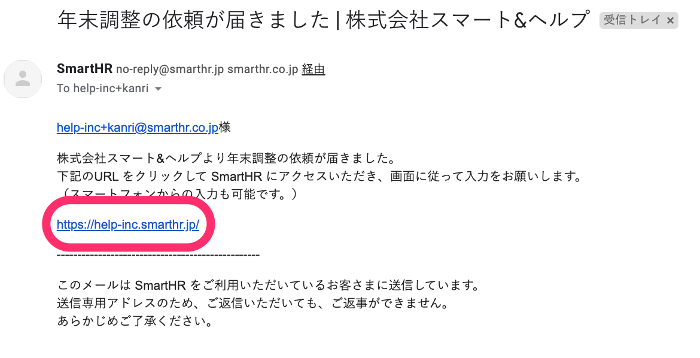
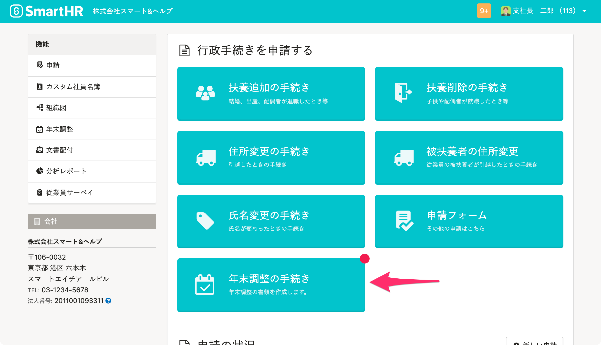
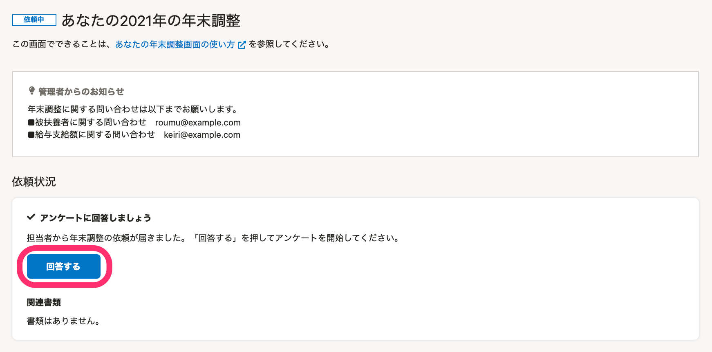
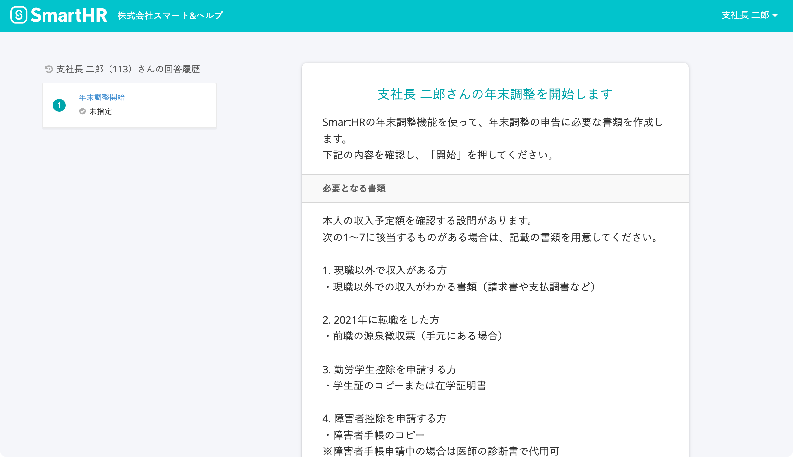
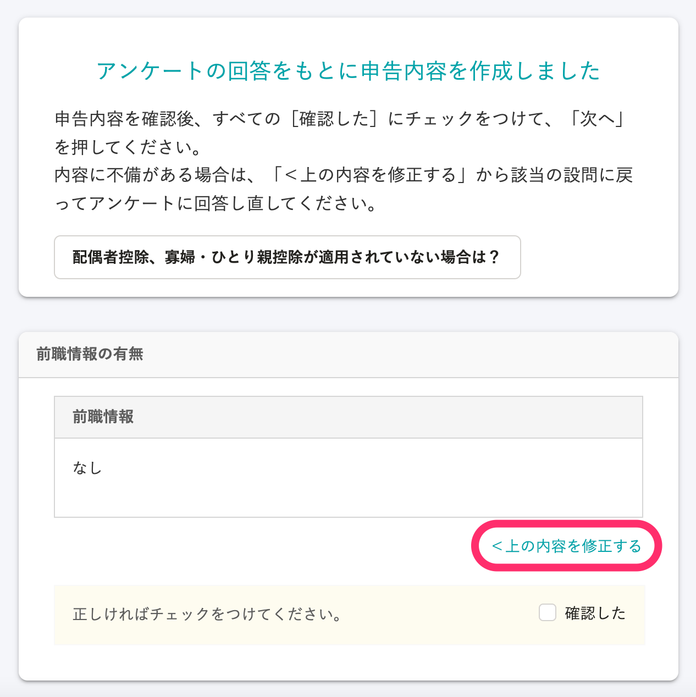
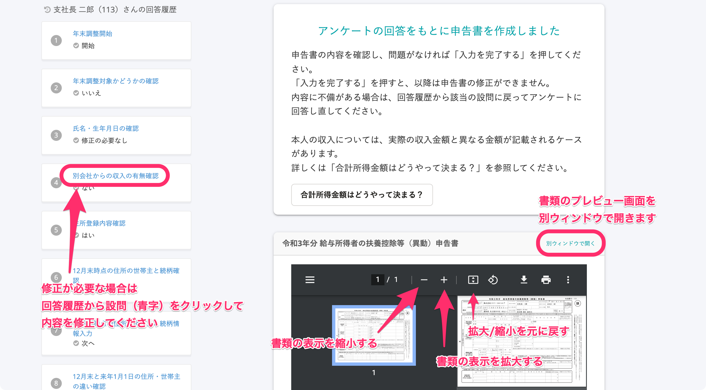
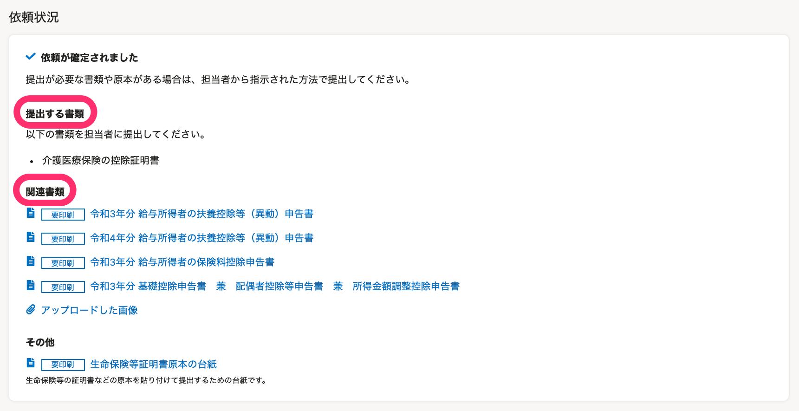

This page explains the year-end adjustment process, from when an employee receives a year-end adjustment request, to answering the survey, to submitting documents to the personnel in charge.

:::tips
**Estimated time required to answer the survey**
When you have the necessary documents on hand, the time required is as follows.
- Life insurance: Not enrolled, no legal dependents enrolled \[Estimate: 1-3 minutes\]
- Life insurance: Enrolled, legal dependents enrolled \[Estimate: 5-15 minutes\]
- Life insurance: Enrolled, legal dependents enrolled + Housing loan \[Estimate: 10-20 minutes\]
:::

# 1\. Open SmartHR from the link listed in the email requesting year-end adjustment

Click on the link listed in the email titled "A request for year-end adjustment has arrived（年末調整の依頼が届きました）" to access SmartHR.

Refer to the following help pages if you have issues like forgetting your password or not being able to log in.

:::related
[Forgot your password?](https://knowledge.smarthr.jp/hc/ja/articles/360026265593)
[Log in with your employee number account](https://knowledge.smarthr.jp/hc/ja/articles/360026263133)
[Forgot your password for the employee number account?](https://knowledge.smarthr.jp/hc/ja/articles/360026104374)
[Unable to log in to SmartHR?](https://knowledge.smarthr.jp/hc/ja/articles/360026104354)
:::

# 2\. Click \[Year-End Adjustment\] on your My Page

When the request for year-end adjustment arrives, the **\[Year-End Adjustment\]** button will be displayed on your My Page.

Click it to display the screen with the title "**Your Year-End Adjustment.**"

# 3\. Click \[Answer\] to begin the year-end adjustment

When you click **\[Answer\]**, question 1 for the year-end adjustment will be displayed.

The screen for question 1 notes the items you need to prepare to create the year-end adjustment, the estimated time required to complete it, and other important points, so please be sure to read through this information.

Click \[Start\] at the bottom of the page to begin answering the survey.

# 4\. Answer the survey

Please proceed through the survey, reading each question and selecting the answers that match your situation.

:::tips
Information entered is saved at the page level.
Please note that partially filled in pages will not be saved unless you proceed to the next page.
Partial answers will be saved for up to 1 page back.
:::

## If you want to redo your answers

If you made a mistake when answering, click the related question shown in blue from the answer history on the left side of the screen to go back to that question.

Click the question you want to correct (shown in blue) to go back to that question.

You can check the content and redo the answer.

:::alert
The clicked question will be displayed, allowing you to edit your answer
If you edit your answer, any answers following that question will be erased.
So please enter your answers for these questions again. We apologize for the inconvenience.
:::

## If you proceed without noticing your mistake

A page to confirm the content you entered so far will be displayed midway through the survey.

If you need to make corrections, do so from **\[< Correct the above content\]**.

If you do not need to make corrections, select the **\[Confirmed\]** checkboxes for all items, then proceed to the next page.

# 5\. Check the content of the application form

SmartHR's year-end adjustment feature automatically creates the various application forms for year-end adjustment based on your survey answers.

Check the content of the application form on the preview screen and if you need to make corrections, click the related question **shown in blue** from the answer history on the left side of the screen and edit your answers.

If there are no problems, click **\[Complete entering information\]** at the bottom of the page to go to the page that provides information about printing documents.

# 6\. Prepare the necessary documents and submit them to a supervisor

Documents with the **\[Must print\]** label must be printed and submitted.

After checking the content, click **\[Complete\]** and then prepare the necessary documents and submit them to a supervisor.

When you complete the survey, the message **"The survey has been answered"** will be displayed.

## If you want to check the documents that need to be submitted

You can also check which documents need to be submitted from the **［Your Year-End Adjustment］** page.

\[Related documents\] lists which created documents need to be printed and checked, while \[Document(s) to submit\] lists items that need to be submitted along with the documents.

[How to use the Your Year-End Adjustment screen](https://knowledge.smarthr.jp/hc/ja/articles/4405811371801)

:::related
[Employee guide: From receiving a year-end adjustment request to submitting the application（for Smartphone）](https://knowledge.smarthr.jp/hc/ja/articles/4405556671641)
:::
