:::alert
当ページで案内しているSmartHRの年末調整機能の内容は、2021年（令和3年）版のものです。
2022年（令和4年）版の年末調整機能の公開時期は秋頃を予定しています。
なお、画面や文言、一部機能は変更になる可能性があります。
公開時期が決まり次第、[アップデート情報](https://smarthr.jp/update%E2%80%9D)でお知らせします。
:::

従業員が年末調整の依頼を受けてから、アンケートに答え、管理者へ書類提出を連絡するまでの流れをパソコンでの表示画面を使用して説明します。

:::tips
 **アンケート回答までの所要時間（目安）** 
手元に必要情報が揃っている状態の所要時間は以下のとおりです。
- 生命保険等 : 加入なし、税法上の扶養家族 : なしの場合【所要：1分〜3分】
- 生命保険等 : 加入あり、税法上の扶養家族 : ありの場合【所要：5分〜15分】
- 生命保険等 : 加入あり、税法上の扶養家族 : あり、住宅ローン : ありの場合【所要：10分〜20分】
:::

# 1\. 年末調整の依頼メールに記載のURLからSmartHRにアクセス

「年末調整の依頼が届きました」というメールに記載のURLをクリックし、SmartHRにアクセスします。

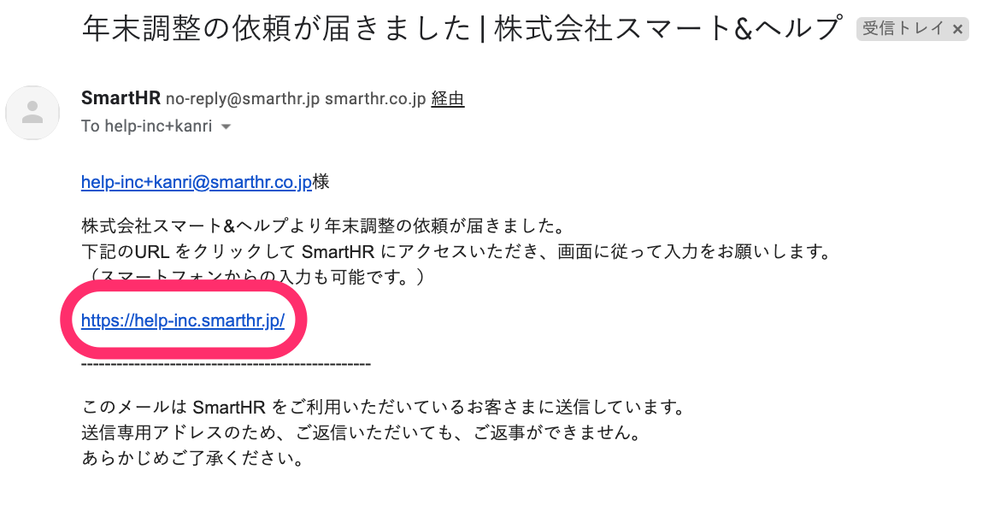

ログイン画面で社員番号またはメールアドレス、パスワードを入力して **［ログイン］** をクリックします。

パスワードを忘れた、ログインができないなど、お困りの際は以下のヘルプページをご覧ください。

:::related
[パスワードを忘れてしまったら？](https://knowledge.smarthr.jp/hc/ja/articles/360026265593)
[社員番号でログインする](https://knowledge.smarthr.jp/hc/ja/articles/360026263133)
[社員番号アカウントのパスワードを忘れてしまったら？](https://knowledge.smarthr.jp/hc/ja/articles/360026104374)
[SmartHRにログインできない場合は？](https://knowledge.smarthr.jp/hc/ja/articles/360026104354)
:::

# 2.［年末調整の手続き］をクリック

年末調整の依頼が届くと、マイページに **［年末調整の手続き］** ボタンが表示されます。

クリックすると、 **［あなたの年末調整］** 画面が表示されます。

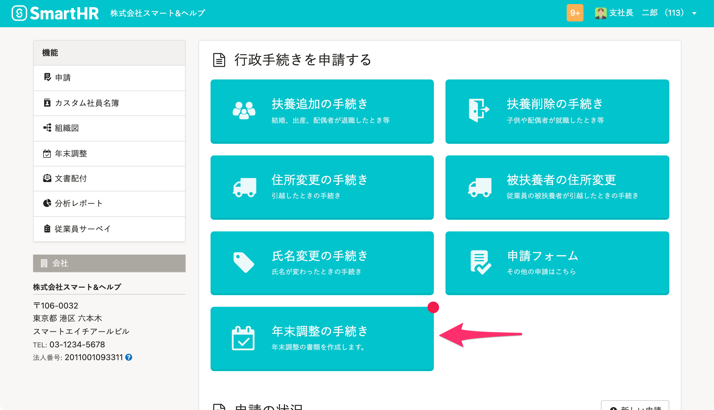

# 3.［回答する］をクリックして、年末調整をはじめる

 **［回答する］** をクリックすると、年末調整の設問1が表示されます。

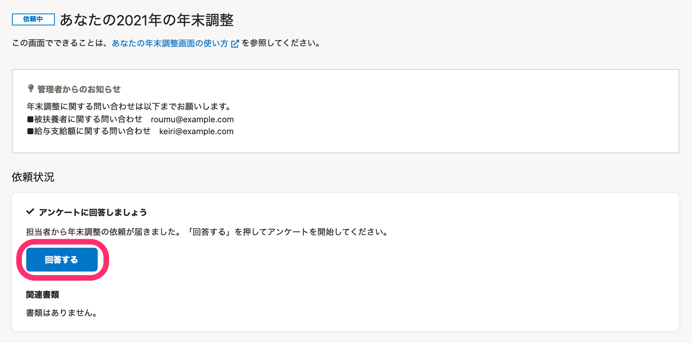

設問1には、年末調整にあたって「必要となる書類」「所要時間の目安」「入力にあたっての注意」が書かれています。

必ずご一読ください。

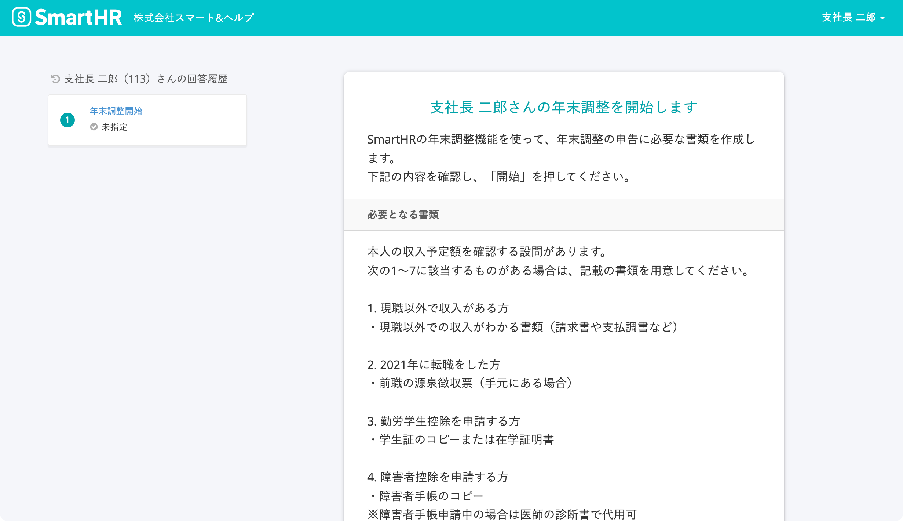

ページ最下部にある **［開始］** をクリックして、アンケートの回答をはじめます。

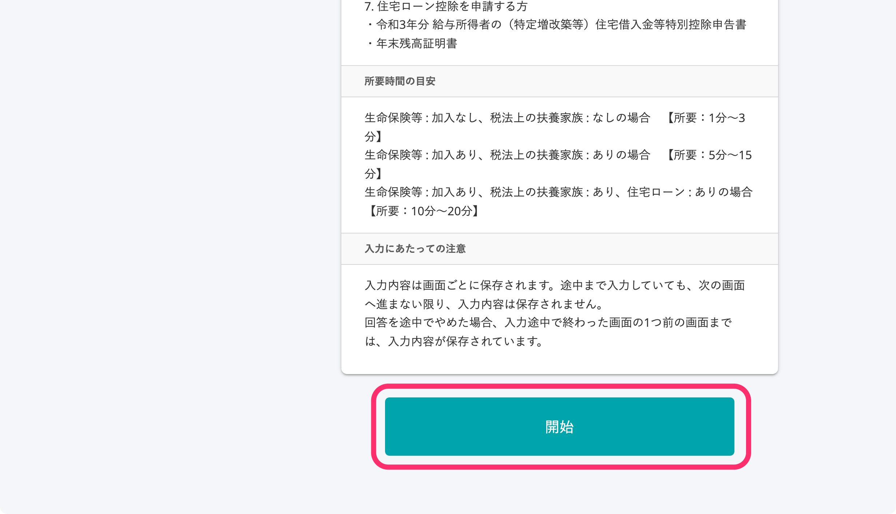

# 4\. アンケートに回答する

設問内容を読んで、ご自身の状況に合った回答を選び、アンケートの回答を進めてください。

:::tips
入力内容は画面ごとに保存されます。
フォームを途中まで入力していても、次の画面へ進まない限り、入力内容は保存されませんのでご注意ください。
回答を途中でやめた場合、入力途中で終わった画面の一つ前の画面までは、入力内容が保存されています。
:::

## 回答をやり直したい場合

選択肢を間違えて回答してしまった場合は、画面左側の回答履歴にある青字の **［設問］** をクリックすると、その設問から回答をやり直せます。

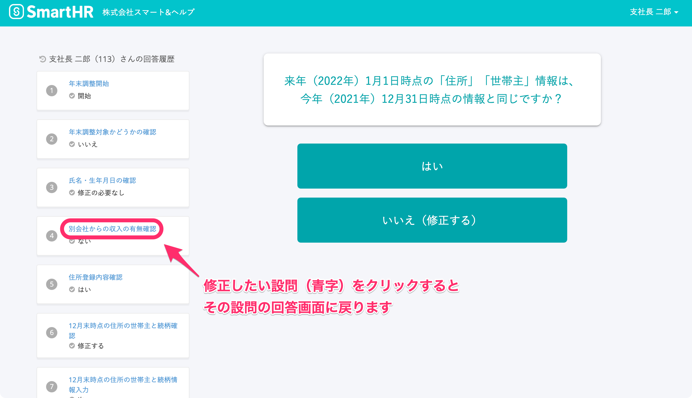

:::alert
回答をやり直す場合は、ブラウザバックは使用せず **［回答履歴］** をクリックして該当の設問に戻ってください。
なお、回答をやり直すと、修正した設問以降の回答は消去されます。
お手数ですが、改めて設問に回答・入力をお願いします。
:::

## 間違いに気づかずに進んでしまった場合

アンケートの途中で、これまでに入力した内容を確認するページが表示されます。

修正が必要な場合は、 **［＜上の内容を修正する］** から修正してください。

修正が必要ない場合は、 **［確認した］** にすべてチェックを入れて、次の設問に進んでください。

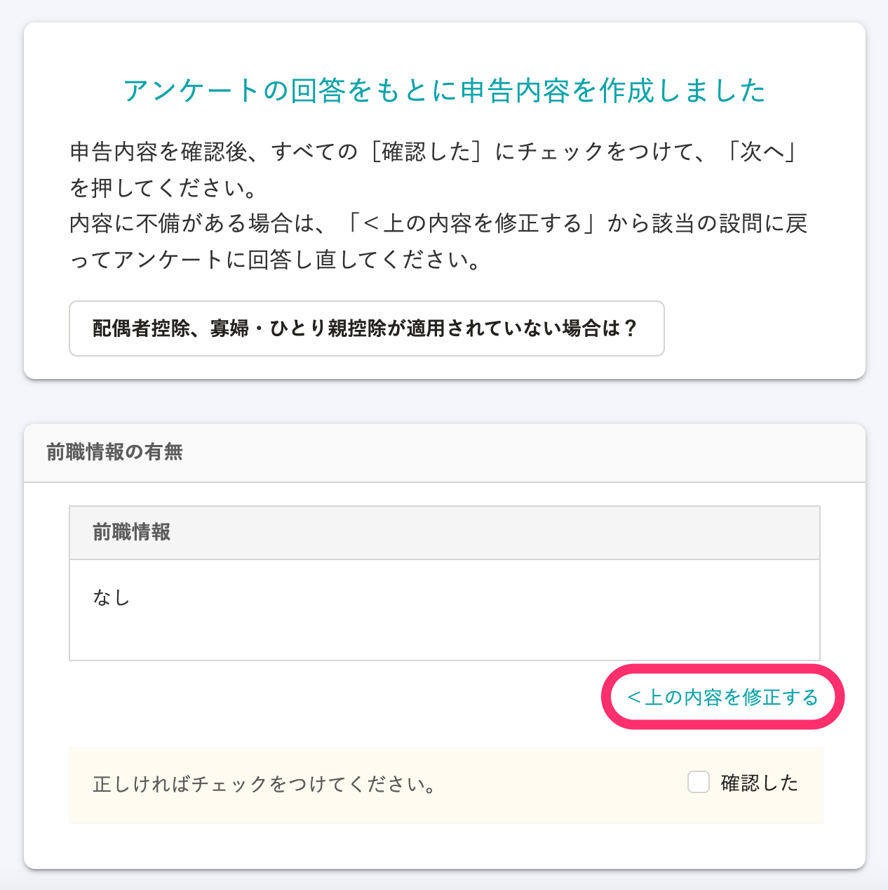

# 5\. 申告書の内容を確認する

SmartHRの年末調整機能は、アンケートの回答をもとに、自動で年末調整の各種申告書を作成します。

プレビュー画面で申告書の内容を確認し、修正が必要な場合は、画面左側にある回答履歴から青字の **［設問］** をクリックして、回答をやり直してください。

プレビュー画面では、書類画像の拡大と縮小が可能です。また、 **［別ウィンドウで開く］** をクリックすると、パソコンの画面全体に書類を表示して確認できます。

問題がなければ、ページ最下部にある **［入力を完了する］** をクリックすると、書類の印刷についての案内ページに移動します。

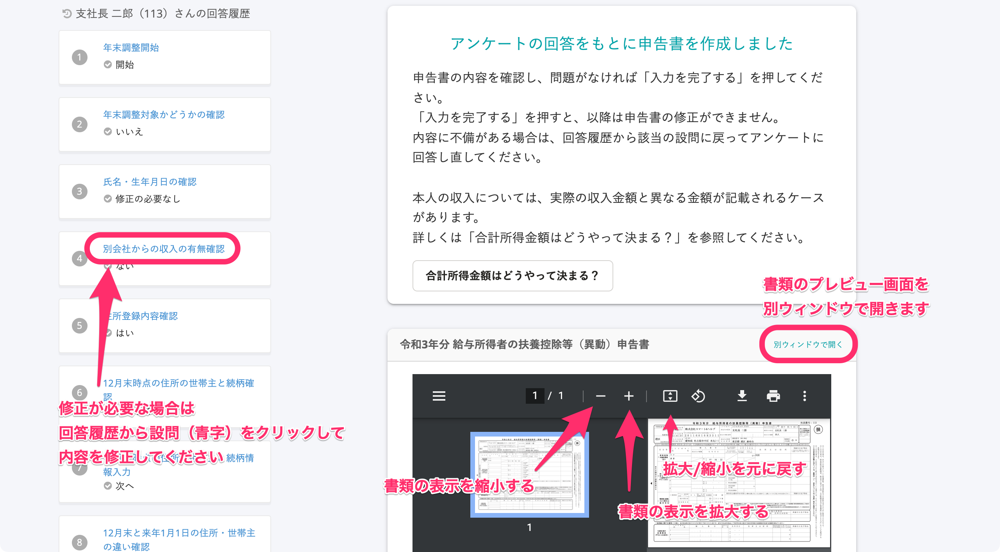

# 6\. 必要書類を準備して担当者に提出する

 **［要印刷］** のラベルがついている書類は、印刷して提出が必要です。

内容を確認したら **［書類の作成を完了する］** をクリックし、必要書類を準備して担当者へ提出をお願いします。

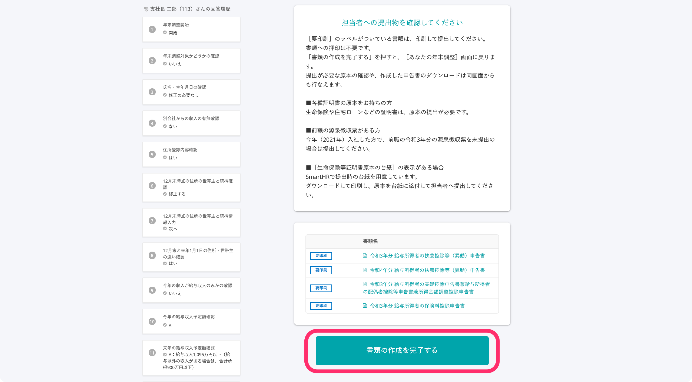

アンケートの回答を終了すると、 **［アンケートに回答しました］** と表示されます。

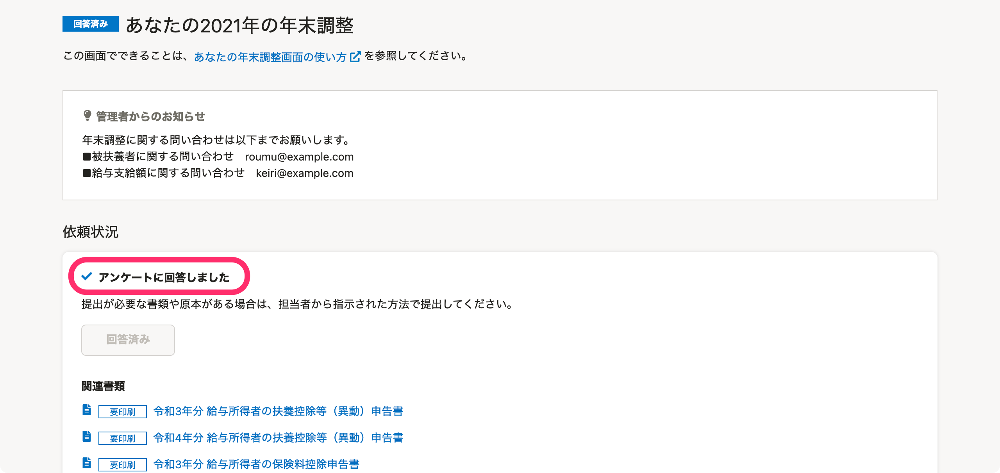

## 提出が必要な書類を確認したい場合

提出が必要な書類は、 **［あなたの年末調整］** 画面でも確認できます。

作成した書類の印刷・確認は **［関連書類］** に記載しています。

あなたの年末調整画面の使い方について、詳しくは以下のヘルプページをご覧ください。

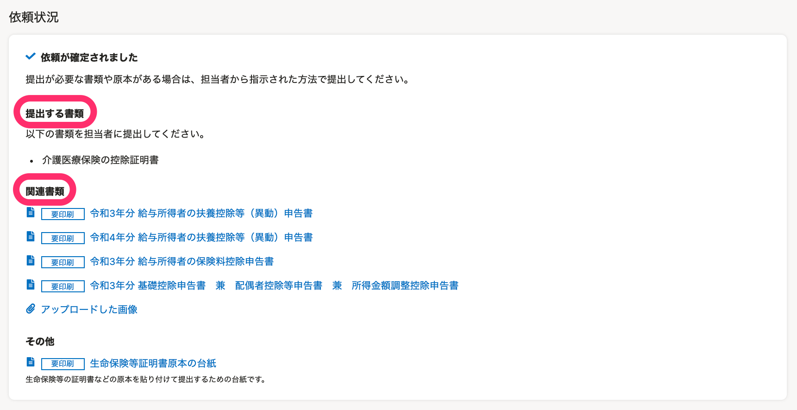

[あなたの年末調整画面の使い方](https://knowledge.smarthr.jp/hc/ja/articles/4405811371801)

:::tips
### 住宅ローン控除申告書の提出について
令和3年度の税制改正で、住宅ローン控除申告書は電子データで提供できるようになりました。
そのため、SmartHRの年末調整機能で書類を作成した場合は、提出する原本は空欄で構いません。
なお、 **「住宅ローン控除証明書」部分** は電子データでの提供対象とはなっていないため、引き続き原本の提出が必要です。
:::

 **［その他］** にある **［生命保険等証明書原本の台紙］** は、各種証明書などの原本を貼り付けて提出するための台紙としてお使いください。

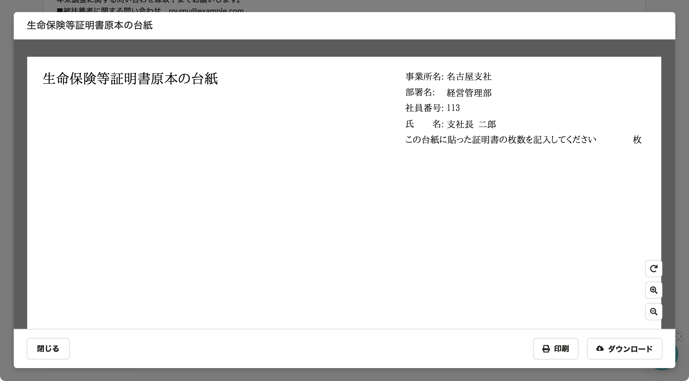

スマートフォンで操作する場合の手順は、以下のヘルプページをご覧ください。

:::related
[従業員が年末調整依頼を受けてから、書類提出までの流れ（スマートフォンの場合）](https://knowledge.smarthr.jp/hc/ja/articles/4405556671641)
:::
