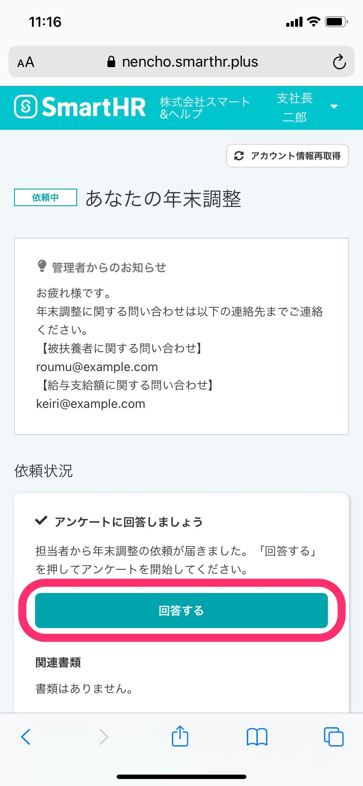
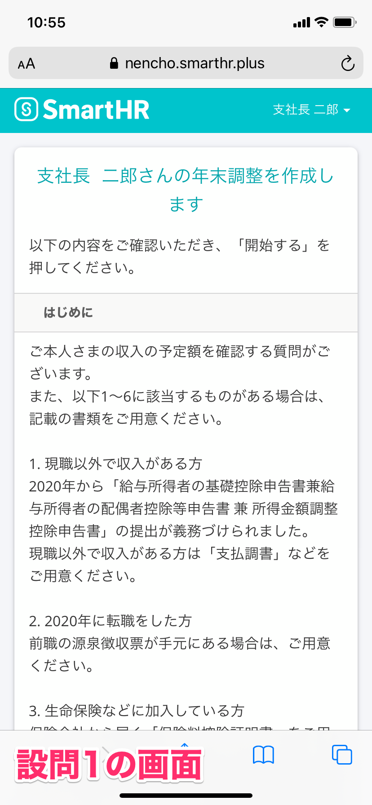
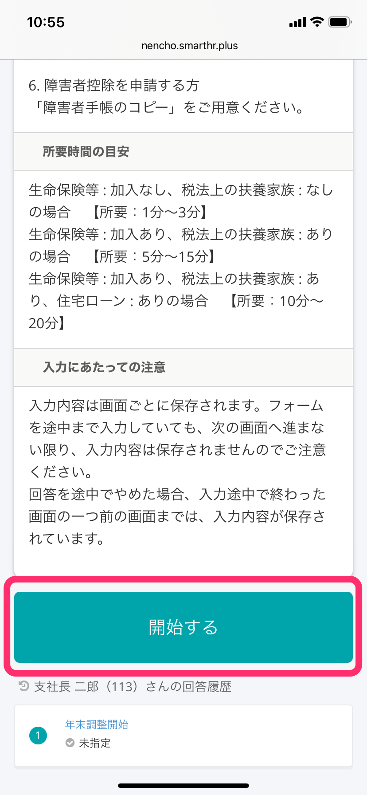
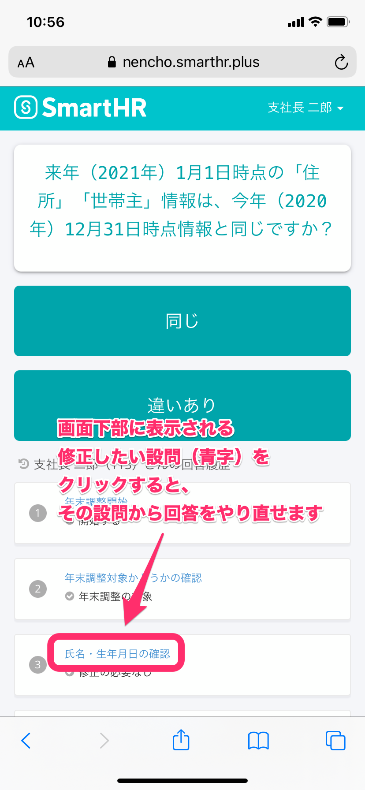
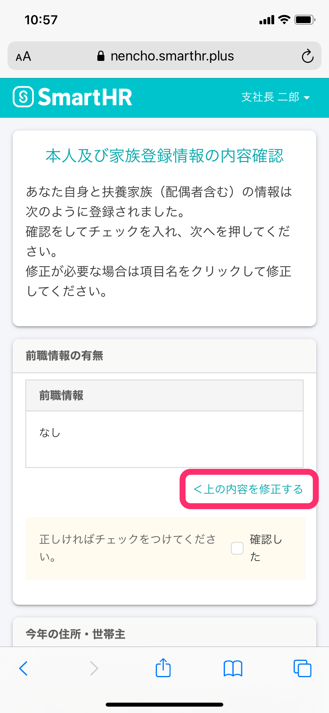
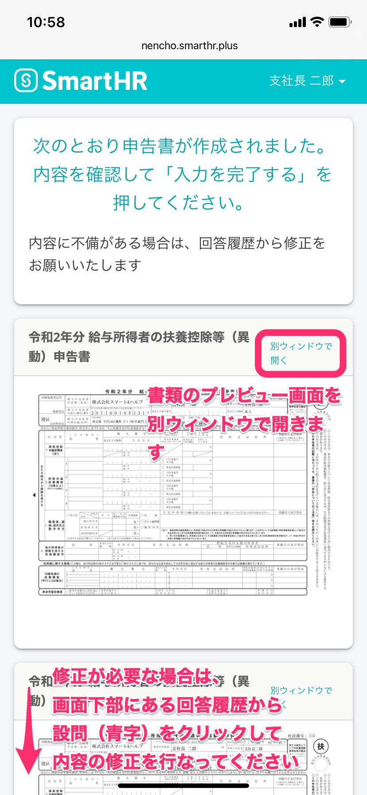
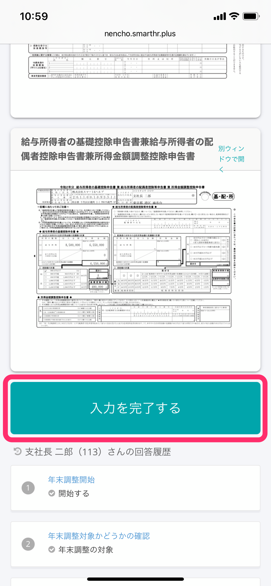
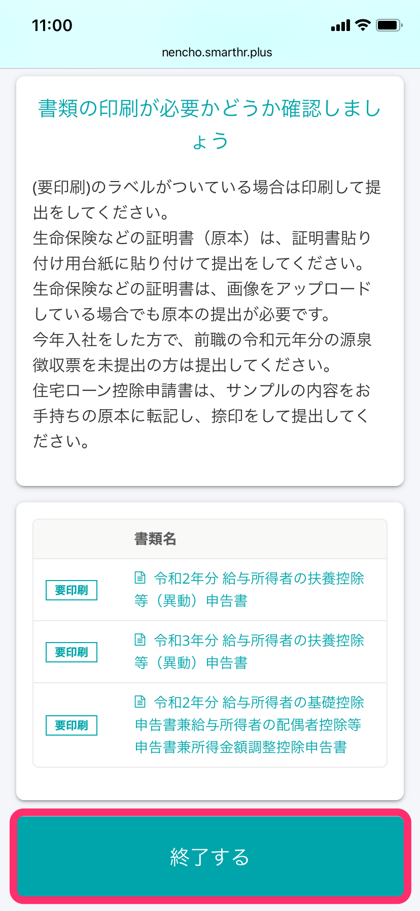
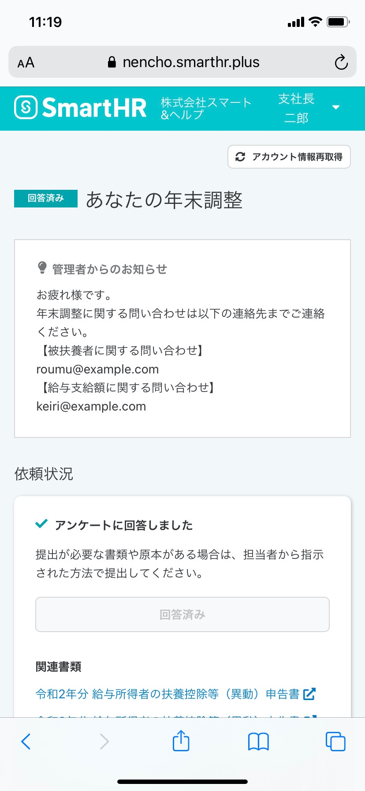

Chúng tôi sẽ giải thích quy trình từ khi nhân viên nhận được yêu cầu điều chỉnh thuế cuối năm, trả lời khảo sát đến khi liên hệ với người phụ trách để nộp hồ sơ.

Để biết quy trình vận hành trên máy tính cá nhân, hãy xem trang trợ giúp bên dưới.

:::related
[Quy trình từ khi nhân viên nhận được yêu cầu điều chỉnh thuế cuối năm đến khi nộp hồ sơ（Đối với PC）](https://knowledge.smarthr.jp/hc/ja/articles/360037014354)
:::
:::tips
**Thời gian (ước tính) cần thiết cho đến khi trả lời khảo sát**
Thời gian cần thiết với tiền đề đã chuẩn bị đầy đủ các thông tin cần thiết như sau.
- • Bảo hiểm nhân thọ, v.v...: Không tham gia, Người thân phụ thuộc theo luật thuế: Không có \[Thời gian cần thiết: Từ 1 phút đến 3 phút\]
- • Bảo hiểm nhân thọ, v.v...: Có tham gia, Người thân phụ thuộc theo luật thuế: Có \[Thời gian cần thiết: Từ 5 phút đến 15 phút\]
- • Bảo hiểm nhân thọ, v.v...: Có tham gia, Người thân phụ thuộc theo luật thuế: Có, Khoản vay mua nhà ở: Có \[Thời gian cần thiết: Từ 10 phút đến 20 phút\]
:::

# 1\. Truy cập vào SmartHR từ URL hiển thị trong email yêu cầu điều chỉnh thuế cuối năm

Nhấn vào URL hiển thị trong email tiêu đề「Bạn đã nhận được yêu cầu điều chỉnh thuế cuối năm（年末調整の依頼が届きました）」và truy cập SmartHR.

Trên màn hình đăng nhập, nhập mã số nhân viên hoặc địa chỉ email và mật khẩu rồi nhấn **\[Đăng nhập\]**.

Nếu bạn gặp khó khăn như quên mật khẩu hay không thể đăng nhập, v.v... vui lòng xem trang trợ giúp dưới đây.

:::related
[Trường hợp quên mật khẩu thì làm thế nào?](https://knowledge.smarthr.jp/hc/ja/articles/360026265593)
[Đăng nhập bằng tài khoản mã số nhân viên](https://knowledge.smarthr.jp/hc/ja/articles/360026263133)
[Trường hợp quên mật khẩu của tài khoản mã số nhân viên thì làm thế nào?](https://knowledge.smarthr.jp/hc/ja/articles/360026104374)
[Trường hợp không thể đăng nhập vào SmartHR thì làm thế nào?](https://knowledge.smarthr.jp/hc/ja/articles/360026104354)
:::

# 2\. Nhấn vào \[Thủ tục điều chỉnh thuế cuối năm\]

Bạn cuộn màn hình Trang của tôi (My page) và nhấn vào nút **\[Thủ tục điều chỉnh thuế cuối năm\]**.

Khi nhấn vào nút đó màn hình “Điều chỉnh thuế cuối năm của bạn” sẽ được hiển thị.

# 3\. Nhấn vào \[Trả lời\] để bắt đầu điều chỉnh thuế cuối năm

Sau khi nhấn vào **\[Trả lời\]**, câu hỏi 1 của điều chỉnh thuế cuối năm sẽ được hiển thị.

Tại màn hình của câu hỏi 1 có liệt kê các tài liệu cần chuẩn bị khi soạn thảo điều chỉnh thuế cuối năm, thời gian ước tính cần thiết và các lưu ý khi nhập dữ liệu, vì vậy, hãy đọc kỹ phần này.

Nhấn vào **\[Bắt đầu\]** ở cuối trang để bắt đầu trả lời khảo sát.

# 4\. Trả lời khảo sát

Hãy đọc nội dung câu hỏi, chọn câu trả lời phù hợp với tình hình của bản thân và tiếp tục trả lời các câu trong khảo sát.

### Trường hợp muốn trả lời lại

Trường hợp chọn nhầm câu trả lời, bạn nhấn vào câu hỏi **\[chữ xanh\]** trong lịch sử trả lời ở phía dưới màn hình để có thể thực hiện trả lời lại từ câu hỏi đó.

Ngoài ra, ngay cả trường hợp không nhận ra sai sót ngay mà tiếp tục trả lời khảo sát, thì ở giữa chừng khảo sát sẽ hiển thị trang xác nhận toàn bộ nội dung bạn đã nhập trước đó.

Trường hợp cần chỉnh sửa, hãy thực hiện chỉnh sửa từ mục **\[<Chỉnh sửa nội dung phía trên\]**.

# 5\. Kiểm tra nội dung tờ khai

SChức năng điều chỉnh thuế cuối năm của SmartHR sẽ tự động tạo các loại tờ khai dành cho điều chỉnh thuế cuối năm căn cứ theo các câu trả lời trong khảo sát.。

Bạn hãy kiểm tra nội dung của tờ khai tại màn hình xem trước, trường hợp cần chỉnh sửa hãy nhấn vào phần **\[Chữ xanh\]** của câu hỏi từ Lịch sử trả lời hiển thị ở bên trái màn hình rồi tiến hành trả lời lại.

Nếu không có bất ký sai sót gì, bạn hãy chuyển đến trang hướng dẫn in hồ sơ bằng cách nhấn vào **\[Hoàn thành nhập dữ liệu\]** hiển thị ở ở cuối trang.

# 6\. Chuẩn bị các hồ sơ cần thiết và nộp cho người phụ trách

Sau khi kiểm tra nội dung, hãy nhấn vào \[Kết thúc\] chuẩn bị các giấy tờ cần thiết và nộp cho người phụ trách.

Những giấy tờ có gắn nhãn **\[Cần bản in\]** thì cần phải in ra và nộp.

Sau khi kết thúc trả lời khảo sát, thông báo “Đã hoàn thành trả lời khảo sát" sẽ được hiển thị.

