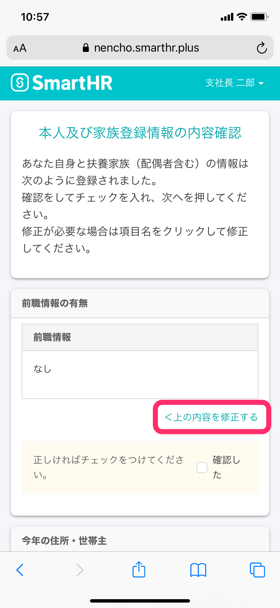
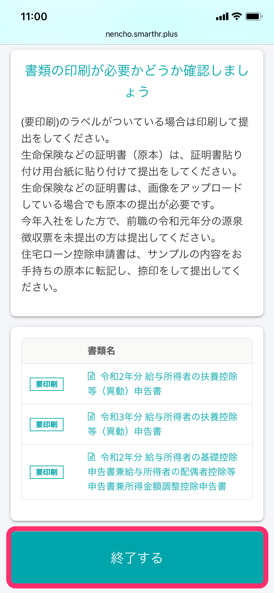

下面介绍从员工收到年末调整填写申请到回答问卷调查，再到向管理员提交文件的整个流程。

在个人电脑上操作的程序是、请查看以下帮助页面。

:::related
[从员工收到年末调整填写申请到提交文件的流程（电脑用）](https://knowledge.smarthr.jp/hc/ja/articles/360037014354)
:::
:::tips
 **员工完成问卷调查所需的时间（参考）** 
在资料齐全的状态下，所需时间如下。
- 未参保人寿保险等、无税法规定的抚养家属的情况【需时：1分钟〜3分钟】
- 参保人寿保险等、有税法规定的抚养家属的情况【需时：5分钟〜15分钟】
- 参保人寿保险等、有税法规定的抚养家属、住宅贷款的情况【需时：10分钟〜20分钟】
:::

# 1\. 从年末调整填写申请邮件中的URL访问SmartHR

点击邮件「收到年末调整填写申请（年末調整の依頼が届きました）」中的URL，访问SmartHR。

在登录画面中输入员工编号或邮箱地址、密码，然后点击 \[登录\]。

若遇到忘记密码、无法登录等问题，请查看以下帮助页面。

:::related
[忘记密码怎么办？](https://knowledge.smarthr.jp/hc/ja/articles/360026265593)
[用员工编号账户登录](https://knowledge.smarthr.jp/hc/ja/articles/360026263133)
[忘记员工编号账户的密码怎么办？](https://knowledge.smarthr.jp/hc/ja/articles/360026104374)
[无法登录SmartHR时怎么办？](https://knowledge.smarthr.jp/hc/ja/articles/360026104354)
:::

# 2\. 在个人主页点击 \[年末调整手续\]

若收到年末调整的填写申请，个人主页会显示 **\[年末调整手续\]** 按钮。

点击后将显示“您的年末调整”画面。

# 3\. 点击 \[回答\]，开始年末调整

点击 **\[回答\]** 后，将显示年末调整的问题1。

问题1的画面中已写明创建年末调整文件需做的准备、所需时间参考、输入时的注意事项，请务必认真阅读。

点击页面底部的 \[开始\]，开始回答问卷调查。

# 4\. 回答问卷调查

请阅读问题内容，根据自身情况选择合适的答案，一步步完成问卷调查。

### 希望重新回答时

若选错选项，在画面下方的历史回答中点击问题的 **\[蓝字\]** 部分，即可重新从该问题开始回答。

另外，如未注意到选错内容就继续作答，在问卷调查的中途也会显示确认此前输入内容的页面。

如需修改，请通过 **\[＜修改上述内容\]** 进行修改。

# 5\. 确认申告书的内容

SmartHR的年末调整功能将根据问卷调查的回答自动创建年末调整的各类申告书。

在预览画面中确认申告书的内容，如需修改，请在画面左侧的历史回答中点击问题的 \[蓝字\] 部分，重新回答。

若无问题，点击页面底部的 **\[输入完成\]**，进入文件的打印引导页面。

# 6\. 准备所需文件并提交给负责人

请在确认内容无误后点击 **\[完成\]**，准备所需文件并提交给负责人。

带有 **\[需打印\]** 标签的文件需要打印出来提交。

完成问卷调查的回答后，将显示「已回答问卷调查」。

