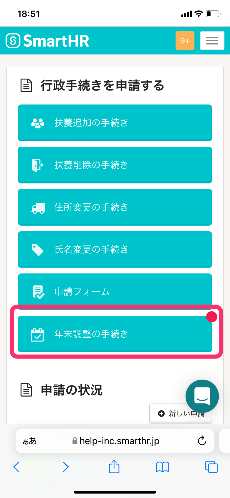
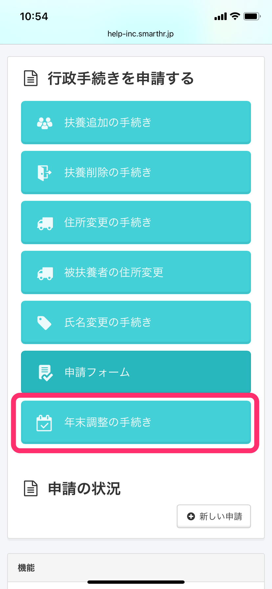
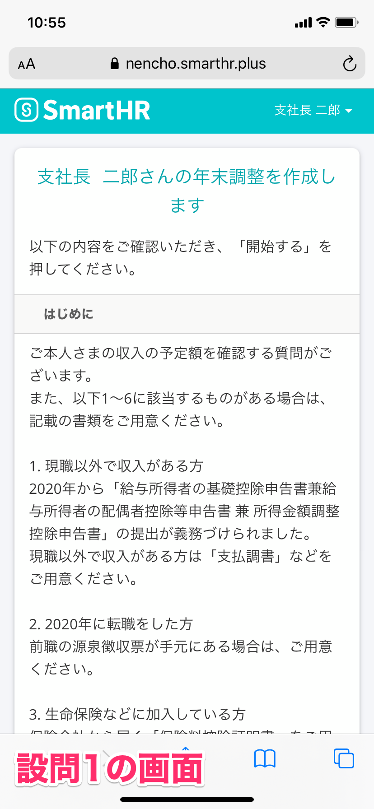
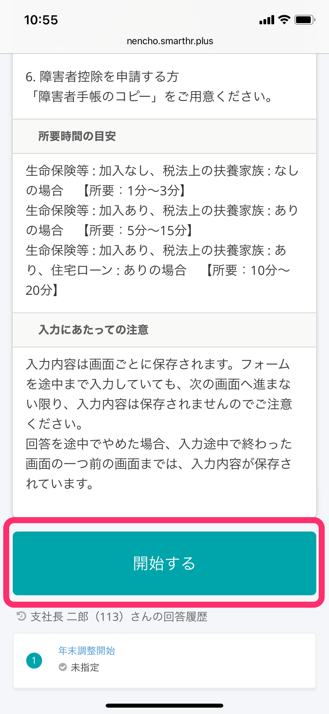
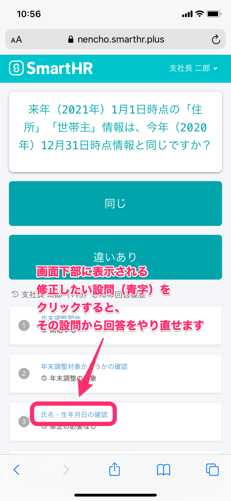
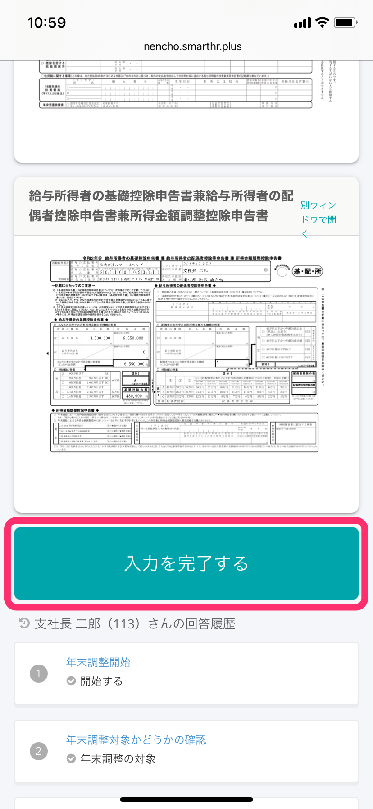

以下說明員工接受年末調整請求、回答問卷到向管理者提交文件為止的流程。

請查看以下幫助頁面以了解您計算機上的操作步驟。

:::related
[員工接受年末調整請求到提交文件為止的流程（電腦用）](https://knowledge.smarthr.jp/hc/ja/articles/360037014354)
:::
:::tips
 **完成問卷所需時間（預估）** 
手邊備齊必要資訊時，所需時間如下所示。
- 未加入生命保險等、無稅法上的扶養家屬：【所需時間：1分鐘～3分鐘】
- 已加入生命保險等、有稅法上的扶養家屬：【所需時間：5分鐘～15分鐘】
- 已加入生命保險等、有稅法上的扶養家屬、有住宅貸款：【所需時間：10分鐘～20分鐘】
:::

# 1\. 從年末調整請求電子郵件中記載的網址連接至SmartHR

在標題為「您已收到年末調整請求（年末調整の依頼が届きました）」的電子郵件中點選網址，連接至SmartHR。

在登入頁面中填寫員工編號／電子郵件地址與密碼後，點選 \[登入\] 。

如您遇到忘記密碼或無法登入等問題，請參閱下列幫助頁面。

:::related
[忘記密碼時如何重設？](https://knowledge.smarthr.jp/hc/ja/articles/360026265593)
[使用員工編號帳號登入](https://knowledge.smarthr.jp/hc/ja/articles/360026263133)
[忘記員工編號帳號的密碼時如何重設？](https://knowledge.smarthr.jp/hc/ja/articles/360026104374)
[無法登入SmartHR時如何處理？](https://knowledge.smarthr.jp/hc/ja/articles/360026104354)
:::

# 2\. 在我的頁面中點選 \[年末調整手續\]

在您收到年末調整請求後，我的頁面將會顯示 **\[年末調整手續\]** 按鈕。

點選後，系統將顯示「您的年末調整」頁面。

# 3\. 點選\[年末調整手續\]

將我的頁面向下拉，點選**\[年末調整手續\]** 。

點選後，系統將顯示「您的年末調整」頁面。

# 4\. 點選\[回答\] 開始進行年末調整

點選**\[回答\]** 後，頁面將顯示年末調整的問題1。

問題1頁面中記有製作年末調整時的準備資料、預估所需時間及填寫注意事項，請務必詳閱所有資訊。

點選頁面最下方的 **\[開始\]** ，開始回答問卷。

# 4\. 回答問卷

請在閱讀問題內容後，選擇符合本身狀況的選項，並繼續回答下一題。

### 如您欲重新作答

當您選錯選項時，只要在頁面下方的回答履歷點選問題的 \[藍字\] 部分，即可從該道問題重新作答。

此外，即使您未發現錯誤便繼續作答，問卷中間將顯示確認頁面，您可查看目前已填寫的內容。

如需要修改，請從**\[＜修改以上內容\]** 進行修改。

# 5\. 確認申報書內容

SmartHR的年末調整功能會根據問卷的回答內容，自動製作年末調整的各項申報書。

在預覽頁面中確認申報書內容，如需要修改，請在頁面左側的回答履歷點選問題的 **\[藍字\]** 部分重新作答。

若沒有問題，請點選頁面最下方的 **\[填寫完畢\]** ，轉移至列印文件的說明頁面。

# 6\. 備妥所需文件，提交給專責人員

確認內容後，請點選 **\[結束問卷\]** ，並備妥所需文件，提交給專責人員。

有**\[須列印\]** 標籤的文件，須列印後提交。

問卷回答完畢後，系統上會顯示為「已回答問卷」。

