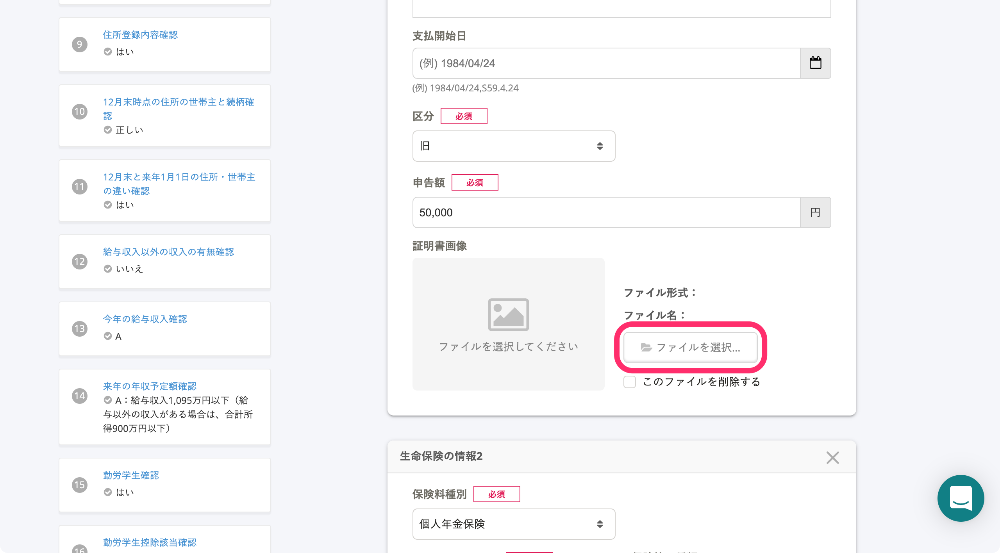
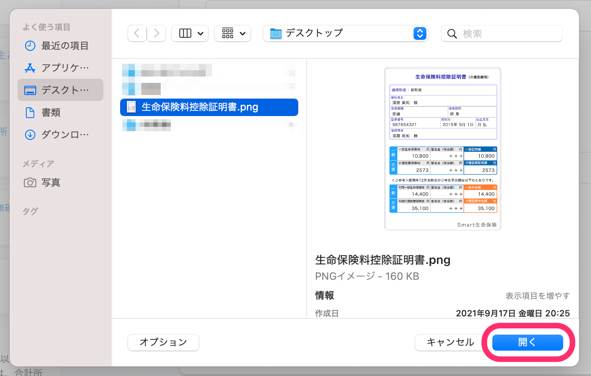
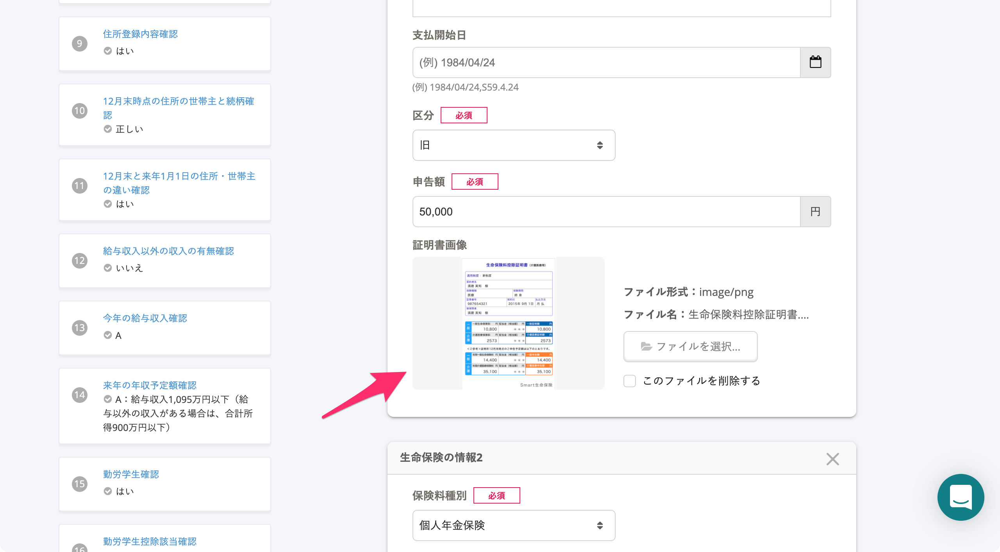
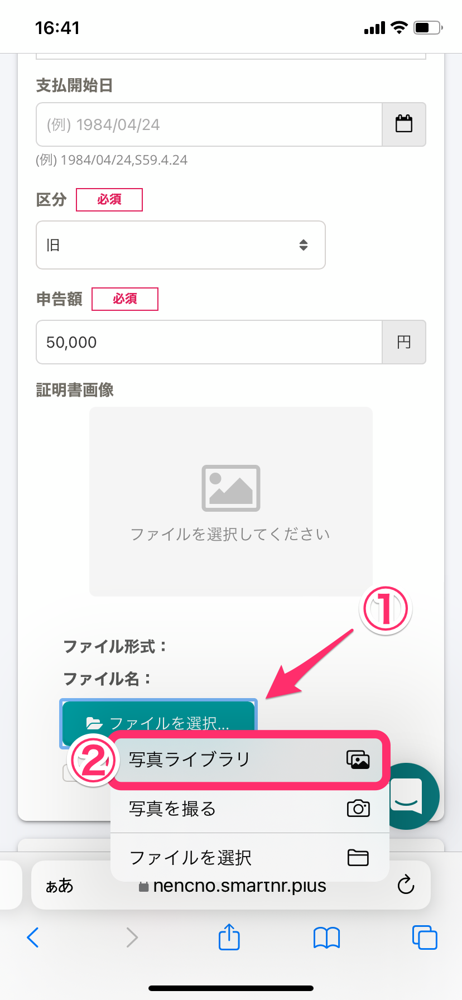
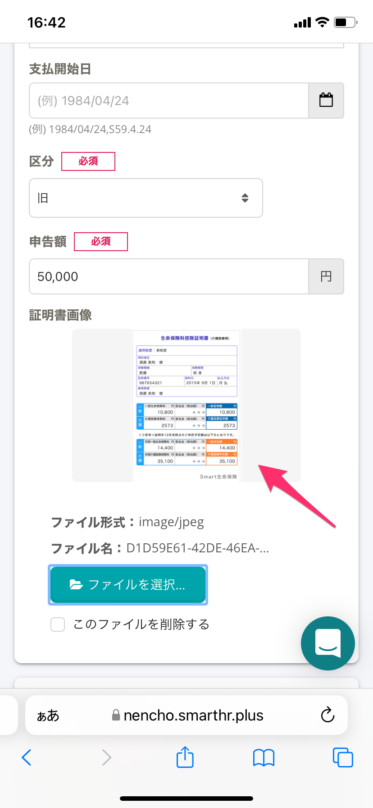
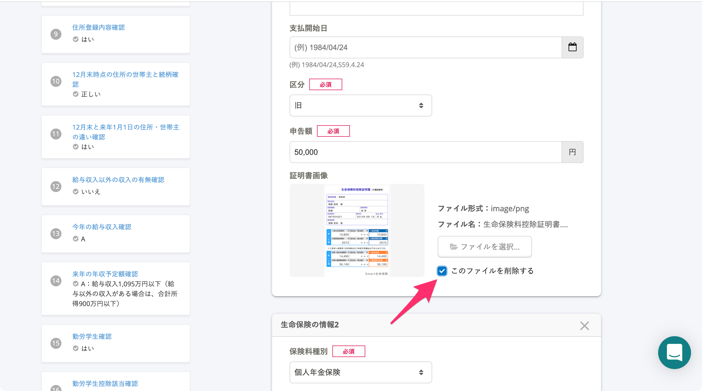

:::alert
当ページで案内しているSmartHRの年末調整機能の内容は、2021年（令和3年）版のものです。
2022年（令和4年）版の年末調整機能の公開時期は秋頃を予定しています。
なお、画面や文言、一部機能は変更になる可能性があります。
公開時期が決まり次第、[アップデート情報](https://smarthr.jp/update%E2%80%9D)でお知らせします。
:::

年末調整のアンケートで画像を添付する操作手順を案内します。

画像添付に関する不明点やお困りごとは、[よくある質問・トラブルと対処法](https://knowledge.smarthr.jp/hc/ja/articles/4408508837401#toc--8)を参照してください。

# パソコンの場合

操作手順は、Macを利用した場合を例に案内します。

## 1.［ファイルを選択…］をクリック

 **［ファイルを選択…］** をクリックすると、添付する画像の選択画面が表示されます。

## 2\. SmartHRに提出したい画像を選択し、［開く］をクリック

パソコンに保存された画像から、SmartHRに提出したい画像を選択して **［開く］** をクリックします。

 **［証明書画像］** 欄に選択した画像が添付されます。

# スマートフォンの場合

操作手順は、iPhoneでSafariを利用した場合を例に案内します。

## 1.［ファイルを選択…］>［写真ライブラリ］をタップ

 **［ファイルを選択…］** をタップし、 **［写真ライブラリ］** を選択します。

:::tips
 **［ファイルを選択…］** から **［写真を撮る］** を選択し、カメラで書類画像を撮影して、添付する方法もあります。
:::

## 2\. SmartHRに提出したい画像を選択する

スマートフォンに保存されている画像から、SmartHRに提出したい画像を選択してください。

## 3\. 画像が反映されていることを確認する

 **［証明書画像］** 欄に選択した画像が添付されます。

# よくある質問・トラブルと対処法

## パソコン・スマートフォン共通

### Q. 選択する画像を間違えました。画像の選択をやり直せますか？

A. はい、 **［ファイルを選択…］** を押して、正しい画像を選択してください。

画像ファイルは、何度でも選択をやり直せます。

### Q. 画像を削除したいです

A. 画像を削除するには、 **［このファイルを削除する］** にチェックを入れて、次の設問に進んでください。

添付した画像は、次の設問に進むことで削除されます。

### Q. 添付可能なファイル形式とサイズが知りたい

A. 年末調整に添付できるファイル形式とサイズは以下の通りです。

| 項目 | ファイル形式 | 一度に保存できるサイズ上限 |
| :-- | :-- | :-- |
| 生命保険等の証明書 | jpeg（jpg）, png, pdf |   30MB  例：収集情報画面で「生命保険等の証明書」と「住宅ローン控除の必要書類」の画像を添付して保存する場合、2つのファイルサイズの合計は30MB以下である必要があります。   |
| 源泉徴収票 | jpeg（jpg）, png, pdf |
| 障害者手帳 | jpeg（jpg）, png, pdf |
| 勤労学生の学生手帳 | jpeg（jpg）, png, pdf |
| 配偶者や扶養家族が海外居住の場合の必要書類 | jpeg（jpg）, png, pdf |
| 住宅ローン控除の必要書類 | jpeg（jpg）, png, pdf |

:::related
[【一覧】アップロードできるファイル形式とサイズ](https://knowledge.smarthr.jp/hc/ja/articles/360026106354)
:::

## スマートフォン利用の場合

### Q. ［ファイルを選択…］>［写真を撮る］を押してカメラを起動しても、シャッターが押せない／カメラが終了してしまう

A.  **［ファイルを選択** … **］>［写真を撮る］** の手順でカメラを起動せず、普段通りにスマートフォンのカメラを起動して必要書類を撮影してください。

撮影した画像は **［ファイルを選択** … **］>［写真ライブラリ］** を選択し、添付してください。
