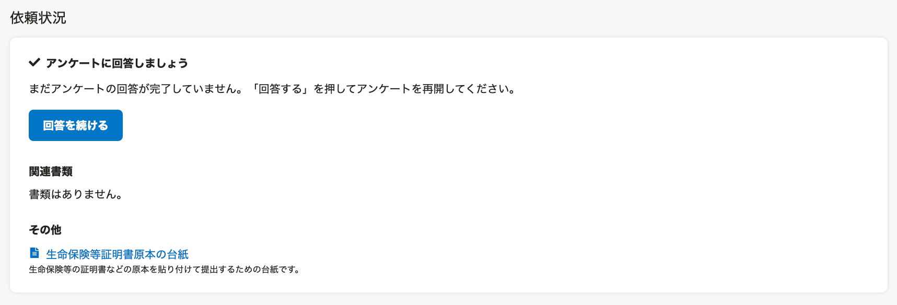
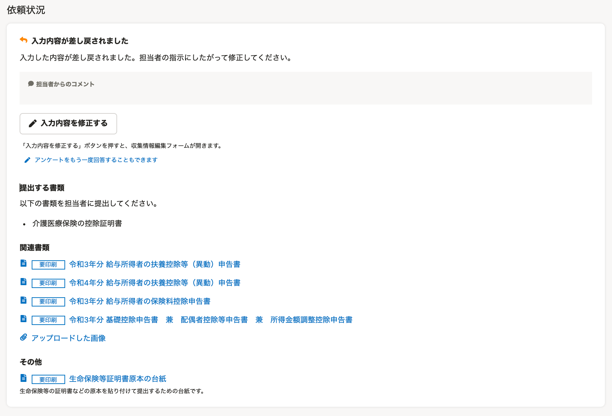

This page explains how to use the "Your Year-End Adjustment" screen, which is the year-end adjustment feature used by employees.

# About the Your Year-End Adjustment screen

The "Your Year-End Adjustment" screen is displayed after you log in to SmartHR and press the **\[Year-End Adjustment\]** button.

From the「Your Year-End Adjustment」screen, you can answer the year-end adjustment survey and check documents that have been created.

This page has been divided into the following five sections to further explain the "Your Year-End Adjustment" screen.

1.  Request status（依頼状況）
2.  Switch the year for implementing year-end adjustment（年末調整の実施年を切り替え）
3.  Notices from SmartHR（SmartHRからのお知らせ）
4.  Reacquisition of account information（アカウント情報再取得）
5.  Notices from the administrator (only displayed if configured)

:::tips
The screen layout is the same for both computers and smartphones.
The explanatory screenshots on this page are taken from a computer.
:::

# 1\. Request status

From the request status field, you can check on the year-end adjustment request status, original document copies that need to be submitted, and year-end adjustment documents that have been created.

Content displayed in the request status field changes as shown below depending on the year-end adjustment request status and response status.

※Click on an image in the display column to enlarge it.

| **Request status** | **Display** | **Explanation** |
| --- | --- | --- |
| A request for year-end adjustment has not yet arrived |  |   Please wait until there is a request from a supervisor.  :::tips **What if this screen is displayed even though you have received an email requesting year-end adjustment/the administrator says that they have requested year-end adjustment?** Please try using the "4. Reacquisition of account information" function introduced on this page. If it still does not switch to a screen with the **\[Answer\]** button, please check with a supervisor. :::  |
| A request for year-end adjustment has arrived (not responded) |  |   A request to answer the year-end adjustment survey has arrived from a supervisor. Press \[Answer\] to begin answering the survey.   |
| A request for year-end adjustment has arrived (in progress) |  |   This is displayed when you have answered at least 1 question on the year-end adjustment survey.  Please answer the year-end adjustment survey all the way.   |
| You have responded to the year-end adjustment request |  |   You have finished answering the year-end adjustment survey.  You can check which documents need to have original copies submitted from **\[Document(s) to submit\]**.  You can check the documents that were created based on the year-end adjustment survey from **\[Related documents\]**.  If the label **\[Must print\]** is included at the beginning of the document name, the document must be printed and submitted.  \*If the "Sheet for affixing original copies of certificates for life insurance, etc." is displayed under \[Other\], attach the original copies to the sheet and submit them.   |
| The year-end adjustment has been returned (corrections requested) |  |   The year-end adjustment has been returned.  Press **\[Correct the content entered\]** and correct the content.  \*If there are comments from a supervisor, they will be displayed under **\[Comments from your supervisor\]**.  \*Press **\[You can reanswer the survey\]** to answer the survey again from the beginning.  :::alert If you answer the survey again from the beginning, **all information related to housing loans will be deleted** when you begin reanswering the questions. Housing loan information must be entered again from the beginning. All other previously entered information will be saved, so you will not need to reenter it. In addition, previously created year-end adjustment documents will be deleted when you begin reanswering the questions. We do not recommend using this option unless instructed to do so by a supervisor. :::  |
| The year-end adjustment has been confirmed |  |   The year-end adjustment has been confirmed.  If a document or the original copy of a form needs to be submitted, please submit it in the manner prescribed by your supervisor.   |

:::related
[Employee guide: From receiving a year-end adjustment request to submitting the application (when using a computer)](https://knowledge.smarthr.jp/hc/ja/articles/360037014354)
[Employee guide: From receiving a year-end adjustment request to submitting the application (when using a smartphone)](https://knowledge.smarthr.jp/hc/ja/articles/4405556671641)
:::

## Related documents

After completing the year-end adjustment survey, the names of documents that were created will be displayed in the related documents field.

Press **\[Document name\]** to display the document preview screen, from which the document can be printed and downloaded.

Press **\[Uploaded images\]** to display the preview screen for image files that you attached when answering the year-end adjustment survey.

:::related
[How to save year-end adjustment documents on a smartphone](https://knowledge.smarthr.jp/hc/ja/articles/360037880754)
[How to print the necessary documents after entering information for year-end adjustment](https://knowledge.smarthr.jp/hc/ja/articles/360037997153)
:::

## Other

**\[Other\]** is only displayed when a supervisor turns on the "Use the sheet for affixing original copies of certificates for life insurance, etc." option for the year-end adjustment feature.

If "Sheet for affixing original copies of certificates for life insurance, etc." is displayed, attach the original copies to the sheet and submit them.

# 2\. Switch the year for implementing year-end adjustment

If you have performed year-end adjustments using SmartHR in the past, you can switch the screen to a different year by pressing **［XXXX (year) Year-End Adjustment▼］.** 

# 3\. Notices from SmartHR

Notices regarding updates to and maintenance of the year-end adjustment feature will be displayed here.

Click **\[List of Notices\]** to display the page where you can check all of the notices from SmartHR.

# 4\. Reacquisition of account information

This function is for people who use SmartHR for multiple companies.

Press **\[Reacquisition of account information\]** to display the **\[Reacquire account information\]** screen. If the company you are logged in to does not change, this function will switch the company account that you are logged in to.

# 5\. Notices from the administrator

**\[Notices from the administrator\]** displays announcements from the supervisor concerning year-end adjustment, such as information about the employee help desk and notices about submission deadlines for original documents.

This screen is not displayed if the supervisor has not configured notice settings for the year-end adjustment feature.

