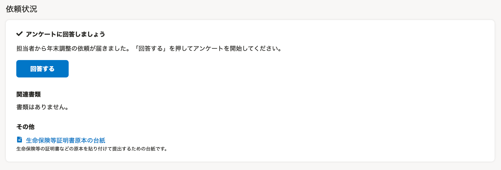
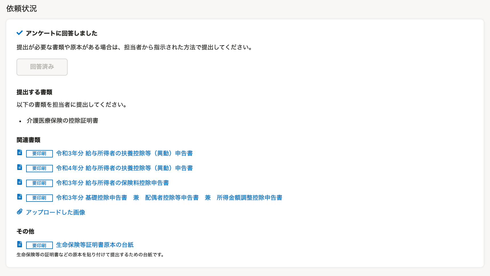
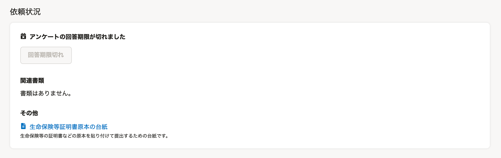
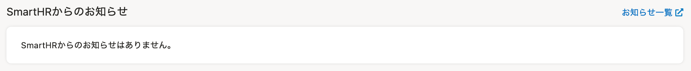

:::alert
当ページで案内しているSmartHRの年末調整機能の内容は、2021年（令和3年）版のものです。
2022年（令和4年）版の年末調整機能の公開時期は秋頃を予定しています。
なお、画面や文言、一部機能は変更になる可能性があります。
公開時期が決まり次第、[アップデート情報](https://smarthr.jp/update%E2%80%9D)でお知らせします。
:::

年末調整機能で従業員が利用する **［あなたの年末調整］** 画面の使い方を説明します。

# あなたの年末調整画面とは

 **［あなたの年末調整］** 画面は、SmartHRにログイン後、 **［年末調整の手続き］** ボタンを押したあとに表示される画面のことです。

 **［あなたの年末調整］** 画面では、年末調整のアンケートの回答や、作成した書類の確認などができます。

ページ内の要素を下記の5つに分けて、概要を説明します。

1.  依頼状況
2.  年末調整の実施年を切り替え
3.  SmartHRからのお知らせ
4.  アカウント情報再取得
5.  管理者からのお知らせ（設定がない場合は表示なし）

:::tips
利用端末がPC（パソコン）でも、スマートフォンでも、画面の構成は同じです。
当ページでは、PC利用時の画面を用いて説明します。
:::

# 1\. 依頼状況

依頼状況欄では、年末調整の依頼状況や、提出が必要な原本、作成した年末調整書類の内容を確認できます。

依頼状況欄の表示内容は、年末調整の依頼状況・対応状況によって以下のとおり変わります。

※表示欄の画像を拡大するには、画像を押してください。

| **依頼の状況** | **表示** | **説明** |
| --- | --- | --- |
| 年末調整の依頼がまだ届いていない |  |   担当者から依頼があるまでお待ちください。  :::tips **年末調整の依頼メールが届いている/管理者が依頼したと言っているのに、この画面が表示される場合は？** 当ページで紹介している「4. アカウント情報再取得」を試してください。 それでも **［回答する］** ボタンのある画面に切り替わらない場合は、担当者に確認してください。 :::  |
| 年末調整の依頼が届いた（未対応） |  |   担当者から年末調整のアンケートの依頼が届いています。   **［回答する］** を押して、アンケートの回答をはじめてください。   |
| 年末調整の依頼が届いた（対応中） |  |   年末調整のアンケートに1問でも回答していると、この表示になります。  年末調整のアンケートを最後まで回答してください。   |
| 年末調整の依頼の対応を完了した |  |   年末調整のアンケートの回答を完了しています。   **［提出する書類］** では、原本提出が必要な書類を確認できます。   **［関連書類］** では、年末調整のアンケートをもとに作成した書類を確認できます。  書類名の頭に **［要印刷］** ラベルがついている場合、書類は印刷して提出する必要があります。  ※ **［その他］** に「生命保険等証明書原本の台紙」の表示がある場合、原本は台紙に添付して提出してください。   |
| 年末調整を差し戻された（修正を依頼された） |  |   年末調整が差し戻されました。   **［入力内容を修正する］** を押して、内容を修正してください。  ※担当者からのコメントがある場合、 **［担当者からのコメント］** に表示されます。  ※ **［アンケートをもう一度回答することもできます］** を押すと、アンケートを一からやり直します。  :::alert アンケートを一からやり直す場合、再回答を開始した時点で、**住宅ローンに関する情報をすべて削除** します。 住宅ローン情報は、一から再入力が必要です。 それ以外の情報は、以前入力した情報を保持しているため、再入力は不要です。 なお、再回答を開始した時点で、以前に作成した年末調整の書類は削除されます。 担当者から指定がない限りは、利用しないことをおすすめします。 :::  |
| 年末調整の依頼が回答期限切れになった |  |   年末調整の依頼が回答期限切れになっています。  年末調整のアンケートに未回答または入力途中の場合、回答はできません。修正依頼に対する入力は可能です。   |
| 年末調整が確定した |  |   年末調整が確定しています。  提出が必要な書類や原本がある場合は、担当者から指示された方法で提出してください。   |

:::related
[従業員が年末調整依頼を受けてから書類提出までの流れ（PCの場合）](https://knowledge.smarthr.jp/hc/ja/articles/360037014354)
[従業員が年末調整依頼を受けてから、書類提出までの流れ（スマートフォンの場合）](https://knowledge.smarthr.jp/hc/ja/articles/4405556671641)
:::

## 関連書類

年末調整のアンケートを完了すると、関連書類欄に作成した書類名が並びます。

 **［書類名］** を押すと、書類のプレビュー画面が表示され、書類の印刷・ダウンロードが可能になります。

 **［アップロードした画像］** を押すと、年末調整のアンケート入力時に添付した画像ファイルのプレビュー画面が表示されます。

:::related
[Q. スマホで年末調整の書類を保存する方法は？](https://knowledge.smarthr.jp/hc/ja/articles/360037880754)
[Q. 年末調整の入力後、必要書類を印刷する方法は？](https://knowledge.smarthr.jp/hc/ja/articles/360037997153)
:::

## その他

 **［その他］** は、担当者が年末調整機能で「生命保険等証明書原本の台紙を使う」設定をしている場合のみ表示されます。

「生命保険等証明書原本の台紙」の表示がある場合、原本は台紙に添付して提出してください。

# 2\. 年末調整の実施年を切り替え

 **［xx年の年末調整▼］** を押すと、SmartHRで実施した過去の年末調整がある場合、画面を切り替えられます。

# 3\. SmartHRからのお知らせ

年末調整機能に関する更新やメンテナンスなどのお知らせがある場合に表示されます。

 **［お知らせ一覧］** をクリックすると、SmartHRのすべてのお知らせ情報を確認できるページが表示されます。

# 4\. アカウント情報再取得

複数の会社でSmartHRを使っている方に向けた機能です。

 **［アカウント情報再取得］** を押すと **［アカウント情報を再取得］** 画面が表示され、マルチログインのログイン先が切り替わっていない場合、ログイン先を切り替えます。

# 5\. 管理者からのお知らせ

 **［管理者からのお知らせ］** には、社内の問い合わせ窓口の案内、原本の提出締切日の周知など、年末調整に関する担当者からの連絡事項が表示されています。

担当者が年末調整機能でお知らせの設定をしていない場合は、画面に表示されません。

