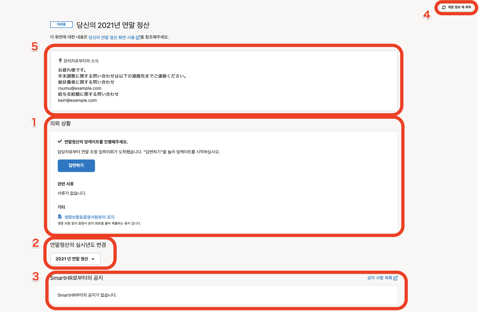
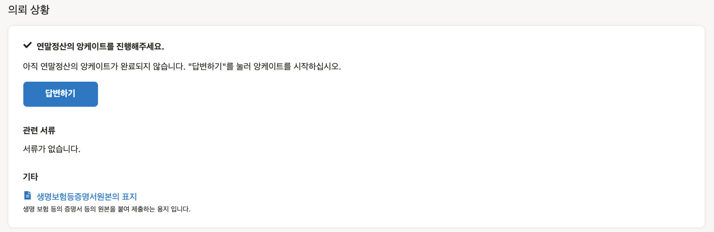

연말정산기능에서 직원이 이용하는 「당신의 연말정산」화면의 사용법을 설명합니다.

# 당신의 연말정산화면 이란?

「당신의 연말정산」화면은 SmartHR에 로그인 후, **［연말정산］** 버튼을 누른면 표시되는 화면을 말합니다.

「당신의 연말정산」화면에서는 연말정산의 앙케이트 답변이나 작성된 서류를 확인 등을 할수 있습니다.

페이지의 요소를 아래의 5가지로 나누어 「당신의 연말정산화면」의 개요를 설명합니다.

1.  의뢰상황
2.  연말정산의 실시년도 변경
3.  SmartHR로부터의 공지
4.  계정 정보 재취득
5.  관리자로부터의 안내（설정하지 않은 경우에는 표시되지 않습니다.）

:::tips
PC（컴퓨터）와 스마트폰의 어느 이용 단말에서도 화면의 구성은 같습니다.
이 페이지에서는 PC이용시의 화면으로 설명 드립니다.
:::

# 1\. 의뢰상황

의뢰상황란에서는 연말정산의 의뢰상황이나 제출에 필요한 원본, 작성한 연말정산서류의 내용을 확인할수 있습니다.

의뢰상황란의 표시내용은 연말정산의 의뢰상황・대응상황에 따라 아래와 같이 변합니다.

※표시란의 이미지를 확대하기 위해서는 이미지를 클릭해 주세요.

| **의뢰의 상황** | **표시** | **설명** |
| --- | --- | --- |
| 연말정산의 입력에 대한 의뢰가 아직 도착하지 않았다 |  |   관리자로부터의 의뢰가 있을때까지 기다려주세요.  :::tips **연말정산의 메일이 도착해있다/관리자가 의뢰하였다고 하지만 이 화면이 표시되거 있을 경우는?** 이 페이지에서 소개하고 있는 「4. 계정정보 재취득」을 시도해주세요. 그래도 **［답변하기］** 버튼이 있는 화면으로 바뀌지 않을 경우에는 담당자에게 확인해 주세요. :::  |
| 연말정산의 의뢰가 도착했다（미대응） |  |   담당자로부터 연말정산의 앙케이트의 의뢰가 도착해 있습니다.   **［답변하기］** 를 클릭하여 앙케이트의 답변을 시작해 주세요.   |
| 연말정산의 의뢰가 도착했다（대응중） |  |   연말정산의 앙케이트에서 1개라도 답변하였을 경우, 이 화면으로 됩니다.  연말정산의 앙케이트를 마지막까지 답변해 주세요.   |
| 연말정산 의뢰의 대응을 완료했다 |  |   연말정산의 앙케이트의 답변을 완료했습니다.   **［제출하는 서류］** 에서는 원본제출이 필요한 서류를 확인할수 있습니다.   **［관련서류］** 에서는 연말정산의 앙케이트를 바탕으로 작성된 서류를 확인할수 있습니다.  서류명의 앞부분에  **［인쇄필요］** 라벨이 있는 경우, 해당서류는 인쇄하여 제출할 필요가 있습니다.  ※ **［기타］** 에 「생명보험등 증명서원본의 표지」의 표시가 있는 경우 원본은 표지에 첨부하여 제출해 주세요.   |
| 연말정산에 대하여 수정의뢰가 도착했다（수정을 요청받았다） |  |   연말정산이 되돌아 왔습니다.   **［입력내용을 수정한다］** 를 클릭하여 내용을 수정해주세요.  ※담당자로부터의 코멘트가 있는 경우 **［담당자로부터의 코멘트］** 에 표시됩니다.  ※ **［앙케이트를 다시 답변 할 수 있습니다.한번 답변하는 것이 가능합니다.］** 를 클릭하면 앙케이트를 다시 답변할수 있습니다.  :::alert 앙케이트를 처음부터 다시 답변할 경우, 다시 답변을 시작하는 시점에 **주택론에 대한 정보를 전부 삭제** 합니다. 주택론정보는 처음부터 다시 입력이 필요합니다. 그 외의 정보는 이전 입력한 정보를 보존하고 있기 때문에 재입력은 필요 없습니다. 또한, 다시 답변을 시작하는 시점에 이전에 작성한 연말정산의 서류는 삭제됩니다. 담당자로부터 지시가 있을 때만 이용하시는 것을 추천 드립니다. :::  |
| 연말정산이 확정되었다 |  |   연말정산이 확정되었습니다.  제출이 필요한 서류와 원본이 있는 경우에는 담당자로부터 지시받은 방법으로 제출해 주세요.   |

:::related
[직원이 연말정산의뢰를 받고 서류제출까지의 흐름（PC의 경우）](https://knowledge.smarthr.jp/hc/ja/articles/360037014354)
[직원이 연말정산의뢰를 받고 서류제출까지의 흐름（스마트폰의 경우）](https://knowledge.smarthr.jp/hc/ja/articles/4405556671641)
:::

## 관련서류（関連書類）

연말정산의 앙케이트를 완료하면 관련서류란에 작성된 서류명이 표시됩니다.

 **［서류명］** 을 클릭하면 서류의 미리보기 화면이 표시되어 서류의 인쇄・다운로드가 가능합니다.

 **［업로드된 이미지(アップロードした画像)］** 를 클릭하면 연말정산의 앙케이트 입력시에 첨부한 이미지파일의 미리보기 화면이 표시됩니다.

:::related
[스마트폰에서 연말정산의 서류를 저장하는 방법은?](https://knowledge.smarthr.jp/hc/ja/articles/360037880754)
[연말정산의 입력후 필요서류를 인쇄하는 방법은?](https://knowledge.smarthr.jp/hc/ja/articles/360037997153)
:::

## 기타

 **［기타（その他）］** 는 담당자가 연말정산기능에서 「생명보험등 증명서원본의 표지를 사용한다」설정을 하고 있는 경우에만 표시됩니다.

「생명보험등 증명서원본의 표지（生命保険等証明書原本の台紙）」가 표시되어 있는 경우 원본은 표지에 첨부하여 제출해 주세요.

# 2\. 연말정산의 실시년도를 변경

 **［xx년의 연말정산▼］** 을 클릭하면 SmartHR에서 실시한 과거의 연말정산이 있는 경우 화면을 전환할수 있습니다.

# 3\. SmartHR로부터의 안내

연말정산기능에 대한 갱신이나 메인테넌스 등의 안내를 하는 경우 표시됩니다.

 **［공지사항 일람（お知らせ一覧）］** 을 클릭하면 SmartHR의 모든 안내정보를 확인할수 있는 페이지가 표시 됩니다.

# 4\. 계정 정보 재취득

복수의 회사에서 SmartHR을 이용하고 있는 분을 위한 기능입니다.

 **［계정 정보 재취득（アカウント情報再取得）］** 을 누르면 **［계정 정보를 재취득］** 화면이 표시되어 멀티로그인의 로그인 된 곳의 정보로 전환되지 않았을 경우 로그인 정보를 전환합니다.

# 5\. 관리자로부터의 공지

 **［관리자로부터의 공지（管理者からのお知らせ）**  **］** 에는 사내의 문의창구의 안내, 원본의 제출마감일의 공지 등, 연말정산에 대한 담당자로부터의 연락사항을 표시하고 있습니다.

담당자가 연말정산기능에서 안내의 설정을 하지 않은 경우, 화면에 표시되지 않습니다.

