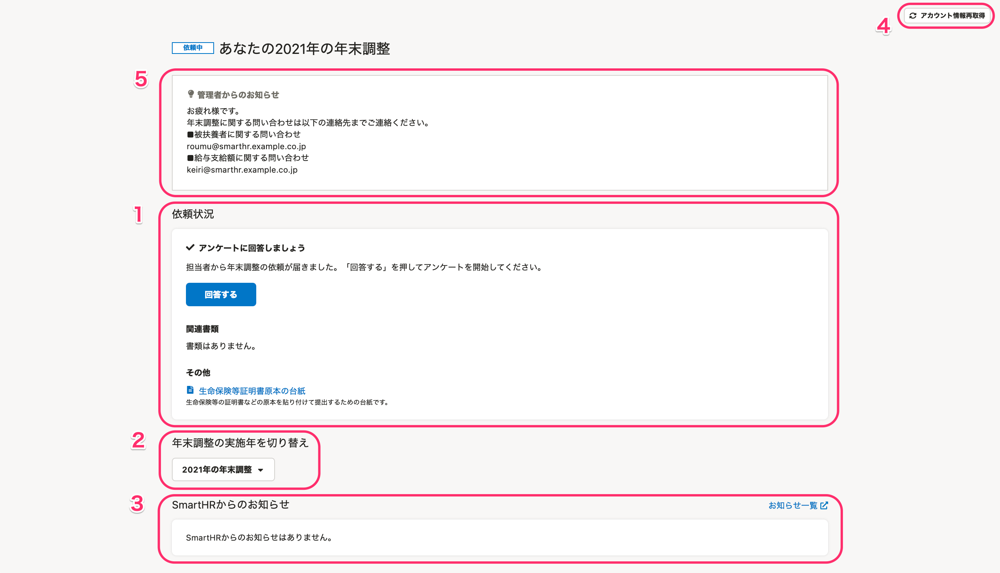
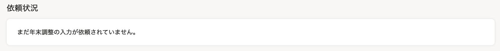
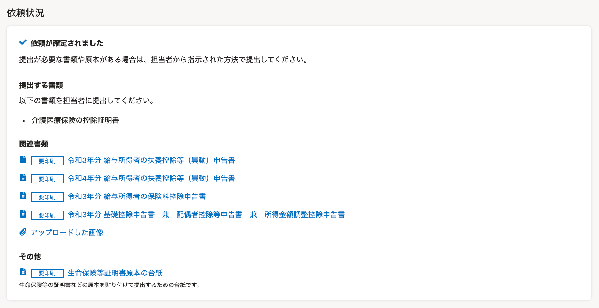
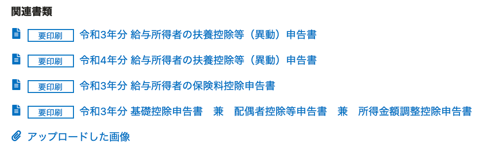
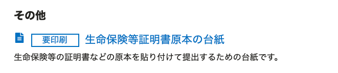

下面介绍员工在年末调整功能中所用“您的年末调整”画面的使用方法。

# 您的年末调整画面定义

“您的年末调整”画面是登录SmartHR后，点击 **［年末调整手续］** 按钮后显示的画面。

在“您的年末调整”画面中，可以回答年末调整问卷调查，或者确认创建的文件等。

下面将页面内的要素分为以下5项，对“您的年末调整画面”的概要进行说明。

1.  填写状况（依頼状況）
2.  切换年末调整的实施年度（年末調整の実施年を切り替え）
3.  来自SmartHR的通知（SmartHRからのお知らせ）
4.  重新获取账户信息（アカウント情報再取得）
5.  来自管理员的通知（未设置则不显示）

:::tips
无论使用的终端是PC（电脑）还是智能手机，画面构成都是相同的。
本页通过使用PC时的画面进行说明。
:::

# 1\. 填写状况

在填写状况栏，可以确认年末调整的填写状况、需要提交的原件和创建的年末调整文件内容。

填写状况栏中显示的内容将根据年末调整的填写状况和处理状况发生以下变化。

※如需放大显示栏中的图像，请点击图像。

| **填写状况** | **显示** | **说明** |
| --- | --- | --- |
| 尚未收到年末调整的委托 |  |   请等待负责人发出委托。  :::tips **已收到年末调整的委托邮件/管理员表示已发出委托，却仍显示此画面时该怎么办？** 请尝试本页面中介绍的“4. 重新获取帐户信息”。 如果仍然没有切换到显示 **［回答］** 按钮的画面，请向负责人确认。 :::  |
| 已收到年末调整的委托（未处理） |  |   负责人已发出了年末调整的问卷调查委托。  请点击**“回答”**，开始回答问卷调查。   |
| 已收到年末调整的委托（处理中） |  |   如果在年末调整的问卷调查中回答了至少一个问题，将会显示此信息。  请完整填写年末调整的问卷调查。   |
| 年末调整委托的处理已完成 |  |   年末调整问卷调查的回答已完成。  在 **［提交文件］** 中，可以确认需要提交原件的文件。  在 **［相关文件］** 中，可以确认基于年末调整问卷调查创建的文件。  文件名称开头附 **［需打印］** 标签时，需打印文件并提交。  ※如果 **［其他］** 中显示了“人寿保险等证明书原件的粘贴用纸”，请将原件贴在粘贴用纸上提交。   |
| 年末调整被退回（要求修改） |  |   年末调整已退回。  请点击 **［修改内容］** ，对内容进行修改。  ※如果有负责人的留言，会显示在 **［负责人留言］** 中。  ※点击 **［可以重新回答问卷调查］** ，从头开始重新回答问卷调查。  :::alert 如果从头开始重新回答问卷调查，将在开始重新回答时**删除有关住宅贷款的所有信息**。 住宅贷款信息需要从头开始重新输入。 其他信息则会保留之前输入的信息，无需重新输入。 开始重新回答时，之前创建的年末调整文件将被删除。 如果不是负责人指定，请勿使用。 :::  |
| 年末调整已确定 |  |   年末调整已确定。 如果您有任何需要提交的文件或原件，请按照负责人的指示提交。   |

:::related
[从员工收到年末调整填写申请到提交文件的流程（PC版）](https://knowledge.smarthr.jp/hc/ja/articles/360037014354)
[从员工收到年末调整填写申请到提交文件的流程（智能手机版）](https://knowledge.smarthr.jp/hc/ja/articles/4405556671641)
:::

## 相关文件

完成年末调整的问卷调查后，相关文件栏会列出创建的文件名称。

点击 **［文件名称］** 后，将显示文件的预览画面，可以打印或下载文件。

点击 **［上传的图片］** 后，将显示输入年末调整问卷调查时所附图片文件的预览画面。

:::related
[在智能手机上保存年末调整文件的方法？](https://knowledge.smarthr.jp/hc/ja/articles/360037880754)
[输入年末调整后，打印所需文件的方法？](https://knowledge.smarthr.jp/hc/ja/articles/360037997153)
:::

## 其他

仅当负责人在年末调整功能中设置了“使用人寿保险等证明书原件的粘贴用纸”时才会显示 **［其他］** 。

如果显示了“人寿保险等证明书原件的粘贴用纸”，请将原件贴在粘贴用纸上提交。

# 2\. 切换年末调整的实施年度

如果存在过去利用SmartHR实施的年末调整，可以点击 **［xx年的年末调整▼］** 切换画面。

# 3\. 来自SmartHR的通知

在有关于年末调整功能的更新或维护等通知时显示。

点击 **［通知一览］** 后，会显示可以确认SmartHR所有通知信息的页面。

# 4\. 重新获取账户信息

此功能适用于在多家公司使用SmartHR的人士。

点击 **［重新获取账户信息］** 后，将显示 **［重新获取帐户信息］** 画面，如果未切换多用户登录的登录目标，将切换登录目标。

# 5\. 来自管理员的通知

在 **［来自管理员的通知］** 中，显示了公司内部咨询窗口的介绍、原件提交截止日期的通知等来自负责人的关于年末调整的联络事项。

如果负责人未在年末调整功能中进行通知的设置，则不会显示在画面中。

