以下說明員工如何使用年末調整功能中的「您的年末調整」頁面。

# 什麼是您的年末調整頁面

登入SmartHR後，點選 **［年末調整手續］** 按鈕，將顯示「您的年末調整」頁面。

您可在「您的年末調整」頁面中回答年末調整問卷，以及確認製作完成的文件等。

將頁面內容分成以下5點，重點說明「您的年末調整頁面」。

1.  問卷狀態（依頼状況）
2.  切換年末調整的實施年度（年末調整の実施年を切り替え）
3.  來自SmartHR的通知（SmartHRからのお知らせ）
4.  重新讀取帳戶資訊（アカウント情報再取得）
5.  來自管理者的通知（如未設定則不會顯示）

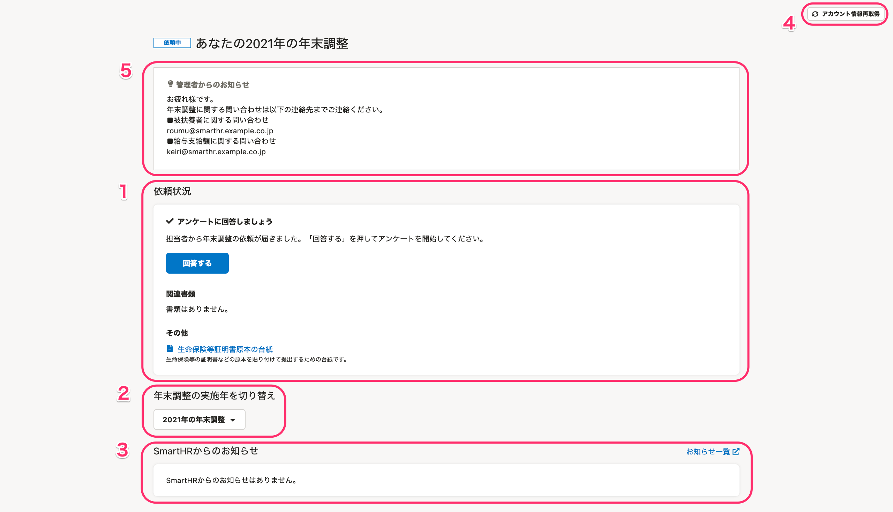

:::tips
無論使用PC（電腦）或智慧型手機操作，頁面架構皆相同。
本頁面將以使用PC時的介面進行說明。
:::

# 1\. 問卷狀態

問卷狀態欄可確認年末調整的問卷狀態、須提交的正本以及製作完成的年末調整文件內容。

問卷狀態欄的顯示內容會依據年末調整的問卷狀態及填寫狀態改變。（如下圖）

※如欲放大顯示欄的圖片，請點選該圖片。

| **問卷狀態** | **顯示** | **說明** |
| --- | --- | --- |
| 尚未收到年末調整請求。 | 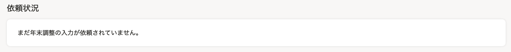 |   請等候專責人員的請求。  :::tips **已收到年末調整的請求電子郵件／管理者表示已發出請求，卻顯示本頁面時，該如何處理？** 請嘗試操作本頁面介紹的「4. 重新讀取帳戶資訊」。 即使已嘗試操作，卻仍無法切換至有 **［回答］** 按鈕的頁面時，請向專責人員確認。 :::  |
| 已收到年末調整請求（尚未填寫） | 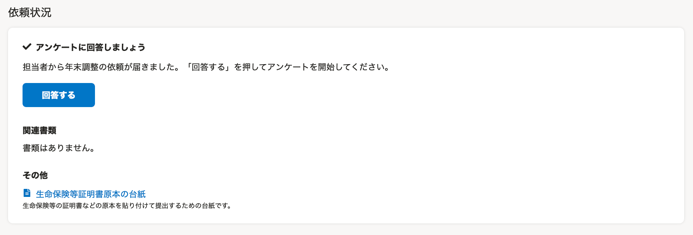 |   已收到來自專責人員的年末調整問卷請求。  請點選 **［回答］** 並開始填寫問卷。   |
|   已收到年末調整請求（填寫中）   | 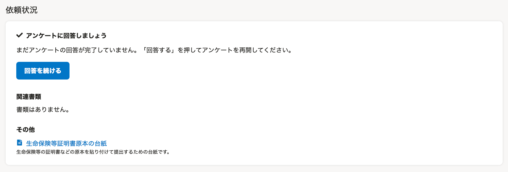 |   只要在年末調整問卷回答1題，就會顯示此狀態。  請完整回答年末調整問卷。   |
| 已完成年末調整請求 | 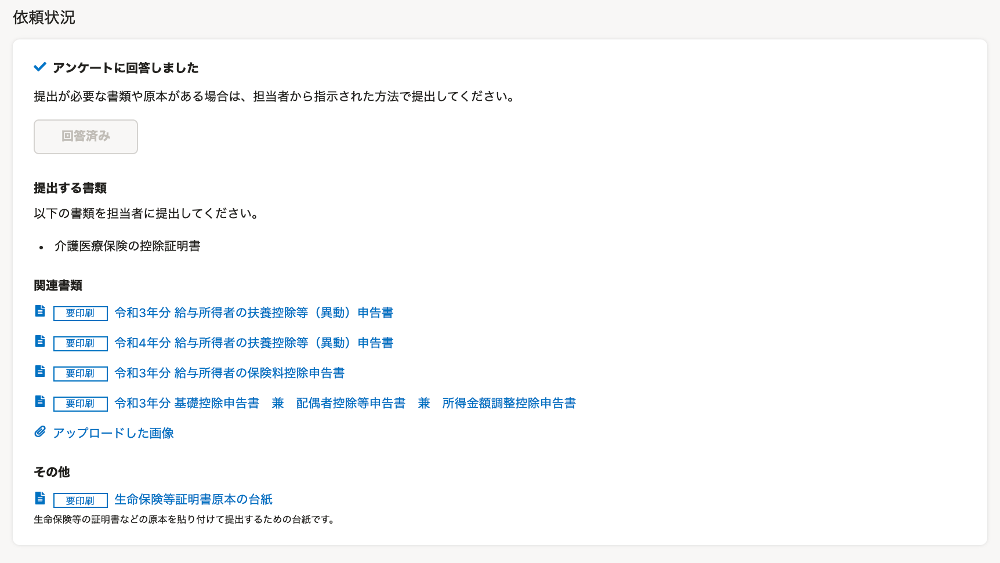 |   年末調整問卷已填寫完成  您可在 **［提交文件］** 中確認須提交正本的文件。  您可在 **［相關文件］** 中確認根據年末調整問卷製作完成的文件。  文件名稱開頭如標有 **［須列印］** 標籤，則須列印該文件並提交。  ※ **［其他］** 中如果出現［生命保險等證明書正本台紙］標示，請將正本附在表格上提交。   |
| 年末調整已被退回（已請求修改） | 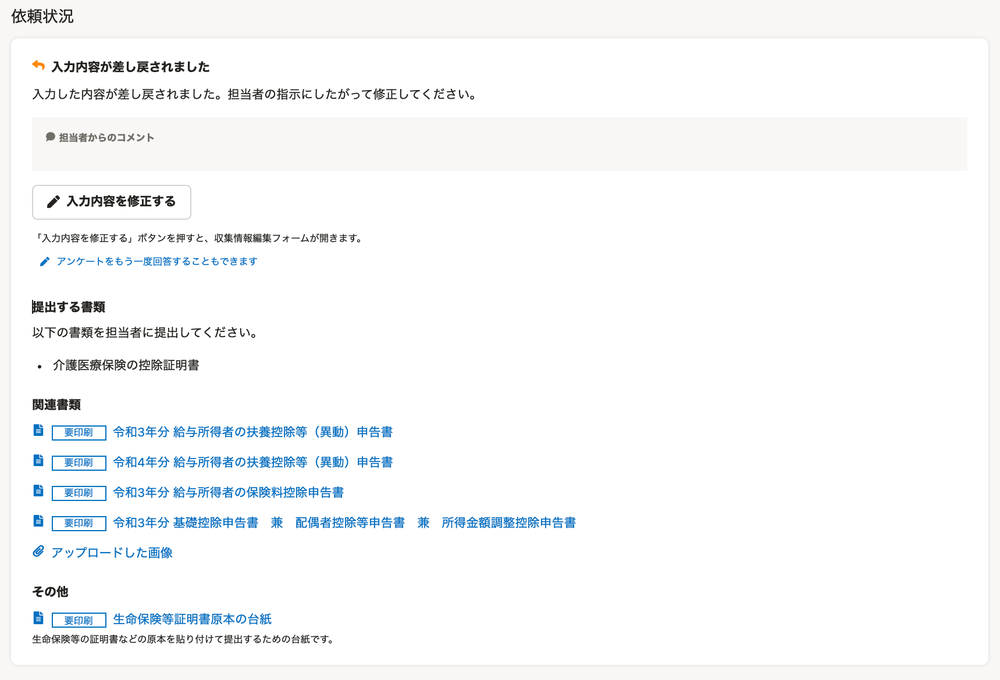 |   年末調整已被退回。  請點選 **［修改填寫內容］** 並修改內容。  ※有來自專責人員的留言時，將顯示 **［專責人員留言］** 。  ※點選 **［重新回答問卷］** ，即可重新回答整份問卷。  :::alert 如您重新回答整份問卷，一旦開始重新作答，將**刪除所有房貸相關資訊** 。 所有房貸資訊都必須重新填寫。 除此之外的資訊則會維持前次填寫的內容，不需重新填寫。 此外，一旦開始重新作答，將刪除前次製作完成的年末調整文件。 除非專責人員有特別指示，否則不建議您使用本功能。 :::  |
| 年末調整已確定 | 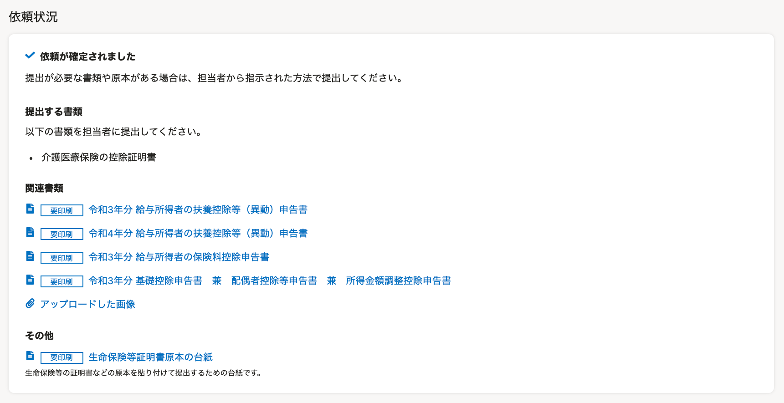 |   年末調整已確定。 如有須提交的文件或正本，請依照專責人員的指定方式提交。   |

:::related
[員工接受年末調整請求到提交文件為止的流程（使用PC）](https://knowledge.smarthr.jp/hc/ja/articles/360037014354)
[員工接受年末調整請求到提交文件為止的流程（使用智慧型手機）](https://knowledge.smarthr.jp/hc/ja/articles/4405556671641)
:::

## 相關文件

完成年末調整問卷後，相關文件欄會列出製作完成的文件名稱。

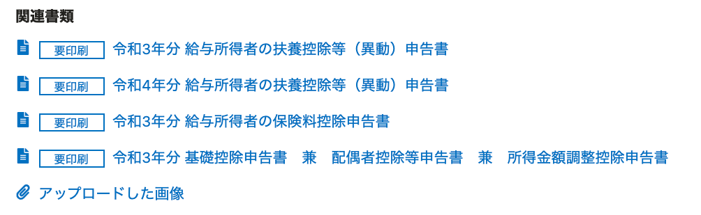

點選 **［文件名稱］** ，系統將顯示文件預覽頁面，可列印或下載文件。

點選 **［已上傳的圖片］** ，系統將顯示填寫年末調整問卷時附上的圖檔預覽頁面。

:::related
[如何使用智慧型手機儲存年末調整文件？](https://knowledge.smarthr.jp/hc/ja/articles/360037880754)
[年末調整填寫完成後，如何列印所需文件？](https://knowledge.smarthr.jp/hc/ja/articles/360037997153)
:::

## 其他

僅限專責人員已在年末調整功能中設定「使用生命保險等證明書正本台紙」時，才會顯示 **［其他］** 。

如果出現「生命保險等證明書正本台紙」標示，請將正本附在表格上提交。

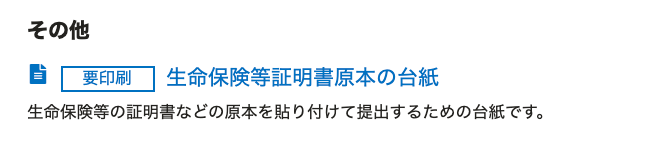

# 2\. 切換年末調整的實施年度

您過去如曾透過SmartHR實施年末調整，只要點選 **［xx年度的年末調整▼］** ，即可切換頁面。

# 3\. 來自SmartHR的通知

如有年末調整功能的相關更新或維護等通知，將顯示於此。

點選 **［通知一覽］** ，將顯示SmartHR所有通知資訊的確認頁面。

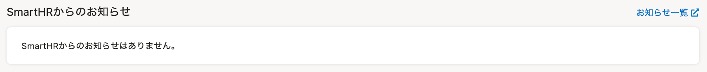

# 4\. 重新讀取帳戶資訊

本功能適用於在多間公司使用SmartHR者。

點選 **［重新讀取帳戶資訊］** 將顯示 **［重新讀取帳戶資訊］** 頁面，若之前未切換成可多重登入的帳戶，點選後將會切換登入帳戶。

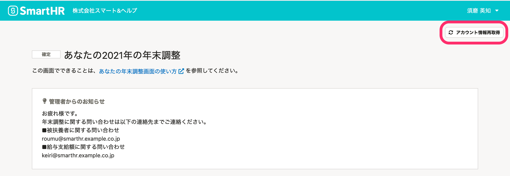

# 5\. 來自管理者的通知

公司內部的諮詢窗口引導、正本提交截止日期公告等來自專責人員的年末調整相關聯絡事項，都會顯示於 **［來自管理者的通知］** 。

專責人員若未在年末調整功能中設定通知功能，則不會顯示於頁面上。

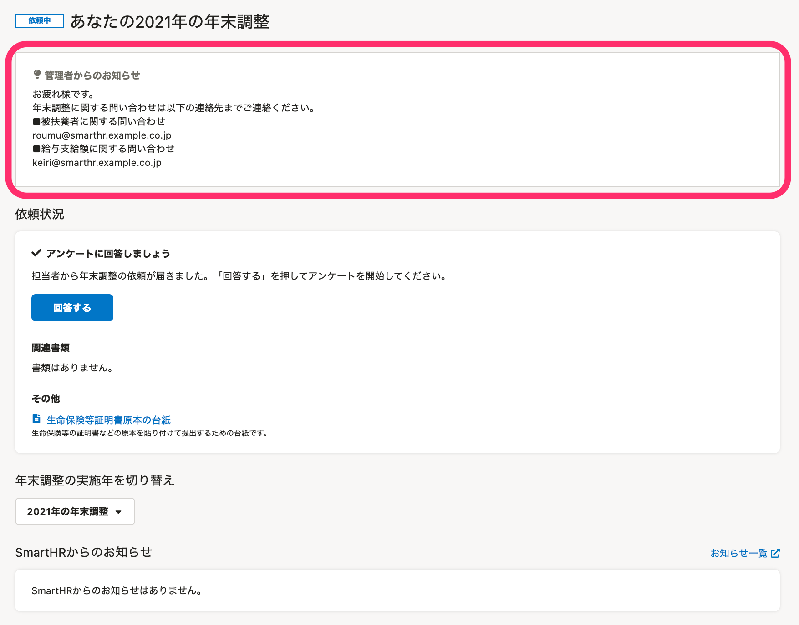
