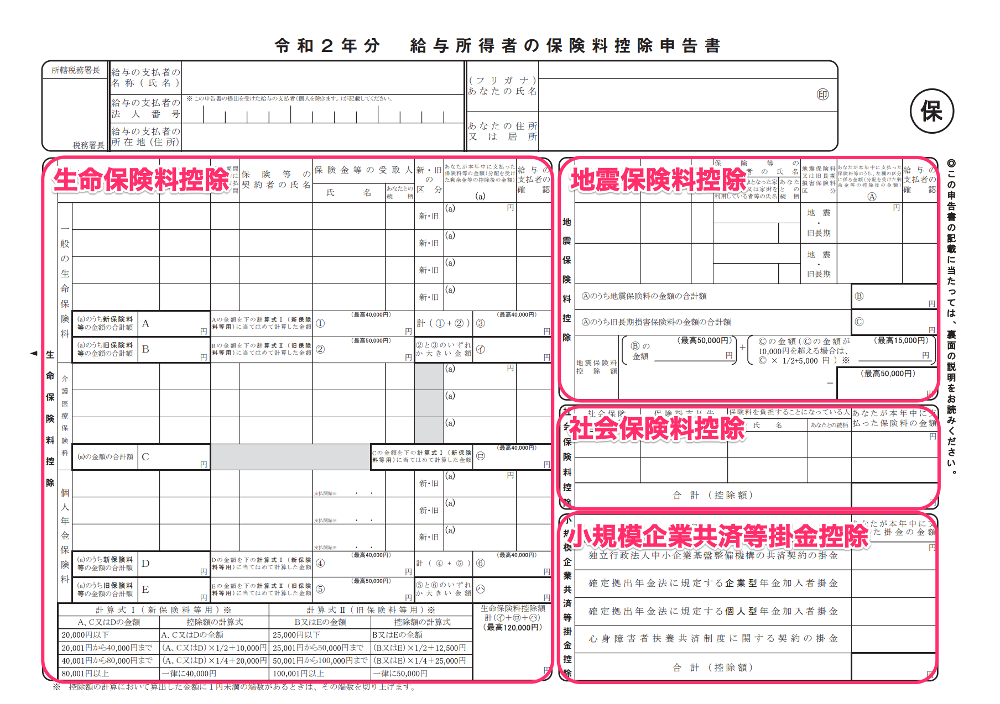

Points to note regarding how content answered during the year-end adjustment survey is reflected in the documents are shown below.

# Application for Exemption for Dependents of Employment Income Earner（給与所得者の扶養控除等申告書）

The conditions to be displayed on documents in both 2021 and 2022 are as follows.

:::tips
Single parent deductions were established and widow (widower) deductions were reviewed from the 2020 year-end adjustment. However, the "2021 Application for (Change in) Exemption for Dependents of Employment Income Earner" form released by the National Tax Agency has not been updated with the items that list single parent deductions and widow deductions, and the notation remains the same as before the revision.
It is assumed that the person submitting the form will correct the old description by hand. However, the 2021 Application for (Change in) Exemption for Dependents of Employment Income Earner created with SmartHR already supports descriptions for widow and single parent deductions.
:::

## A：Conditions to display a spouse who qualifies for tax deduction at the source（源泉控除対象配偶者）

- You answered "Yes" to having a spouse or "My spouse passed away this year" in the year-end adjustment survey
- Your employment income is 10.95 million yen or less (9 million yen or less in earnings)
- Your spouse's employment income is 1.5 million yen or less (950,000 yen or less in earnings)
- (For 2021) You answered "This year" concerning your support for dependents in the year-end adjustment survey
- (For 2022) You answered "Next year" concerning your support for dependents in the year-end adjustment survey

Whether you are supporting your spouse under the tax act is determined based on what is displayed in this field.

If you do not meet the above income (earnings) requirements, you will not be eligible for this deduction and it will not be displayed on the document.

## B：Conditions to display a relative who qualifies for deductions (16 years or older)（控除対象親族（16歳以上））

- You answered "Yes" to having a dependent in the year-end adjustment survey
- Your dependent relative's employment income is 1.03 million yen or less (380,000 yen or less in earnings)
- Your dependent relative's date of birth is January 1, 2005 or prior (this includes the day of January 1, 2005)

:::tips
Whether you are supporting the family member under the tax act is determined based on what is displayed in this field.
The date of birth will determine whether the dependent relative is displayed in the "Dependent relative who qualifies for deductions (16 years or older)" field or the "Dependent relative under the age of 16" field.
In addition, family relationships deemed to be of direct ancestry are as follows.
- Father/mother/biological father/biological mother/Father-in-law/Mother-in-law
- Grandfather/grandmother/stepgrandfather/stepgrandmother
- Great-grandfather/great-grandmother/step-great-grandfather/step-great-grandmother
:::

## C：Conditions to display a person with disabilities, widow, single parent or working student（障害者、寡婦、ひとり親、勤労学生）

### Disabilities deductions（障害者控除）

- You declared disabilities deductions in the year-end adjustment survey
- Information required to declare disabilities deductions was entered
    - The condition for a spouse to be eligible for disabilities deductions is that their earnings are 480,000 yen or less (a spouse sharing living expenses)

### Widow and single parent deductions（寡婦、ひとり親控除）

#### Widow deductions（寡婦控除）

- The person who answered the survey is a woman
- You answered "not in a common-law marriage" in the year-end adjustment survey
- Your total earnings amount is 5 million yen or less
- You answered "Yes, but we divorced" to the question about your past spouse, and a dependent relative other than a child has been registered in the information about your family
- You answered "Yes, but they passed away" (includes the answer: "Yes, but I do not know if they are still alive") to the question about your past spouse, and a dependent relative has not been registered, or a dependent relative other than a child has been registered in the information about your family

#### Single parent deductions（ひとり親控除）

- You answered "not in a common-law marriage" in the year-end adjustment survey
- Your total earnings amount is 5 million yen or less
- You answered "No, I have not," "Yes, but we divorced" or "Yes, but they passed away" (includes the answer: "Yes, but I do not know if they are still alive") to the question about your past spouse
- A child has been registered in the information about your family

### Working student（勤労学生）

- You declared working student deductions in the year-end adjustment survey
- Information required for working student deductions was entered
- Your employment income is 1.3 million yen or less (750,000 yen or less in earnings), and among which earnings outside of employment is 100,000 yen or less

## D：Conditions to display dependent relatives under the age of 16（16歳未満の扶養親族に表示する条件）

- You answered "Yes" to having a dependent in the year-end adjustment survey
- Your dependent relative's employment income is 1.03 million yen or less (480,000 yen or less in earnings)
- Your dependent relative's date of birth is January 2, 2005 or later (this includes the day of January 2, 2005)

# Application for Basic Exemption of Employment Income Earner and Application for Exemption for Spouse and Application for Exemption of Amount of Income Adjustment（給与所得者の基礎控除申告書 兼 配偶者控除等申告書 兼 所得金額調整控除申告書）

The conditions to be displayed on the "Application for Basic Exemption" used to determine the basic deductions that are applied uniformly based on your salary, the "Application for Exemption for Spouse" required to receive the exemption for spouses or special exemption for spouses, and the "Application for Exemption of Amount of Income Adjustment" required to receive earnings amount adjustment deductions are as follows.

## Conditions to display information on the Application for Basic Exemption（基礎控除申告書）

- Your employment income is 20 million yen or less (or estimated earnings is 25 million yen or less), and your income tax classification falls under Column 甲 (Kou)

This excludes the following cases even if you have completed the year-end adjustment survey.

- You will quit your job in November
- Your employment income is over 20 million yen (or estimated earnings is over 25 million yen)
- Your income tax classification on the withholding record falls under column 乙 (Otsu)
- You entered "unable to obtain" regarding the withholding record from your previous job

## Conditions to display information on the Application for Exemption for Spouse（配偶者控除等申告書）

- Your total earnings are 10 million yen or less
- Your spouse's earnings are 1.33 million yen or less
- You answered "This year" concerning your support for dependents in the year-end adjustment survey

## Conditions to display information on the Application for Exemption of Amount of Income Adjustment（所得金額調整控除申告書）

The information is displayed if your employment income is over 8.5 million yen and any of the following conditions are met.

- You are a person with special disabilities
- A spouse sharing living expenses with you is a person with special disabilities
- A dependent relative is a person with special disabilities
- A dependent relative is under the age of 23 (born on or after January 2, 1998)
- A relative for which an income earner other than you receives deductions is a person with special disabilities※
- A relative for which an income earner other than you receives deductions is under the age of 23 (born on or after January 2, 1998)※

:::tips
**※ Who is a relative for which an income earner other than you receives deductions?**
When there are two or more income earners living in the same household, earnings amount adjustment deductions (for children, etc.) can be applied even if the following eligible people are dependents of an income earner other than you.
- A dependent relative who is a person with special disabilities
- A dependent relative who is under the age of 23
:::

# Application for Deduction for Insurance Premiums for Employment Income Earner（給与所得者の保険料控除等申告書）

The conditions to be displayed on the document to apply for insurance premium deductions are as follows.

:::tips
If no information about insurance has been entered in the year-end adjustment survey, this deductions application form will not be created.
:::

## Conditions to display life insurance premium deductions（生命保険料控除）

- A general life premium has been entered
- A nursing care insurance premium has been entered
- A personal pension premium has been entered

## Conditions to display earthquake insurance premium deductions（地震保険料控除）

- An earthquake insurance premium has been entered

## Conditions to display social insurance premium deductions（社会保険料控除）

- National pension and national health insurance premiums have been entered

## Conditions to display small business mutual aid premium deductions（小規模企業共済等掛金控除）

- A small business mutual aid premium amount has been entered

# Application for Special Credit for Loans, etc. Related to a Dwelling (Specific Additions or Improvements, etc.) for Employment Income Earner（給与所得者の（特定増改築等）住宅借入金等特別控除申告書）

The conditions to be displayed on a sample of the housing loan deductions application are as follows.

| **Item** | **Data to display or conditions for displaying information** |
| --- | --- |
|   (1)-A   | ・Displays the total year-end balance for "breakdown of the housing loan amount, etc. from a financial loan institution is housing only" when the house is "purchased or newly built" ・Displays the total amount to be paid by you when there is joint liability |
|   (1)-B   |   ・Displays the total year-end balance for "breakdown of the housing loan amount, etc. from a financial loan institution is land only" when the house is "purchased or newly built" ・Displays the total amount to be paid by you when there is joint liability   |
|   (1)-C   | ・Displays the total year-end balance for "breakdown of the housing loan amount, etc. from a financial loan institution is both housing and land" when the house is "purchased or newly built" ・Displays the total amount to be paid by you when there is joint liability |
|   (6)   | ・Displays the total year-end balance for the "financial loan institution" when there is an "addition or improvement" to the house ・Displays the total amount to be paid by you when there is joint liability |
|   (2)-A   | Displays the amount in Column ロ (Ro) of the certificate |
|   (2)-B   | Displays the amount in Column ホ (Ho) of the certificate |
|   (2)-C   | Displays the "total amount for ロ (Ro) and ホ (Ho)" or the "total amount for ホ (Ho) and リ (Ri)" |
|   (7)   | Displays the amount in Column リ (Ri) of the certificate |
|   (3)-A   | ・Displays the number in Column 二 (Ni) of the certificate・Displays the number in Column ハ (Ha) of the certificate・Displays the percentage obtained by dividing 二 (Ni) by ハ (Ha). Calculated to the 4th decimal place and rounded up to the 3rd decimal place. Also, 100% is displayed in cases of 90% or higher. |
|   (3)-B   | ・Displays the number in Column 二 (Ni) of the certificate・Displays the number in Column ハ (Ha) of the certificate・Displays the percentage obtained by dividing 二 (Ni) by ハ (Ha). Calculated to the 4th decimal place and rounded up to the 3rd decimal place. Also, 100% is displayed in cases of 90% or higher. |
|   (3)-C   | ・If (3)-A and (3)-B are the same percentage, the (3)-A percentage is displayed ・If (3)-B and (8) are the same percentage, the (8) percentage is displayed ・If they have a different percentage, nothing is displayed |
|   (8)   |   ・Displays the number in Column ヌ (Nu) of the certificate・Displays the number in Column リ (Ri) of the certificate・Displays the percentage obtained by dividing ヌ (Nu) by リ (Ri). Calculated to the 4th decimal place and rounded up to the 3rd decimal place. Also, 100% is displayed in cases of 90% or higher.   |
|   (4)-A   | Displays the lower figure between (1)-A and (2)-A. When there is no figure for (1)-A, nothing is displayed. |
|   (4)-B   | Displays the lower figure between (1)-B and (2)-B. When there is no figure for (1)-B, nothing is displayed. |
|   (4)-C   | Displays the lower figure between (1)-C and (2)-C. When there is no figure for (1)-C, nothing is displayed. |
|   (9)   | Displays the lower figure between (6) and (7) |
|   (5)-A   | Displays the result of ((4)-A x (3)-A). When there is no figure for (4)-A, nothing is displayed. |
|   (5)-B   | Displays the result of ((4)-B x (3)-B). When there is no figure for (4)-B, nothing is displayed. |
|   (5)-C   |   ・If (3)-A and (3)-B or (3)-B and (8) are the same percentage, the result of ((4)-C x (3)-C) is displayed ・If (3)-A and (3)-B or (3)-B and (8) have a different percentage, the following formula is used to calculate i (C4){C4} yen x ((A2){A2} yen ÷ (C2){C2} yen) x (A3){A3 percentage}% = {i} yen ii (C4){C4} yen x ((B2){B2} yen ÷ (C2){C2} yen) x (B3){B3 percentage}% = {ii}yen i + ii = {C(5)} yen   |
|   (10)   | Displays the result of (9) x (8) |
|   Maximum amount for 11   | Displays the amount entered as the maximum amount in 11 |
|   Amount for 11   | Displays the amount for (5) + (10). When greater than the maximum amount for 11, the maximum amount for 11 is displayed. |
| Amount for 12 | Displays Column ル (Ru) of the certificate |
| Maximum amount for 13 | Displays the amount entered as the maximum amount in 13 |
| Amount for 13 | Displays the lower amount between 11 and 12. When greater than the maximum amount for 13, the maximum amount for 13 is displayed. |
| Percentage for 14 | Displays the amount entered as the percentage for 14 |
| 14 | Displays (11 x percentage for 14). Rounded down to units of 100 yen. |
| Year-end balance for the housing loan amount, etc. based on joint liability | Displays the total year-end balance when there is joint liability |
|   Remarks   |   Displays content for joint liability when there is joint liability, content when a calculation was performed using calculations based on different percentages for C(5), or content entered to remark on certain information   |
