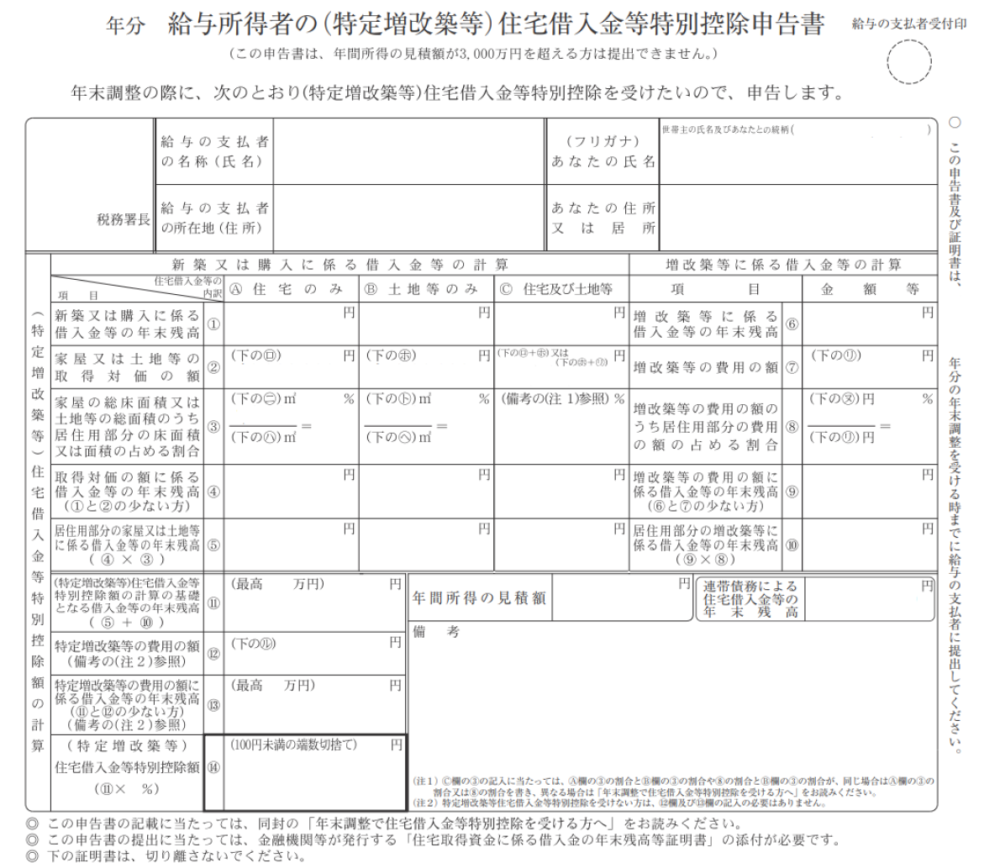

:::alert
当ページで案内しているSmartHRの年末調整機能の内容は、2021年（令和3年）版のものです。
2022年（令和4年）版の年末調整機能の公開時期は秋頃を予定しています。
なお、画面や文言、一部機能は変更になる可能性があります。
公開時期が決まり次第、[アップデート情報](https://smarthr.jp/update%E2%80%9D)でお知らせします。
:::

従業員の年末調整書類に、控除の申請内容が表示される条件は下記のとおりです。

# 給与所得者の扶養控除等申告書

令和3年分、4年分ともに、書類への表示条件は下記の通りです。

:::tips
令和2年分の年末調整から、ひとり親控除の創設、および、寡婦（寡夫）控除の見直しが行なわれましたが、国税庁が公表している「令和3年分の給与所得者の扶養控除等（異動）申告書」の様式には、ひとり親控除および寡婦控除を記載する項目が反映されておらず、表記は改正前のままになっています。
古い記載は手書きで訂正することを前提とされていますが、SmartHRで作成する令和3年分の給与所得者の扶養控除等（異動）申告書は、あらかじめ寡婦・ひとり親控除の記載に対応しています。
:::

## A：源泉控除対象配偶者に表示する条件

- 年末調整のアンケートで配偶者が「いる」もしくは「今年死別した配偶者がいる」と回答
- あなたの給与収入が1,095万円以下（所得の場合は900万円以下）
- 配偶者の給与収入が150万円以下（所得の場合は95万円以下）
- （令和3年分の場合）年末調整のアンケートで今年「扶養する」と回答
- （令和4年分の場合）年末調整のアンケートで来年「扶養する」と回答

配偶者を「税法上扶養しているかどうか」は、この欄の表示によって判断します。

収入（所得）要件を満たしていないと、対象外となり、書類には表示されません。

## B：控除対象親族（16歳以上）に表示する条件

- 年末調整のアンケートで扶養親族情報を入力
- 扶養親族の給与収入は103万円以下（所得の場合は48万円以下）
- 扶養親族の生年月日が、平成18年1月1日以前（平成18年1月1日を含む）

:::tips
家族を「税法上扶養しているかどうか」は、この欄の表示によって判断します。
控除対象扶養親族（16歳以上）、16歳未満の扶養親族欄への表示は、生年月日で判定しています。
:::

### 老人扶養親族・特定扶養親族に表示する条件

- 「同居」かつ「直系尊属の続柄である昭和27年1月1日以前生まれの場合」は、老人扶養親族の **「同居老親等」** と判定
- 「同居以外」もしくは「直系尊属の続柄ではない昭和27年1月1日以前生まれの場合」は、老人扶養親族の **「その他」** と判定
- 平成11年1月2日生まれ〜平成15年1月1日生まれの場合は **「特定扶養親族」** と判定

なお、直系尊属判定としている続柄は以下のとおりです。

- 父/母/実父/実母/義父/義母
- 祖父/祖母/義祖父/義祖母
- 曾祖父/曾祖母/義曾祖父/義曾祖母

## C：障害者、寡婦、ひとり親、勤労学生に表示する条件

### 障害者控除

- 年末調整のアンケートで障害者控除の申告がある
- 障害者控除の申告に必要な情報が入力されている
- 「配偶者」が障害者控除対象となる条件は、所得が48万円以下（同一生計配偶者）

### 寡婦・ひとり親控除

#### 寡婦控除

- アンケートの回答者が女性である
- 「住民票の続柄に（未届）の記載はありますか？」に「いいえ」と回答（事実婚確認）
- あなたの合計所得金額が500万円以下
- 過去の配偶者についての設問で、「ある（離婚した）」と回答し、かつ家族情報に「子供以外の扶養親族が登録されている」
- 過去の配偶者についての設問で、「ある（死別した）」と回答し、かつ家族情報に「子供以外の扶養親族が登録されている」
- 過去の配偶者についての設問で、「ある（生死不明）」と回答し、かつ家族情報に「扶養親族が登録されていない」

#### ひとり親控除

- 「住民票の続柄に（未届）の記載はありますか？」に「いいえ」と回答（事実婚確認）
- あなたの合計所得金額が500万円以下
- 過去の配偶者について「ない」「ある（離婚した）」「ある（死別した）」「ある（生死不明）」のいずれかと回答
- 家族情報に「子供」が登録されている

### 勤労学生

- 年末調整のアンケートで勤労学生の申告がある
- 勤労学生控除に必要な情報が入力されている
- あなたの給与収入が130万円以下（所得の場合は75万円以下）、かつ、そのうち給与以外の所得が10万円以下

## D：16歳未満の扶養親族に表示する条件

- 年末調整のアンケートで扶養家族情報を入力
- 扶養親族の給与収入は103万円以下（所得の場合は48万円以下）
- （令和3年分の場合）扶養親族の生年月日が、平成18年1月2日以後（平成18年1月2日を含む）
- （令和4年分の場合）扶養親族の生年月日が、平成19年1月2日以後（平成19年1月2日を含む）

# 給与所得者の基礎控除申告書 兼 配偶者控除等申告書 兼 所得金額調整控除申告書

給与の額によって一律に適用される基礎控除を確定するための「基礎控除申告書」と、配偶者控除・配偶者特別控除を受けるために必要な「配偶者控除等申告書」、所得金額調整控除を受けるために必要な「所得金額調整控除申告書」への表示条件は以下のとおりです。

## 基礎控除申告書に表示する条件

- あなたの給与収入が2,000万円以下（もしくは所得見積もりが2,500万円以下）、かつ、所得税が甲欄

:::alert
年末調整のアンケートを完了していても、下記に該当する場合は除きます。
- 11月中に退職する（退職対象外、退職対象外）
- あなたの給与収入が2,000万円超（もしくは所得見積もりが2,500万円超）
- 源泉徴収票の所得税が乙欄（乙欄対象外候補、乙欄対象外）
- 前職の源泉徴収票を「入手不可」と入力（源泉対象外候補、源泉対象外）
- 従業員の申告による対象外
:::

## 配偶者控除等申告書に表示する条件

- あなたの合計所得が1,000万円以下
- 配偶者の合計所得が133万円以下
- 年末調整のアンケートで今年「扶養する」と回答

## 所得金額調整控除申告書に表示する条件

あなたの給与収入が850万円超で、以下のいずれかの条件を満たす場合に表示します。

- 本人が特別障害者
- 同一生計配偶者が特別障害者
- 扶養親族が特別障害者
- 扶養親族が23歳未満（平成11年1月2日以後生まれ）
- 本人以外の所得者が控除をうける親族が特別障害者※
- 本人以外の所得者が控除をうける親族が年齢23歳未満（平成11年1月2日以後生まれ）※

:::tips
**※本人以外の所得者が控除をうける親族とは？**
同じ世帯に所得者が2人以上いる場合、下記に該当する人があなた以外の所得者の扶養に入っていても、所得金額調整控除（子ども等）の適用を受けられます。
- 特別障害者である扶養親族がいる
- 年齢23歳未満の扶養親族がいる
:::

# 給与所得者の保険料控除等申告書

保険料控除を申請するための書類への表示条件は以下のとおりです。

:::tips
年末調整のアンケートに保険の情報を一つも入力していない場合、申告書は作成されません。
:::

## 生命保険料控除に表示する条件

- 一般の生命保険料を入力している
- 介護医療保険料を入力している
- 個人年金保険料を入力している

## 地震保険料控除に表示する条件

- 地震保険料を入力している

## 社会保険料控除に表示する条件

- 国民年金・国民健康保険料を入力している

## 小規模企業共済等掛金控除に表示する条件

- 小規模企業共済等掛金の金額を入力している

# 給与所得者の（特定増改築等）住宅借入金等特別控除申告書（旧様式）

住宅ローン控除申告書（旧様式）の表示条件は以下のとおりです。

| **項目** | **表示するデータもしくは条件** |
| --- | --- |
| ①-A |   ・「新築もしくは購入」の場合に、「借入金融機関の住宅借入金等の内訳が住宅のみ」の、年末残高の合計を表示  ・連帯債務である場合は、あなたの負担すべき金額の合計を表示   |
| ①-B |   ・「新築もしくは購入」の場合に、「借入金融機関の住宅借入金等の内訳が土地等のみ」の、年末残高の合計を表示  ・連帯債務である場合は、あなたの負担すべき金額の合計を表示   |
| ①-C |   ・「新築もしくは購入」の場合に、「借入金融機関の住宅借入金等の内訳が住宅及び土地等」の、年末残高の合計を表示  ・連帯債務である場合は、あなたの負担すべき金額の合計を表示   |
| ⑥ |   ・「増改築」の場合に、「借入金融機関」 の、年末残高の合計を表示  ・連帯債務である場合は、あなたの負担すべき金額の合計を表示   |
| ②-A | 証明書のロ欄の額を表示 |
| ②-B | 証明書のホ欄の額を表示 |
| ②-C | 証明書の「ロとホの合計額」 または 「ホとリの合計額」を表示 |
| ⑦ | 証明書のリ欄の額を表示 |
| ③-A |   ・証明書の二欄の数字を表示  ・証明書のハ欄の数字を表示  ・二をハで割った％を表示。小数点以下第4位まで計算し、第4位を切り上げる。また、90%以上のときは100%と表示   |
| ③-B |   ・証明書のト欄の数字を表示  ・証明書のヘ欄の数字を表示  ・トをヘで割った％を表示。小数点以下第4位まで計算し、第4位を切り上げる。また、90%以上のときは100%と表示   |
| ③-C |   ・③-Aと③-Bが同じ割合の場合は、③-Aの割合を表示  ・③-Bと⑧が同じ割合の場合は、⑧の割合を表示  ・それぞれの割合が異なる場合は表示しない   |
| ⑧ |   ・証明書のヌ欄の数字を表示  ・証明書のリ欄の数字を表示  ・ヌをリで割った％を表示。小数点以下第4位まで計算し、第4位を切り上げる。また、90%以上のときは100%と表示   |
| ④-A | ①-Aと②-Aの少ない方を表示 |
| ④-B | ①-Bと②-Bの少ない方を表示 |
| ④-C | ①-Cと②-Cの少ない方を表示 |
| ⑨ | ⑥と⑦の少ない方を表示 |
| ⑤-A | （④-A×③-A）の結果を表示 |
| ⑤-B | （④-B×③-B）の結果を表示 |
| ⑤-C |   ・③-Aと③-B、もしくは、③-Bと⑧が同じ割合の場合は、（④-C×③-C）の結果を表示  ・③-Aと③-B、もしくは、③-Bと⑧が違う割合の場合は、以下の計算式で割り出す  ⅰ　(C4){C4}円 × ((A2){A2}円 ÷ (C2){C2}円)×(A3){A3の割合}% = {ⅰ}円  ⅱ　(C4){C4}円 × ((B2){B2}円 ÷ (C2){C2}円)×(B3){B3の割合}% = {ⅱ}円  ⅰ＋ⅱ = {C⑤}円   |
| ⑩ | ⑨×⑧の結果を表示 |
| 11の最高額 | 11の欄の最高額として入力した金額を表示 |
| 11の額 | ⑤＋⑩の額を表示。11の最高額を上回った場合は、11の最高額を表示 |
| 12の額 | 証明書のル欄を表示 |
| 13の最高額 | 13の欄の最高額として入力した金額を表示 |
| 13の額 | 11と12の少ない方の額を表示。13の最高額を上回った場合は、13の最高額を表示 |
| 14のパーセンテージ | 14のパーセンテージとして入力した額を表示 |
| 14 | （11×14のパーセンテージ）を表示。100円未満は切り捨て |
| 連帯債務による住宅借入金等の年末残高 | 連帯債務である場合、合計年末残高を表示 |
| 備考 | 連帯債務である場合は連帯債務の内容、C⑤が割合違いによる計算により算出した場合はその内容、もしくは備考に入力した内容を表示 |

# 給与所得者の（特定増改築等）住宅借入金等特別控除申告書 兼 （特定増改築等）住宅借入金等特別控除計算明細書（新様式）

住宅ローン控除申告書（新様式）の表示条件は以下のとおりです。

| **項目** | **表示するデータもしくは条件** |
| --- | --- |
| ①-A |   ・「新築もしくは購入」の場合に、「借入金融機関の住宅借入金等の内訳が住宅のみ」 の、年末残高の合計を表示  ・カッコ内には、連帯債務の借入金の年末残高を表示   |
| ①-B |   ・「新築もしくは購入」の場合に、「借入金融機関の住宅借入金等の内訳が土地等のみ」 の、年末残高の合計を表示  ・カッコ内には、連帯債務の借入金の年末残高を表示   |
| ①-C |   ・「新築もしくは購入」の場合に、「借入金融機関の住宅借入金等の内訳が住宅及び土地等」 の、年末残高の合計を表示  ・カッコ内には、連帯債務の借入金の年末残高を表示   |
| ①-D |   ・「増改築等」の場合に、「借入金融機関」 の、年末残高の合計を表示  ・カッコ内には、連帯債務の借入金の年末残高を表示   |
| ②-A |   ・パーセンテージには、証明書のニ欄の連帯債務割合を表示  ・「①-Aのうち、単独債務の年末残高」＋「①-Aのうち、連帯債務のうち自分の負担する額」×上記の連帯債務割合   |
| ②-B |   ・パーセンテージには、証明書のト欄の連帯債務割合を表示  ・「①-Bのうち、単独債務の年末残高」＋「①-Bのうち、連帯債務のうち自分の負担する額」×上記の連帯債務割合   |
| ②-C |   ・パーセンテージには、証明書のニ欄の連帯債務割合を表示  ・「①-Cのうち、単独債務の年末残高」＋「①-Cのうち、連帯債務のうち自分の負担する額」×上記の連帯債務割合   |
| ②-D |   ・パーセンテージには、証明書のヲ欄の連帯債務割合を表示  ・「①-Dのうち、単独債務の年末残高」＋「①-Dのうち、連帯債務のうち自分の負担する額」×上記の連帯債務割合   |
| ③-A | ・②-Aと証明書ロ欄の少ない方を表示 |
| ③-B | ・②-Bと証明書ホ欄の少ない方を表示 |
| ③-C | ・②-Cと「証明書ロ＋ホ」または「証明書ホ＋リ」の少ない方を表示 |
| ③-D | ・②-Dと「証明書リ」の少ない方を表示 |
| ④-A |   ・パーセンテージには、証明書のハ欄の居住用割合を表示  ・「③-A」×上記の居住用割合  ・小数点以下は切り捨て   |
| ④-B |   ・パーセンテージには、証明書のヘ欄の居住用割合を表示  ・「③-B」×上記の居住用割合  ・小数点以下は切り捨て   |
| ④-C |   ・パーセンテージには、住宅のみと土地のみの居住用割合が同じ場合は、証明書のハ欄（ヘ欄） の居住用割合を表示  ・「③-C」×上記の居住用割合  ・小数点以下第4位を切り上げ   |
| ④-D |   ・パーセンテージには、証明書のル欄の居住用割合を表示  ・「③-D」×上記の居住用割合  ・小数点以下は切り捨て   |
| ⑤の最高額 | ⑤の欄の最高額として入力した金額を表示 |
| ⑤ | ④-A＋④-B＋（④-Cまたは④-D） |
| 年間所得の見積額 |   ・従業員の年間所得の見積額  ・3,000万円を超える場合は控除の適用はなし   |
| ⑥ | ・証明書のヌ欄を表示 |
| 備考 |   ・従業員が入力した内容、もしくは入力内容に応じて自動出力した内容を表示  ・以下ケースに適合する場合に、それぞれ指定した内容を表示  ［家屋と土地等の居住用割合が違う場合］  居住用割合の計算式を表示  ［連帯債務がある場合］  連帯債務者の勤務先記載は必要なし   |
| ⑦の最高額 | ⑦の欄の最高額として入力した金額を表示 |
| ⑦ | ⑤と⑥の少ない方の額を表示。⑦の最高額を上回った場合は、⑦の最高額を表示 |
| ⑧のパーセンテージ | ⑧のパーセンテージとして入力した額を表示 |
| ⑧の最高額 | ⑧の欄の最高額として入力した金額を表示 |
| ⑧の額 |   ・（⑤×⑧のパーセンテージ）を表示  ・100円未満は切り捨て   |
|   重複適用(の特例)を受ける場合の  ( 特 定 増 改 築 等 )  住 宅 借 入 金 等 特 別 控 除 額   | SmartHRでは対応していません |
