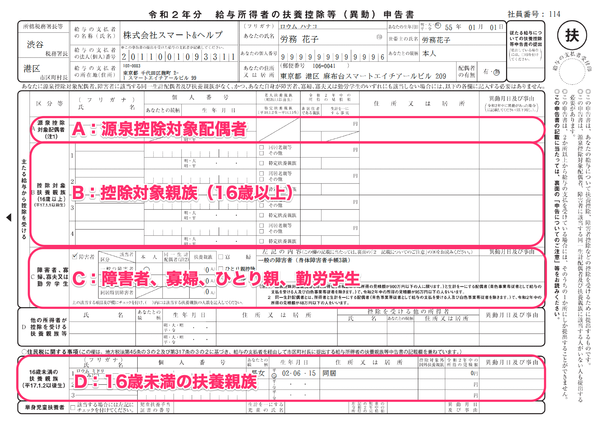

연말정산의 앙케이트 답변이 서류에 어떻게 반영되는지 확인하는 포인트는 아래와 같습니다.

# 급여소득자의 부양공제등신고서 (給与所得者の扶養控除等申告書)

레이와3년(2021년)분, 4년(2022년)분 모두, 서류에의 표시조건은 아래와 같습니다.

:::tips
레이와3년(2021년)분의 연말정산에서 편부모공제의 창설 및 과부(寡婦/寡夫)공제의 검토가 이루어졌습니다만, 국세청이 공표하고 있는 「레이와3년분의 급여소득자의 부양공제등（이동）신고서」의 양식에는 편부모공제 및 과부공제를 기재하는 항목이 반영되지 않고, 표기는 개정전의 상태로 되어있습니다.
오래된 기재는 수필로 수정하는 것을 전제로 하고 있습니다만, SmartHR에서 작성한 레이와3년(2021년)분의 급여소득자의 부양공제등(이동)보고서는 미리 과부(寡婦)・편부모(ひとり親)공제의 기재에 대응하고 있습니다.
:::

## A：원천공제대상배우자（源泉控除対象配偶者）에 표시하는 조건

- 연말정산의 앙케이트에서 배우자가 「있다」혹은 「올해 사별한 배우자가 있다」라고 답변
- 당신의 급여수입이 1,095만엔이하（소득의 경우는 900만엔이하）
- 배우자의 급여수입이 150만엔이하（소득의 경우는 95만엔이하）
- （레이와3년(2021년)분의 경우）연말정산의 앙케이트에서 올해 「부양한다」라고 답변
- （레이와4년(2022년)분의 경우）연말정산의 앙케이트에서 내년 「부양한다」라고 답변

배우자를 「세법상 부양하고 있는지 아닌지」는 이 란의 표시에 따라 판단합니다.

상기의 수입(소득) 요선을 만족하고 있지 않으면 대상외가 되며, 서류에는 표시되지 않습니다.

## B：공제대상친족（16세이상）（控除対象親族（16歳以上））에 표시되는 조건

- 연말정산의 앙케이트에서 부양가족이 「있다」라고 답변
- 부양친족의 급여소득이 103만엔이하（소득의 경우는 38만엔이하）
- 부양친족의 생년월일이 헤이세이17년(2005년) 1월1일 이전（헤이세이17년 1월1일을 포함한다）

:::tips
가족을 「세법상 부양하고 있는지 아닌지」는 이 란의 표시에 따라 판단합니다.
공제대상부양친족（16세이상）, 16세미만의 부양친족란에의 표시는 생년월일로 판정합니다.
또한, 직계존속판정하고 있는 관계는 아래와 같습니다.
- 아버지(父)/어머니(母)/친아버지(実父)/친어머니(実母)/시아버지・장인(義父)/시어머니・장모(義母)
- 할아버지(祖父)/할머니(祖母)/외할아버지(義祖父)/외할머니(義祖母)
- 증조할아버지(曾祖父)/증조할머니(曾祖母)/외증조할아버지(義曾祖父)/외증조할머니(義曾祖母)
:::

## C：장애인, 과부 , 편부모, 근로학생（障害者、寡婦、ひとり親、勤労学生）에 표시되는 조건

### 장애인공제(障害者控除)

- 연말정산의 앙케이트에서 장애인공제의 신고가 있다
- 장애인공제의 신고에 필요한 정보가 입력되어 있다.
    - 「배우자」가 장애인공제 대상이 되는 조건은 소득이 48만엔이하（동일생계배우자）

### 과부(寡婦), 편부모(ひとり親) 공제

#### 과부공제(寡婦控除)

- 앙케이트의 답변자 본인이 여성이다
- 연말정산의 앙케이트에서 「사실혼을 하고 있지 않다」라고 답변
- 당신의 합계소득금액이 500만엔이하
- 과거의 배우자에 대하여 「있었지만 이혼했다」라고 답변하고, 가족정보에 「자녀 이외의 부양친족이 등록되어있다」
- 과거의 배우장에 대하여 「있었지만 사별했다（생사불명도 포함）」라고 답변하고, 가족정보에 「부양친족이 등록되어 있지 않다」또는 「자녀 이외의 부양친족이 등록되어 있다」

#### 편부모공제(ひとり親控除)

- 연말정산의 앙케이트에 「사실혼을 하고있지 않다」라고 답변
- 당신의 합계소득금액이 500만엔 이하
- 과거의 배우자에 대하여 「있었던 적이 없다」「있었지만 이혼했다」「있었지만 사별했다（생사불명도 포함)」라고 답변
- 가족정보에 「자녀(子供)」가 등록되어 있다

### 근로학생(勤労学生)

- 연말정산의 앙케이트에 근로학생의 신고가 있다
- 근로학생공제에 필요한 정보가 입력되어 있다
- 당신의 급여수입이 130만엔 이하（소득의 경우는 75만엔 이하）이며 그 중 급여이외의 소득이 10만엔 이하

## D：16세 미만의 부양친족（16歳未満の扶養親族）에 표시하는 조건

- 연말정산의 앙케이트에 부양가족이 「있다」라고 답변
- 부양친족의 급여수입이 103만엔 이하（소득의 경우는 48만엔 이하）
- 부양친족의 생년월일이 헤이세이17년(2005년) 1월 2일 이후（헤이세이17년 1월 2일을 포함한다）

# 급여소득자의 기초공제신고서 겸 배우자공제등신고서 겸 소득금액조정공제 신고서 (給与所得者の基礎控除申告書 兼 配偶者控除等申告書 兼 所得金額調整控除申告書)

급여 금액에 따라 일률적으로 적용되는 기초 공제를 확정하기 위한 「기초 공제 신고서(基礎控除申告書)」와 배우자 공제 · 배우자 특별 공제를 받기 위해 필요한 '배우자 공제 등 신고서」, 소득 금액 조정 공제를 받기 위해 필요한 「소득 금액 조정 공제 신고서(所得金額調整控除申告書)」에 표시하는 조건은 다음과 같습니다.

## 기초공제신고서(基礎控除申告書)에 표시되는 조건

- 당신의 급여수입이 2,000만엔 이하（또는 소득예상금액이 2,500만엔 이하）이며 소득세가 갑(甲) 란

연말정산의 앙케이트를 완료하고 있더라도 아래에 해당하는 경우에는 제외됩니다.

- 11월중에 퇴사 한다
- 당신의 급여소득이 2,000만엔 초과（또는 소득예상금액이 2,500만엔 초과）
- 원천징수표의 소득세가 을(乙) 란
- 이전직장의 원천징수표를 「입수불가」로 입력

## 배우자공제등신고서（配偶者控除等申告書）에 표시하는 조건

- 당신의 합계소득이 1,000만엔 이하
- 배우자의 소득조건이 133만엔 이하
- 연말정산의 앙케이트에서 올해 「부양한다」라고 답변

## 소득금액조정공제 신고서(所得金額調整控除申告書)에 표시하는 조건

당신의 급여수입이 850만엔을 초과하며 아래의 조건 중 하나를 만족하는 경우에 표시 됩니다.

- 본인이 특별장애인
- 동일 생계배우자가 특별장애인
- 부양친족이 특별장애인
- 부양친족이 23세 미만（1998년 1월 2일 이후 출생）
- 본인 이외의 소득자가 공제를 받는 친족이 특별장애인※
- 본인 이외의 소득자가 공제를 받는 친족의 나이가 23세 미만（1998년 1월 2일 이후 출생）※

:::tips
**※본인이외의 소득자가 공제를 받는 친족이란?**
같은 세대에 소득자가 2명이상인 경우, 아래에 해당하는 사람이 당신 이외의 소득자의 부양에 들어있더라도 소득금액조정공제（어린이 등）의 적용을 받을수 있습니다.
- 특별장애인 인 부양친족이 있다
- 나이가 23미만의 부양친족이 있다
:::

# 급여소득자의 보험표공제등 신고서(給与所得者の保険料控除等申告書)

보험료공제를 신청하기 위한 서류에의 표시조건은 아래와 같습니다.

:::tips
연말정산의 앙케이트에 보험 정보를 하나도 입력하지 않을 경우에는 작성되지 않습니다.
:::

## 생명보험료공제（生命保険料控除）에 표시되는 조건

- 일반 생명보험료를 입력하고 있다
- 간호보험료(介護保険料)를 입력하고 있다
- 개인연금보험료를 입력하고 있다

## 지진보험표공제（地震保険料控除）에 표시하는 조건

- 지진보험료를 입력하고 있다

## 사회보험료（社会保険料控除）에 표시하는 조건

- 국민연금・국민건강보험료를 입력하고 있다

## 소규모기업공제등부금 공제(小規模企業共済等掛金控除)에 표시하는 조건

- 소규모기업공제등부금(小規模企業共済等掛金)의 금액을 입력하고 있다

# 급여소득자의 (특정증개축등) 주택차입금등 특별공제 신고서(給与所得者の（特定増改築等）住宅借入金等特別控除申告書)

주택론공제보고서의 샘플에의 표시조건은 아래와 같습니다.

| **항목** | **표시하는 데이터 또는 조건** |
| --- | --- |
| ①-A | ・「구입 또는 신축」의 경우에는 「대출금융기관의 주택대출금등의 내역이 주택 뿐」의 연말잔고의 합계를 표시 ・연대채무가 있는 경우는 당신이 부담해야 할 금액의 합계를 표시 |
| ①-B | ・「구입 또는 신축」의 경우에는 「대출금융기관의 주택대출금등의 내역이 토지 뿐」의 연말잔고이 합계를 표시 ・연대채무가 있는 경우는 당신이 부담해야 할 금액의 합계를 표시 |
| ①-C | ・「구매 또는 신축」의 경우에는 「대출금융기관의 주택대출금등의 내역이 주택 및 토지 등」의 연말잔고의 합계를 표시  ・연대채무가 있는 경우는 당신이 부담해야 할 금액의 합계를 표시 |
| ⑥ | ・「증개축」의 경우에는 「대출금융기관」의 연말잔고의 합계를 표시 ・연대채무가 있는 경우는 당신이 부담해야 할 금액의 합계를 표시 |
| ②-A | 증명서의 로(ロ)란의 금액을 표시 |
| ②-B | 증명서의 호(ホ)란의 금액을 표시 |
| ②-C | 「로(ロ)와 호(ホ)의 합계금액」 또는 「호(ホ)와 리(リ)의 합계금액」을 표시 |
| ⑦ | 증명서의 리(リ)란의 금액을 표시 |
| ③-A | ・증명서의 니(二)란의 숫자를 표시 ・증명서의 하(ハ)란의 숫자를 표시 ・니(二)를 하(ハ)로 나눈 ％를 표시. 소수점이하 4자리수까지 계산하여 4자리수에서 반올림한다. 또한 90%이상일 경우, 100%로 표시 |
| ③-B | ・증명서의 니(二)란의 숫자를 표시 ・증명서의 하(ハ)란의 숫자를 표시 ・니(二)를 하(ハ)로 나눈 ％를 표시. 소수점이하 4자리수까지 계산하여 4자리수에서 반올림한다.또한 90%이상일 경우, 100%로 표시 |
| ③-C | ・③-A와 ③-B가 동일한 비율일 경우는 ③-A의 비율을 표시 ・③-B와 ⑧가 동일한 비율일 경우는 ⑧의 비율을 표시 ・각각의 비율이 다를 경우에는 표시하지 않는다 |
| ⑧ | ・증명서의 누(ヌ)란의 숫자를 표시 ・증명서의 리(リ)란의 숫자를 표시 ・누(ヌ)를 리(リ)로 나눈 ％를 표시. 소수점이하 4자리수까지 계산하여 4자리수에서 반올림한다.또한 90%이상일 경우, 100%로 표시 |
| ④-A | ①-A와 ②-A 중 적은 쪽을 표시. ①-A가 존재하지 않는 경우에는 아무것도 표시되지 않는다 |
| ④-B | ①-B와 ②-B 중 적은 쪽을 표시. ①-B가 존재하지 않는 경우에는 아무것도 표시되지 않는다 |
| ④-C | ①-C와 ②-C 중 적은 쪽을 표시. ①-C가 존재하지 않는 경우에는 아무것도 표시되지 않는다 |
| ⑨ | ⑥과 ⑦ 중 적은 쪽을 표시 |
| ⑤-A | （④-A×③-A）의 결과를 표시. ④-A가 존재하지 않는 경우에는 아무것도 표시되지 않는다 |
| ⑤-B | （④-B×③-B）의 결과를 표시. ④-B가 존재하지 않는 경우에는 아무것도 표시되지 않는다 |
| ⑤-C | ・③-A와 ③-B、또는 ③-B와 ⑧이 같은 비율의 경우에는 （④-C×③-C）의 결과를 표시 ・③-A와 ③-B、또는 ③-B와 ⑧가 같은 비율의 경우에는 이하의 계산식으로 산출한다 ⅰ　(C4){C4}엔 × ((A2){A2}엔 ÷ (C2){C2}엔)×(A3){A3의 비율}% = {ⅰ}엔 ⅱ　(C4){C4}엔 × ((B2){B2}엔 ÷ (C2){C2}엔)×(B3){B3의 비율}% = {ⅱ}엔 ⅰ + ⅱ = {C⑤}엔 |
| ⑩ | ⑨x⑧의 결과를 표시 |
| 11의 최고금액 | 11의 란의 최고금액으로 입력한 금액을 표시 |
| 11의 금액 | ⑤＋⑩의 금액을 표시. 11의 최고금액을 상회하는 경우에는 11의 최고금액을 표시 |
| 12의 금액 | 증명서의 루(ル)란을 표시 |
| 13의 최고금액 | 13의 란의 최고금액으로 입력한 금액을 표시 |
| 13의 금액 | 11과 12 중 적은 쪽의 금액을 표시. 13의 최고금액을 상회하는 경우에는 13의 최고금액을 표시 |
| 14의 퍼센테이지 | 14의 퍼센테이지로 입력한 금액을 표시 |
| 14 | （11×14의 퍼센테이지）을 표시. 100엔 미만은 버림 |
| 연대채무가 있는 주택차입금등의 연말잔고 | 연대채무가 있는 경우, 합계연말잔고를 표시 |
| 비고 | 연대채무가 있는 경우는 연대채무의 내용, C⑤가 비율차이에 의한 계산으로 산출된 경우에는 그 내용 또는 비고에 입력한 내용을 표시 |
